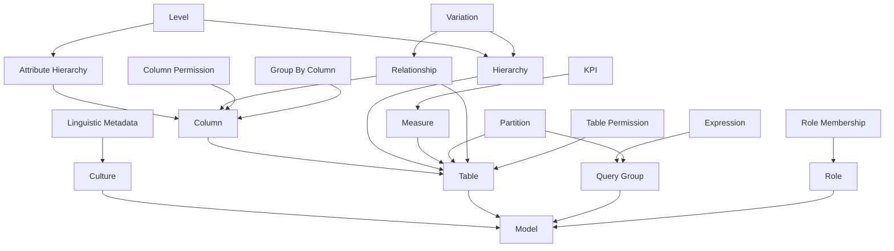

# Dev Instructions


## Set Up

```shell
python -m venv venv
venv\Scripts\activate
python -m pip install .[dev]
pre-commit install
```

# Sphinx

```shell
python -m pip install .[docs]
sphinx-autobuild docs/source docs/build/html
# http://127.0.0.1:8000
```


filters, condition
sources:
  arithmatic
  hierarchy
  aggregation


# SSAS Entity Hierarchy

Unmapped Tables:
-   alternate_of[Alternate Of]
-   annotations[Annotations]
-   calculation_group[Calculation Group]
-   calculation_item[Calculation Item]
-   data_source[Data Source]
-   detail_row_definition[Detail Row Definition]
-   extended_property[Extended Property]
-   format_string_definition[Format String Definition]
-   object_translation[Object Translation]
-   perspective_column[Perspective Column]
-   perspective_hierarchy[Perspective Hierarchy]
-   perspective_measure[Perspective Measure]
-   perspective_set[Perspective Set]
-   perspective_table[Perspective Table]
-   perspective[Perspective]
-   refresh_policy[Refresh Policy]
-   related_column_detail[Related Column Detail]
-   set[Set]


