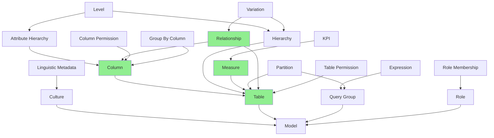

```mermaid

flowchart TD
  attribute_hierarchy[Attribute Hierarchy]
  
  column_permission[Column Permission]
  column[Column]
  culture[Culture]
  
  expression[Expression]
  
  
  group_by_column[Group By Column]
  hierarchy[Hierarchy]
  kpi[KPI]
  level[Level]
  linguistic_metadata[Linguistic Metadata]
  measure[Measure]
  model[Model]
  partition[Partition]

  query_group[Query Group]
  relationship[Relationship]
  role_membership[Role Membership]
  role[Role]
  
  table_permission[Table Permission]
  table[Table]
  variation[Variation]

  level --> attribute_hierarchy --> column
  relationship & column_permission & group_by_column --> column --> table
  linguistic_metadata --> culture --> model
  expression --> query_group
  level & variation --> hierarchy --> table
  kpi --> measure --> table --> model
  partition --> table & query_group
  query_group --> model
  variation --> relationship --> table
  role_membership --> role --> model
  table_permission --> table

  classDef important fill:#90EE90;
  class table,column,measure,relationship important;


  click attribute_hierarchy "../entities/attribute_hierarchy/reference/"
  click column_permission "../entities/column_permission/reference/"
  click column "../entities/column/reference/"
  click culture "../entities/culture/reference/"
  click expression "../entities/expression/reference/"
  click group_by_column "../entities/group_by_column/reference/"
  click hierarchy "../entities/hierarchy/reference/"
  click kpi "../entities/kpi/reference/"
  click level "../entities/level/reference/"
  click linguistic_metadata "../entities/linguistic_metadata/reference/"
  click measure "../entities/measure/reference/"
  click model "../entities/model/reference/"
  click partition "../entities/partition/reference/"
  click query_group "../entities/query_group/reference/"
  click relationship "../entities/relationship/reference/"
  click role_membership "../entities/role_membership/reference/"
  click role "../entities/role/reference/"
  click table_permission "../entities/table_permission/reference/"
  click table "../entities/table/reference/"
  click variation "../entities/variation/reference/"
```

Note: the light-green SSAS entities are the most common to work with