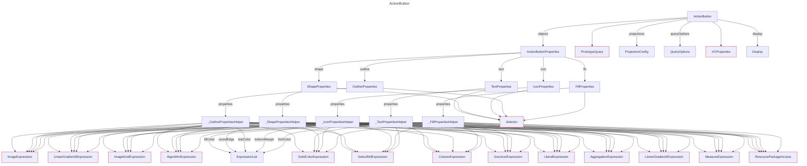

```mermaid
---
title: ActionButton
---
graph 
2430514984576["FillProperties"]
2430552676304["ActionButtonProperties"]
2430071951472["PrototypeQuery"]
style 2430071951472 stroke:#ff0000,stroke-width:1px
2430071907552["SolidColorExpression"]
style 2430071907552 stroke:#ff0000,stroke-width:1px
2430071930000["AlgorithmExpression"]
style 2430071930000 stroke:#ff0000,stroke-width:1px
2430552669472["_TextPropertiesHelper"]
2430552666544["OutlineProperties"]
2430071921216["ResourcePackageAccess"]
style 2430071921216 stroke:#ff0000,stroke-width:1px
2430071926096["ImageKindExpression"]
style 2430071926096 stroke:#ff0000,stroke-width:1px
2430552660688["ShapeProperties"]
2430514799136["ProjectionConfig"]
2430071925120["ColumnExpression"]
style 2430071925120 stroke:#ff0000,stroke-width:1px
2430552672400["TextProperties"]
2430071920240["LinearGradient2Expression"]
style 2430071920240 stroke:#ff0000,stroke-width:1px
2430071930976["ExpressionList"]
2430071910480["LinearGradient3Expression"]
style 2430071910480 stroke:#ff0000,stroke-width:1px
2430514817680["QueryOptions"]
2430071888032["MeasureExpression"]
style 2430071888032 stroke:#ff0000,stroke-width:1px
2430552651904["_OutlinePropertiesHelper"]
2430514978720["IconProperties"]
2430552661664["_ShapePropertiesHelper"]
2430071923168["SelectRefExpression"]
style 2430071923168 stroke:#ff0000,stroke-width:1px
2430514972864["_IconPropertiesHelper"]
2430071919264["ImageExpression"]
style 2430071919264 stroke:#ff0000,stroke-width:1px
2430514981648["_FillPropertiesHelper"]
2430071745536["Selector"]
style 2430071745536 stroke:#ff0000,stroke-width:1px
2430071889008["AggregationExpression"]
style 2430071889008 stroke:#ff0000,stroke-width:1px
2430071918288["GeoJsonExpression"]
style 2430071918288 stroke:#ff0000,stroke-width:1px
2430514805968["VCProperties"]
style 2430514805968 stroke:#ff0000,stroke-width:1px
2430552673376["ActionButton"]
2430514810848["Display"]
2430071887056["LiteralExpression"]
style 2430071887056 stroke:#ff0000,stroke-width:1px
2430552672400 --->|properties| 2430552669472
2430552651904 ---> 2430071907552
2430552661664 ---> 2430071888032
2430552669472 ---> 2430071919264
2430552673376 --->|display| 2430514810848
2430552676304 --->|fill| 2430514984576
2430552651904 ---> 2430071887056
2430514981648 ---> 2430071919264
2430552669472 ---> 2430071907552
2430514981648 ---> 2430071910480
2430552661664 ---> 2430071920240
2430552669472 ---> 2430071920240
2430552661664 ---> 2430071923168
2430514972864 ---> 2430071888032
2430552651904 ---> 2430071930000
2430514972864 ---> 2430071921216
2430552669472 ---> 2430071925120
2430514972864 ---> 2430071930000
2430552651904 ---> 2430071910480
2430552651904 ---> 2430071919264
2430552661664 ---> 2430071925120
2430552661664 ---> 2430071919264
2430552676304 --->|outline| 2430552666544
2430552661664 ---> 2430071907552
2430552661664 ---> 2430071918288
2430514972864 ---> 2430071907552
2430552676304 --->|icon| 2430514978720
2430552661664 ---> 2430071926096
2430514981648 ---> 2430071926096
2430514981648 ---> 2430071930000
2430552669472 ---> 2430071926096
2430552651904 ---> 2430071889008
2430552651904 ---> 2430071923168
2430552651904 ---> 2430071888032
2430514972864 ---> 2430071887056
2430552669472 ---> 2430071910480
2430552661664 ---> 2430071910480
2430552672400 ---> 2430071745536
2430514972864 ---> 2430071910480
2430514972864 ---> 2430071889008
2430552669472 ---> 2430071887056
2430514984576 --->|properties| 2430514981648
2430552651904 ---> 2430071921216
2430552651904 ---> 2430071925120
2430514972864 ---> 2430071923168
2430514981648 --->|fillColor| 2430071930976
2430514981648 ---> 2430071907552
2430552661664 ---> 2430071930000
2430514981648 ---> 2430071923168
2430514972864 ---> 2430071926096
2430514981648 ---> 2430071925120
2430552660688 ---> 2430071745536
2430514978720 --->|properties| 2430514972864
2430514972864 ---> 2430071918288
2430552673376 --->|objects| 2430552676304
2430552673376 ---> 2430514805968
2430552661664 ---> 2430071921216
2430514972864 ---> 2430071925120
2430552661664 --->|roundEdge| 2430071930976
2430514981648 ---> 2430071918288
2430552669472 ---> 2430071918288
2430514972864 ---> 2430071920240
2430514981648 ---> 2430071887056
2430514978720 ---> 2430071745536
2430552669472 ---> 2430071888032
2430514981648 ---> 2430071889008
2430552651904 ---> 2430071926096
2430552651904 --->|lineColor| 2430071930976
2430514972864 --->|bottomMargin| 2430071930976
2430552666544 ---> 2430071745536
2430552651904 ---> 2430071918288
2430514981648 ---> 2430071920240
2430552673376 ---> 2430071951472
2430552669472 ---> 2430071889008
2430552676304 --->|shape| 2430552660688
2430552669472 ---> 2430071923168
2430552669472 ---> 2430071930000
2430552669472 ---> 2430071921216
2430552676304 --->|text| 2430552672400
2430552651904 ---> 2430071920240
2430552669472 --->|fontColor| 2430071930976
2430514984576 ---> 2430071745536
2430552661664 ---> 2430071887056
2430514981648 ---> 2430071888032
2430552661664 ---> 2430071889008
2430552673376 --->|projections| 2430514799136
2430552666544 --->|properties| 2430552651904
2430514972864 ---> 2430071919264
2430514981648 ---> 2430071921216
2430552660688 --->|properties| 2430552661664
2430552673376 --->|queryOptions| 2430514817680
```