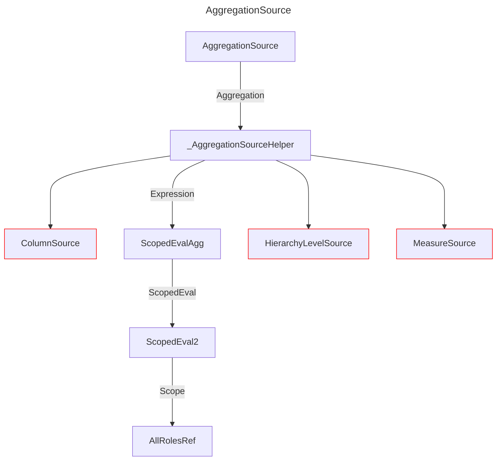

```mermaid
---
title: AggregationSource
---
graph 
2430071365824["ColumnSource"]
style 2430071365824 stroke:#ff0000,stroke-width:1px
2430071371680["ScopedEvalAgg"]
2430071362896["AllRolesRef"]
2430071357040["_AggregationSourceHelper"]
2430071358016["AggregationSource"]
2430071363872["HierarchyLevelSource"]
style 2430071363872 stroke:#ff0000,stroke-width:1px
2430071369728["ScopedEval2"]
2430071359968["MeasureSource"]
style 2430071359968 stroke:#ff0000,stroke-width:1px
2430071357040 ---> 2430071359968
2430071371680 --->|ScopedEval| 2430071369728
2430071358016 --->|Aggregation| 2430071357040
2430071357040 ---> 2430071365824
2430071357040 --->|Expression| 2430071371680
2430071357040 ---> 2430071363872
2430071369728 --->|Scope| 2430071362896
```