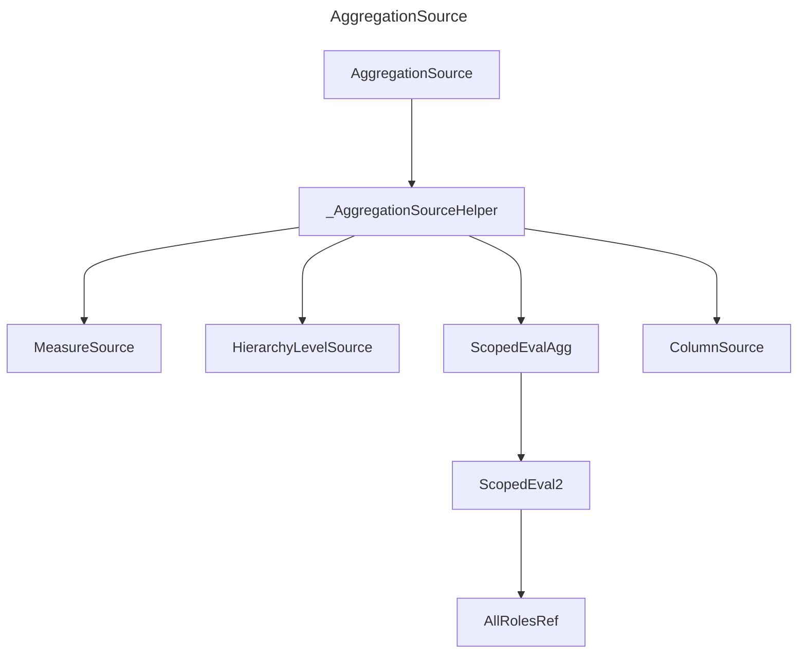

```mermaid
---
title: AggregationSource
---
graph 
2721642018912["_AggregationSourceHelper"]
2721642009152["MeasureSource"]
2721642012080["HierarchyLevelSource"]
2721642007200["ScopedEvalAgg"]
2721642017936["ScopedEval2"]
2721642014032["ColumnSource"]
2721642001344["AllRolesRef"]
2721642003296["AggregationSource"]
2721642018912 ---> 2721642014032
2721642018912 ---> 2721642009152
2721642018912 ---> 2721642012080
2721642003296 ---> 2721642018912
2721642018912 ---> 2721642007200
2721642017936 ---> 2721642001344
2721642007200 ---> 2721642017936
```