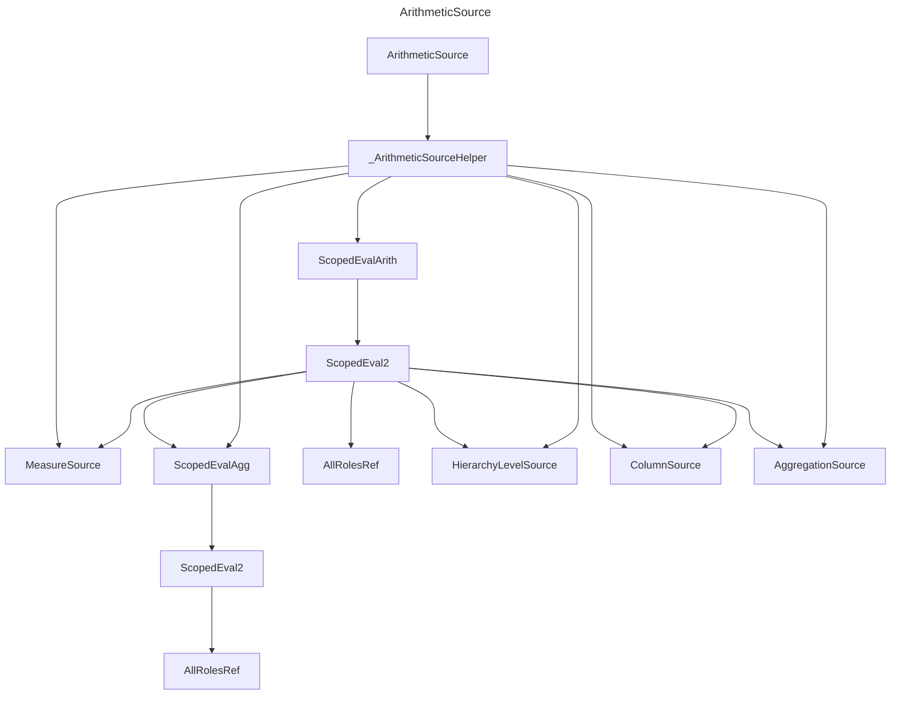

```mermaid
---
title: ArithmeticSource
---
graph 
2721642009152["MeasureSource"]
2721642037456["_ArithmeticSourceHelper"]
2721642007200["ScopedEvalAgg"]
2721642017936["ScopedEval2"]
2721642008176["AllRolesRef"]
2721642001344["AllRolesRef"]
2721642019888["ScopedEval2"]
2721642012080["HierarchyLevelSource"]
2721642030624["ScopedEvalArith"]
2721642014032["ColumnSource"]
2721642003296["AggregationSource"]
2721642031600["ArithmeticSource"]
2721642037456 ---> 2721642007200
2721642037456 ---> 2721642003296
2721642019888 ---> 2721642008176
2721642019888 ---> 2721642003296
2721642037456 ---> 2721642012080
2721642037456 ---> 2721642030624
2721642019888 ---> 2721642014032
2721642019888 ---> 2721642009152
2721642007200 ---> 2721642017936
2721642017936 ---> 2721642001344
2721642037456 ---> 2721642014032
2721642019888 ---> 2721642012080
2721642030624 ---> 2721642019888
2721642019888 ---> 2721642007200
2721642031600 ---> 2721642037456
2721642037456 ---> 2721642009152
```