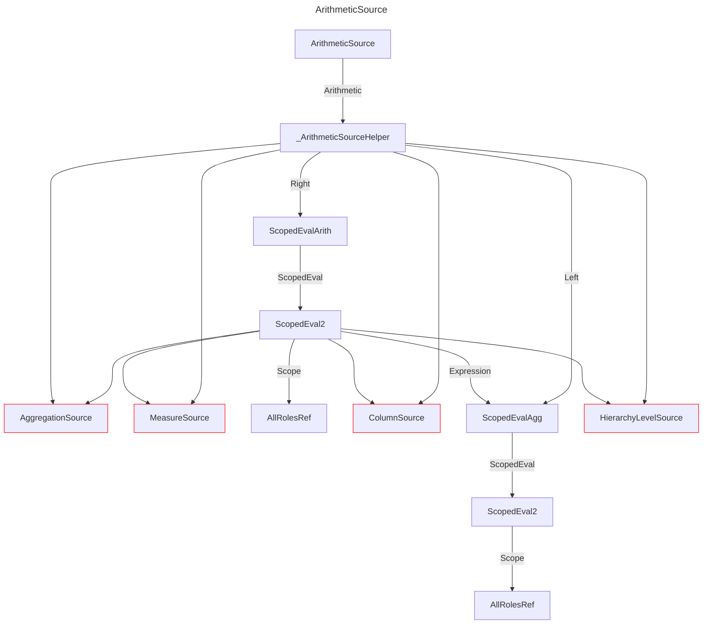

```mermaid
---
title: ArithmeticSource
---
graph 
2430071358016["AggregationSource"]
style 2430071358016 stroke:#ff0000,stroke-width:1px
2430071359968["MeasureSource"]
style 2430071359968 stroke:#ff0000,stroke-width:1px
2430071360944["AllRolesRef"]
2430071365824["ColumnSource"]
style 2430071365824 stroke:#ff0000,stroke-width:1px
2430071379488["_ArithmeticSourceHelper"]
2430071371680["ScopedEvalAgg"]
2430071362896["AllRolesRef"]
2430071361920["ScopedEval2"]
2430071376560["ScopedEvalArith"]
2430071363872["HierarchyLevelSource"]
style 2430071363872 stroke:#ff0000,stroke-width:1px
2430071369728["ScopedEval2"]
2430071382416["ArithmeticSource"]
2430071376560 --->|ScopedEval| 2430071361920
2430071361920 --->|Expression| 2430071371680
2430071361920 ---> 2430071365824
2430071379488 --->|Left| 2430071371680
2430071382416 --->|Arithmetic| 2430071379488
2430071379488 --->|Right| 2430071376560
2430071371680 --->|ScopedEval| 2430071369728
2430071361920 ---> 2430071359968
2430071361920 ---> 2430071363872
2430071379488 ---> 2430071358016
2430071379488 ---> 2430071363872
2430071379488 ---> 2430071365824
2430071361920 ---> 2430071358016
2430071379488 ---> 2430071359968
2430071369728 --->|Scope| 2430071362896
2430071361920 --->|Scope| 2430071360944
```