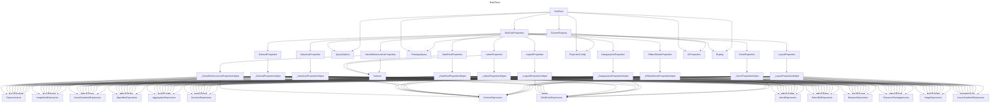

```mermaid
---
title: BarChart
---
graph 
2722113560000["LayoutProperties"]
2722113570736["_XAxisReferenceLinePropertiesHelper"]
2721641876416["ColumnExpression"]
2721641835424["LiteralExpression"]
2722113593184["BarChart"]
2722113585376["_ZoomPropertiesHelper"]
2722113546336["LegendProperties"]
2721641858848["LinearGradient2Expression"]
2721641839328["AggregationExpression"]
2721641889104["GeoJsonExpression"]
2722076049904["QueryOptions"]
2722113527792["GeneralProperties"]
2721641891056["AlgorithmExpression"]
2721641892032["ExpressionList"]
2722113566832["_ValueAxisPropertiesHelper"]
2722076168976["Selector"]
2722113529744["_GeneralPropertiesHelper"]
2721641883248["SelectRefExpression"]
2722076123104["PrototypeQuery"]
2722113576592["ValueAxisProperties"]
2721641874464["SolidColorExpression"]
2722113523888["DataPointProperties"]
2722113564880["XAxisReferenceLineProperties"]
2721641884224["ResourcePackageAccess"]
2722113554144["_LegendPropertiesHelper"]
2722076034288["ProjectionConfig"]
2722113597088["BarChartProperties"]
2722113571712["RibbonBandsProperties"]
2722113583424["ZoomProperties"]
2722113521936["_DataPointPropertiesHelper"]
2722113522912["_LabelsPropertiesHelper"]
2722113552192["_RibbonBandsPropertiesHelper"]
2721641852016["MeasureExpression"]
2722076033312["VCProperties"]
2721641878368["ImageKindExpression"]
2722076045024["Display"]
2722113511200["ColumnProperty"]
2722113532672["LabelsProperties"]
2722113543408["_LayoutPropertiesHelper"]
2721641859824["LinearGradient3Expression"]
2722113519984["CategoryAxisProperties"]
2721641886176["ImageExpression"]
2722113501440["_CategoryAxisPropertiesHelper"]
2722113554144 ---> 2721641874464
2722113552192 ---> 2721641891056
2722113529744 ---> 2721641839328
2722113597088 ---> 2722113523888
2722113597088 ---> 2722113571712
2722113566832 ---> 2721641884224
2722113501440 ---> 2721641883248
2722113570736 ---> 2721641859824
2722113570736 ---> 2721641876416
2722113554144 ---> 2721641876416
2722113570736 ---> 2721641852016
2722113522912 ---> 2721641839328
2722113566832 ---> 2721641886176
2722113529744 ---> 2721641889104
2722113529744 ---> 2721641884224
2722113554144 ---> 2721641852016
2722113529744 ---> 2721641859824
2722113570736 ---> 2721641839328
2722113593184 ---> 2722076034288
2722113552192 ---> 2721641874464
2722113521936 ---> 2721641892032
2722113554144 ---> 2721641835424
2722113519984 ---> 2722113501440
2722113570736 ---> 2721641835424
2722113585376 ---> 2721641878368
2722113566832 ---> 2721641876416
2722113566832 ---> 2721641858848
2722113521936 ---> 2721641878368
2722113585376 ---> 2721641835424
2722113521936 ---> 2721641858848
2722113521936 ---> 2721641891056
2722113522912 ---> 2721641835424
2722113583424 ---> 2722113585376
2722113566832 ---> 2721641892032
2722113593184 ---> 2722076033312
2722113511200 ---> 2722076034288
2722113597088 ---> 2722113527792
2722113585376 ---> 2721641858848
2722113501440 ---> 2721641889104
2722113529744 ---> 2721641835424
2722113529744 ---> 2721641886176
2722113529744 ---> 2721641874464
2722113585376 ---> 2721641859824
2722113511200 ---> 2722076049904
2722113554144 ---> 2721641891056
2722113566832 ---> 2721641859824
2722113521936 ---> 2721641839328
2722113552192 ---> 2721641892032
2722113566832 ---> 2721641891056
2722113566832 ---> 2721641883248
2722113501440 ---> 2721641886176
2722113554144 ---> 2721641892032
2722113570736 ---> 2721641883248
2722113570736 ---> 2721641878368
2722113570736 ---> 2721641892032
2722113554144 ---> 2721641883248
2722113522912 ---> 2721641891056
2722113570736 ---> 2721641891056
2722113522912 ---> 2721641859824
2722113521936 ---> 2721641889104
2722113511200 ---> 2722076033312
2722113529744 ---> 2721641892032
2722113501440 ---> 2721641839328
2722113521936 ---> 2721641876416
2722113529744 ---> 2721641883248
2722113576592 ---> 2722113566832
2722113523888 ---> 2722113521936
2722113566832 ---> 2721641839328
2722113585376 ---> 2721641891056
2722113566832 ---> 2721641874464
2722113521936 ---> 2721641874464
2722113522912 ---> 2721641878368
2722113543408 ---> 2721641889104
2722113543408 ---> 2721641839328
2722113522912 ---> 2721641892032
2722113552192 ---> 2721641839328
2722113522912 ---> 2721641883248
2722113554144 ---> 2721641839328
2722113597088 ---> 2722113546336
2722113522912 ---> 2721641852016
2722113597088 ---> 2722113560000
2722113511200 ---> 2722076045024
2722113523888 ---> 2722076168976
2722113522912 ---> 2721641889104
2722113597088 ---> 2722113583424
2722113521936 ---> 2721641835424
2722113585376 ---> 2721641889104
2722113543408 ---> 2721641883248
2722113554144 ---> 2721641886176
2722113597088 ---> 2722113576592
2722113543408 ---> 2721641884224
2722113552192 ---> 2721641884224
2722113501440 ---> 2721641878368
2722113532672 ---> 2722076168976
2722113522912 ---> 2721641886176
2722113529744 ---> 2721641891056
2722113585376 ---> 2721641892032
2722113501440 ---> 2721641852016
2722113552192 ---> 2721641835424
2722113521936 ---> 2721641883248
2722113570736 ---> 2721641889104
2722113560000 ---> 2722113543408
2722113546336 ---> 2722113554144
2722113552192 ---> 2721641859824
2722113597088 ---> 2722113519984
2722113570736 ---> 2721641884224
2722113552192 ---> 2721641886176
2722113543408 ---> 2721641858848
2722113597088 ---> 2722113532672
2722113501440 ---> 2721641858848
2722113501440 ---> 2721641891056
2722113570736 ---> 2721641874464
2722113501440 ---> 2721641892032
2722113585376 ---> 2721641883248
2722113543408 ---> 2721641859824
2722113570736 ---> 2721641886176
2722113543408 ---> 2721641835424
2722113501440 ---> 2721641874464
2722113529744 ---> 2721641858848
2722113593184 ---> 2722113511200
2722113521936 ---> 2721641852016
2722113564880 ---> 2722113570736
2722113529744 ---> 2721641878368
2722113585376 ---> 2721641884224
2722113543408 ---> 2721641892032
2722113566832 ---> 2721641852016
2722113593184 ---> 2722076123104
2722113501440 ---> 2721641859824
2722113566832 ---> 2721641835424
2722113543408 ---> 2721641852016
2722113543408 ---> 2721641886176
2722113585376 ---> 2721641839328
2722113552192 ---> 2721641889104
2722113543408 ---> 2721641878368
2722113521936 ---> 2721641884224
2722113552192 ---> 2721641878368
2722113554144 ---> 2721641889104
2722113511200 ---> 2722076123104
2722113585376 ---> 2721641886176
2722113543408 ---> 2721641891056
2722113522912 ---> 2721641876416
2722113529744 ---> 2721641876416
2722113597088 ---> 2722113564880
2722113552192 ---> 2721641883248
2722113570736 ---> 2721641858848
2722113522912 ---> 2721641874464
2722113552192 ---> 2721641852016
2722113501440 ---> 2721641884224
2722113522912 ---> 2721641884224
2722113566832 ---> 2721641889104
2722113585376 ---> 2721641876416
2722113501440 ---> 2721641835424
2722113554144 ---> 2721641878368
2722113543408 ---> 2721641874464
2722113552192 ---> 2721641858848
2722113543408 ---> 2721641876416
2722113501440 ---> 2721641876416
2722113521936 ---> 2721641886176
2722113521936 ---> 2721641859824
2722113552192 ---> 2721641876416
2722113564880 ---> 2722076168976
2722113566832 ---> 2721641878368
2722113527792 ---> 2722113529744
2722113593184 ---> 2722076045024
2722113554144 ---> 2721641884224
2722113532672 ---> 2722113522912
2722113522912 ---> 2721641858848
2722113585376 ---> 2721641874464
2722113529744 ---> 2721641852016
2722113571712 ---> 2722113552192
2722113554144 ---> 2721641859824
2722113593184 ---> 2722113597088
2722113554144 ---> 2721641858848
2722113593184 ---> 2722076049904
2722113585376 ---> 2721641852016
```