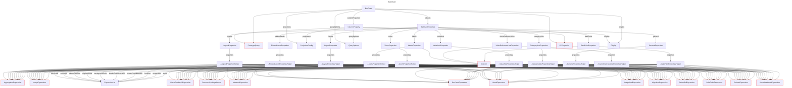

```mermaid
---
title: BarChart
---
graph 
2430552762192["BarChart"]
2430552737792["_RibbonBandsPropertiesHelper"]
2430552710464["GeneralProperties"]
2430552766096["_ZoomPropertiesHelper"]
2430071951472["PrototypeQuery"]
style 2430071951472 stroke:#ff0000,stroke-width:1px
2430071907552["SolidColorExpression"]
style 2430071907552 stroke:#ff0000,stroke-width:1px
2430071930000["AlgorithmExpression"]
style 2430071930000 stroke:#ff0000,stroke-width:1px
2430071921216["ResourcePackageAccess"]
style 2430071921216 stroke:#ff0000,stroke-width:1px
2430071926096["ImageKindExpression"]
style 2430071926096 stroke:#ff0000,stroke-width:1px
2430071887056["LiteralExpression"]
style 2430071887056 stroke:#ff0000,stroke-width:1px
2430552697776["DataPointProperties"]
2430552678256["ColumnProperty"]
2430514799136["ProjectionConfig"]
2430071925120["ColumnExpression"]
style 2430071925120 stroke:#ff0000,stroke-width:1px
2430552686064["_CategoryAxisPropertiesHelper"]
2430071920240["LinearGradient2Expression"]
style 2430071920240 stroke:#ff0000,stroke-width:1px
2430552751456["ZoomProperties"]
2430071930976["ExpressionList"]
2430071910480["LinearGradient3Expression"]
style 2430071910480 stroke:#ff0000,stroke-width:1px
2430514817680["QueryOptions"]
2430071888032["MeasureExpression"]
style 2430071888032 stroke:#ff0000,stroke-width:1px
2430552725104["LabelsProperties"]
2430552730960["ValueAxisProperties"]
2430552721200["_LegendPropertiesHelper"]
2430552690944["CategoryAxisProperties"]
2430071923168["SelectRefExpression"]
style 2430071923168 stroke:#ff0000,stroke-width:1px
2430552709488["_LabelsPropertiesHelper"]
2430071919264["ImageExpression"]
style 2430071919264 stroke:#ff0000,stroke-width:1px
2430071745536["Selector"]
style 2430071745536 stroke:#ff0000,stroke-width:1px
2430552746576["_ValueAxisPropertiesHelper"]
2430552753408["BarChartProperties"]
2430071889008["AggregationExpression"]
style 2430071889008 stroke:#ff0000,stroke-width:1px
2430552700704["_DataPointPropertiesHelper"]
2430552749504["XAxisReferenceLineProperties"]
2430071918288["GeoJsonExpression"]
style 2430071918288 stroke:#ff0000,stroke-width:1px
2430552732912["LegendProperties"]
2430514805968["VCProperties"]
style 2430514805968 stroke:#ff0000,stroke-width:1px
2430552714368["_LayoutPropertiesHelper"]
2430552745600["RibbonBandsProperties"]
2430514810848["Display"]
2430552693872["_GeneralPropertiesHelper"]
2430552755360["_XAxisReferenceLinePropertiesHelper"]
2430552719248["LayoutProperties"]
2430552686064 ---> 2430071889008
2430552721200 ---> 2430071887056
2430552746576 --->|axisScale| 2430071930976
2430552737792 ---> 2430071918288
2430552686064 ---> 2430071925120
2430552721200 ---> 2430071919264
2430552714368 ---> 2430071889008
2430552753408 --->|xAxisReferenceLine| 2430552749504
2430552714368 ---> 2430071920240
2430552753408 --->|general| 2430552710464
2430552714368 ---> 2430071925120
2430552693872 ---> 2430071920240
2430552721200 ---> 2430071921216
2430552678256 --->|display| 2430514810848
2430552737792 ---> 2430071907552
2430552766096 ---> 2430071920240
2430552746576 ---> 2430071887056
2430552737792 ---> 2430071926096
2430552721200 ---> 2430071926096
2430552714368 ---> 2430071930000
2430552693872 ---> 2430071921216
2430552725104 ---> 2430071745536
2430552753408 --->|ribbonBands| 2430552745600
2430552693872 ---> 2430071919264
2430552766096 ---> 2430071930000
2430552697776 --->|properties| 2430552700704
2430552693872 ---> 2430071930000
2430552714368 ---> 2430071919264
2430552753408 --->|valueAxis| 2430552730960
2430552686064 ---> 2430071919264
2430552737792 ---> 2430071923168
2430552721200 ---> 2430071889008
2430552714368 ---> 2430071921216
2430552766096 ---> 2430071910480
2430552746576 ---> 2430071910480
2430552737792 ---> 2430071889008
2430552737792 ---> 2430071930000
2430552709488 ---> 2430071925120
2430552746576 ---> 2430071907552
2430552766096 ---> 2430071919264
2430552762192 --->|projections| 2430514799136
2430552709488 ---> 2430071923168
2430552709488 ---> 2430071919264
2430552762192 --->|queryOptions| 2430514817680
2430552737792 ---> 2430071919264
2430552709488 ---> 2430071910480
2430552714368 ---> 2430071926096
2430552721200 ---> 2430071910480
2430552686064 --->|axisStyle| 2430071930976
2430552737792 ---> 2430071921216
2430552721200 ---> 2430071888032
2430552737792 ---> 2430071920240
2430552753408 --->|zoom| 2430552751456
2430552700704 ---> 2430071907552
2430552737792 ---> 2430071910480
2430552709488 ---> 2430071887056
2430552721200 ---> 2430071918288
2430552721200 ---> 2430071925120
2430552766096 ---> 2430071926096
2430552755360 ---> 2430071889008
2430552714368 --->|ribbonGapSize| 2430071930976
2430552700704 ---> 2430071910480
2430552721200 ---> 2430071920240
2430552693872 ---> 2430071923168
2430552755360 ---> 2430071919264
2430552714368 ---> 2430071923168
2430552766096 ---> 2430071925120
2430552755360 --->|displayName| 2430071930976
2430552686064 ---> 2430071921216
2430552709488 --->|backgroundColor| 2430071930976
2430552737792 --->|borderColorMatchFill| 2430071930976
2430552766096 ---> 2430071907552
2430552755360 ---> 2430071920240
2430552709488 ---> 2430071889008
2430552755360 ---> 2430071921216
2430552700704 ---> 2430071918288
2430552700704 ---> 2430071921216
2430552700704 ---> 2430071889008
2430552710464 --->|properties| 2430552693872
2430552709488 ---> 2430071907552
2430552746576 ---> 2430071921216
2430552755360 ---> 2430071888032
2430552709488 ---> 2430071930000
2430552700704 ---> 2430071887056
2430552721200 ---> 2430071930000
2430552753408 --->|labels| 2430552725104
2430552709488 ---> 2430071888032
2430552686064 ---> 2430071920240
2430552714368 ---> 2430071887056
2430552700704 --->|borderColorMatchFill| 2430071930976
2430552721200 ---> 2430071923168
2430552746576 ---> 2430071923168
2430552746576 ---> 2430071918288
2430552730960 --->|properties| 2430552746576
2430552762192 ---> 2430514805968
2430552755360 ---> 2430071918288
2430552709488 ---> 2430071918288
2430552766096 ---> 2430071889008
2430552755360 ---> 2430071887056
2430552755360 ---> 2430071926096
2430552686064 ---> 2430071930000
2430552755360 ---> 2430071930000
2430552766096 ---> 2430071923168
2430552700704 ---> 2430071919264
2430552745600 --->|properties| 2430552737792
2430552678256 ---> 2430514805968
2430552678256 ---> 2430071951472
2430552753408 --->|legend| 2430552732912
2430552766096 ---> 2430071888032
2430552686064 ---> 2430071910480
2430552749504 ---> 2430071745536
2430552751456 --->|properties| 2430552766096
2430552709488 ---> 2430071921216
2430552721200 --->|fontSize| 2430071930976
2430552737792 ---> 2430071925120
2430552700704 ---> 2430071923168
2430552762192 ---> 2430071951472
2430552709488 ---> 2430071926096
2430552693872 ---> 2430071910480
2430552714368 ---> 2430071910480
2430552755360 ---> 2430071923168
2430552746576 ---> 2430071926096
2430552700704 ---> 2430071920240
2430552693872 ---> 2430071889008
2430552693872 --->|responsive| 2430071930976
2430552709488 ---> 2430071920240
2430552714368 ---> 2430071907552
2430552755360 ---> 2430071907552
2430552746576 ---> 2430071925120
2430552737792 ---> 2430071887056
2430552737792 ---> 2430071888032
2430552686064 ---> 2430071907552
2430552762192 --->|display| 2430514810848
2430552746576 ---> 2430071919264
2430552700704 ---> 2430071930000
2430552686064 ---> 2430071926096
2430552719248 --->|properties| 2430552714368
2430552693872 ---> 2430071918288
2430552746576 ---> 2430071930000
2430552697776 ---> 2430071745536
2430552766096 ---> 2430071887056
2430552762192 --->|columnProperties| 2430552678256
2430552686064 ---> 2430071887056
2430552678256 --->|queryOptions| 2430514817680
2430552686064 ---> 2430071918288
2430552714368 ---> 2430071888032
2430552762192 --->|objects| 2430552753408
2430552766096 ---> 2430071921216
2430552686064 ---> 2430071923168
2430552690944 --->|properties| 2430552686064
2430552746576 ---> 2430071889008
2430552766096 --->|show| 2430071930976
2430552678256 --->|projections| 2430514799136
2430552746576 ---> 2430071888032
2430552693872 ---> 2430071888032
2430552700704 ---> 2430071888032
2430552746576 ---> 2430071920240
2430552725104 --->|properties| 2430552709488
2430552693872 ---> 2430071925120
2430552766096 ---> 2430071918288
2430552714368 ---> 2430071918288
2430552700704 ---> 2430071926096
2430552749504 --->|properties| 2430552755360
2430552700704 ---> 2430071925120
2430552753408 --->|layout| 2430552719248
2430552693872 ---> 2430071907552
2430552721200 ---> 2430071907552
2430552693872 ---> 2430071926096
2430552755360 ---> 2430071925120
2430552753408 --->|categoryAxis| 2430552690944
2430552753408 --->|dataPoint| 2430552697776
2430552755360 ---> 2430071910480
2430552686064 ---> 2430071888032
2430552732912 --->|properties| 2430552721200
2430552693872 ---> 2430071887056
```