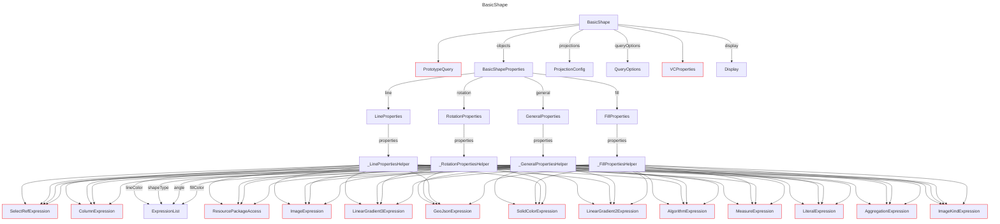

```mermaid
---
title: BasicShape
---
graph 
2430071951472["PrototypeQuery"]
style 2430071951472 stroke:#ff0000,stroke-width:1px
2430071907552["SolidColorExpression"]
style 2430071907552 stroke:#ff0000,stroke-width:1px
2430552809040["BasicShapeProperties"]
2430071930000["AlgorithmExpression"]
style 2430071930000 stroke:#ff0000,stroke-width:1px
2430552790496["FillProperties"]
2430071921216["ResourcePackageAccess"]
style 2430071921216 stroke:#ff0000,stroke-width:1px
2430552787568["GeneralProperties"]
2430071926096["ImageKindExpression"]
style 2430071926096 stroke:#ff0000,stroke-width:1px
2430514799136["ProjectionConfig"]
2430071925120["ColumnExpression"]
style 2430071925120 stroke:#ff0000,stroke-width:1px
2430071920240["LinearGradient2Expression"]
style 2430071920240 stroke:#ff0000,stroke-width:1px
2430552776832["_LinePropertiesHelper"]
2430071930976["ExpressionList"]
2430071910480["LinearGradient3Expression"]
style 2430071910480 stroke:#ff0000,stroke-width:1px
2430514817680["QueryOptions"]
2430071888032["MeasureExpression"]
style 2430071888032 stroke:#ff0000,stroke-width:1px
2430552772928["_FillPropertiesHelper"]
2430071923168["SelectRefExpression"]
style 2430071923168 stroke:#ff0000,stroke-width:1px
2430071919264["ImageExpression"]
style 2430071919264 stroke:#ff0000,stroke-width:1px
2430552794400["LineProperties"]
2430552807088["_RotationPropertiesHelper"]
2430071889008["AggregationExpression"]
style 2430071889008 stroke:#ff0000,stroke-width:1px
2430071918288["GeoJsonExpression"]
style 2430071918288 stroke:#ff0000,stroke-width:1px
2430514805968["VCProperties"]
style 2430514805968 stroke:#ff0000,stroke-width:1px
2430552775856["_GeneralPropertiesHelper"]
2430514810848["Display"]
2430552810016["RotationProperties"]
2430071887056["LiteralExpression"]
style 2430071887056 stroke:#ff0000,stroke-width:1px
2430552806112["BasicShape"]
2430552772928 ---> 2430071887056
2430552775856 ---> 2430071918288
2430552807088 ---> 2430071925120
2430552776832 ---> 2430071923168
2430552807088 ---> 2430071889008
2430552776832 ---> 2430071925120
2430552807088 ---> 2430071918288
2430552776832 --->|lineColor| 2430071930976
2430552776832 ---> 2430071921216
2430552776832 ---> 2430071919264
2430552776832 ---> 2430071910480
2430552775856 ---> 2430071910480
2430552790496 --->|properties| 2430552772928
2430552776832 ---> 2430071918288
2430552807088 ---> 2430071920240
2430552775856 ---> 2430071907552
2430552772928 ---> 2430071919264
2430552775856 ---> 2430071889008
2430552807088 ---> 2430071910480
2430552772928 ---> 2430071907552
2430552806112 --->|objects| 2430552809040
2430552776832 ---> 2430071907552
2430552807088 ---> 2430071921216
2430552776832 ---> 2430071920240
2430552772928 ---> 2430071930000
2430552809040 --->|line| 2430552794400
2430552775856 ---> 2430071925120
2430552775856 ---> 2430071887056
2430552775856 ---> 2430071921216
2430552807088 ---> 2430071923168
2430552807088 ---> 2430071888032
2430552809040 --->|general| 2430552787568
2430552772928 ---> 2430071888032
2430552775856 ---> 2430071920240
2430552809040 --->|rotation| 2430552810016
2430552806112 ---> 2430071951472
2430552772928 ---> 2430071923168
2430552772928 ---> 2430071910480
2430552776832 ---> 2430071930000
2430552772928 ---> 2430071889008
2430552807088 ---> 2430071919264
2430552776832 ---> 2430071888032
2430552775856 ---> 2430071930000
2430552807088 ---> 2430071930000
2430552807088 ---> 2430071887056
2430552775856 --->|shapeType| 2430071930976
2430552772928 ---> 2430071918288
2430552775856 ---> 2430071923168
2430552775856 ---> 2430071926096
2430552772928 ---> 2430071920240
2430552794400 --->|properties| 2430552776832
2430552787568 --->|properties| 2430552775856
2430552775856 ---> 2430071888032
2430552806112 --->|projections| 2430514799136
2430552809040 --->|fill| 2430552790496
2430552772928 ---> 2430071925120
2430552806112 --->|queryOptions| 2430514817680
2430552807088 --->|angle| 2430071930976
2430552810016 --->|properties| 2430552807088
2430552775856 ---> 2430071919264
2430552806112 --->|display| 2430514810848
2430552776832 ---> 2430071887056
2430552776832 ---> 2430071889008
2430552807088 ---> 2430071907552
2430552776832 ---> 2430071926096
2430552806112 ---> 2430514805968
2430552772928 --->|fillColor| 2430071930976
2430552807088 ---> 2430071926096
2430552772928 ---> 2430071926096
2430552772928 ---> 2430071921216
```