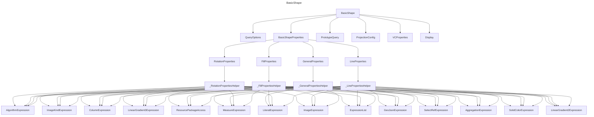

```mermaid
---
title: BasicShape
---
graph 
2721641876416["ColumnExpression"]
2721641835424["LiteralExpression"]
2722144571296["LineProperties"]
2721641858848["LinearGradient2Expression"]
2722144584960["RotationProperties"]
2721641839328["AggregationExpression"]
2721641889104["GeoJsonExpression"]
2722076049904["QueryOptions"]
2721641891056["AlgorithmExpression"]
2721641892032["ExpressionList"]
2722144581056["_RotationPropertiesHelper"]
2722144586912["BasicShapeProperties"]
2722144576176["GeneralProperties"]
2722144596672["BasicShape"]
2721641883248["SelectRefExpression"]
2722076123104["PrototypeQuery"]
2721641874464["SolidColorExpression"]
2721641884224["ResourcePackageAccess"]
2722076034288["ProjectionConfig"]
2722113595136["_FillPropertiesHelper"]
2721641852016["MeasureExpression"]
2722076033312["VCProperties"]
2721641878368["ImageKindExpression"]
2722076045024["Display"]
2722113602944["FillProperties"]
2722113606848["_GeneralPropertiesHelper"]
2721641859824["LinearGradient3Expression"]
2722144573248["_LinePropertiesHelper"]
2721641886176["ImageExpression"]
2722144581056 ---> 2721641891056
2722144581056 ---> 2721641878368
2722113595136 ---> 2721641839328
2722144581056 ---> 2721641876416
2722144586912 ---> 2722144584960
2722113595136 ---> 2721641859824
2722113606848 ---> 2721641835424
2722113595136 ---> 2721641892032
2722113606848 ---> 2721641852016
2722113595136 ---> 2721641835424
2722144571296 ---> 2722144573248
2722144581056 ---> 2721641859824
2722113595136 ---> 2721641876416
2722144581056 ---> 2721641884224
2722113595136 ---> 2721641891056
2722144596672 ---> 2722076045024
2722113595136 ---> 2721641884224
2722113606848 ---> 2721641891056
2722144586912 ---> 2722113602944
2722144576176 ---> 2722113606848
2722144573248 ---> 2721641889104
2722144596672 ---> 2722144586912
2722144573248 ---> 2721641892032
2722113606848 ---> 2721641839328
2722113595136 ---> 2721641878368
2722144573248 ---> 2721641859824
2722144573248 ---> 2721641874464
2722113606848 ---> 2721641876416
2722144596672 ---> 2722076033312
2722113602944 ---> 2722113595136
2722113606848 ---> 2721641884224
2722144573248 ---> 2721641852016
2722144581056 ---> 2721641852016
2722113595136 ---> 2721641889104
2722144581056 ---> 2721641835424
2722113595136 ---> 2721641852016
2722144581056 ---> 2721641886176
2722144584960 ---> 2722144581056
2722113595136 ---> 2721641858848
2722144596672 ---> 2722076049904
2722144596672 ---> 2722076123104
2722144581056 ---> 2721641892032
2722113606848 ---> 2721641859824
2722113606848 ---> 2721641883248
2722113606848 ---> 2721641892032
2722144586912 ---> 2722144571296
2722144573248 ---> 2721641891056
2722144581056 ---> 2721641889104
2722144581056 ---> 2721641883248
2722144573248 ---> 2721641886176
2722144573248 ---> 2721641858848
2722144573248 ---> 2721641883248
2722113606848 ---> 2721641878368
2722144581056 ---> 2721641839328
2722113606848 ---> 2721641858848
2722113595136 ---> 2721641883248
2722144581056 ---> 2721641874464
2722113595136 ---> 2721641886176
2722144573248 ---> 2721641884224
2722144573248 ---> 2721641876416
2722113595136 ---> 2721641874464
2722144573248 ---> 2721641878368
2722144573248 ---> 2721641835424
2722144586912 ---> 2722144576176
2722113606848 ---> 2721641874464
2722113606848 ---> 2721641889104
2722144573248 ---> 2721641839328
2722144596672 ---> 2722076034288
2722144581056 ---> 2721641858848
2722113606848 ---> 2721641886176
```