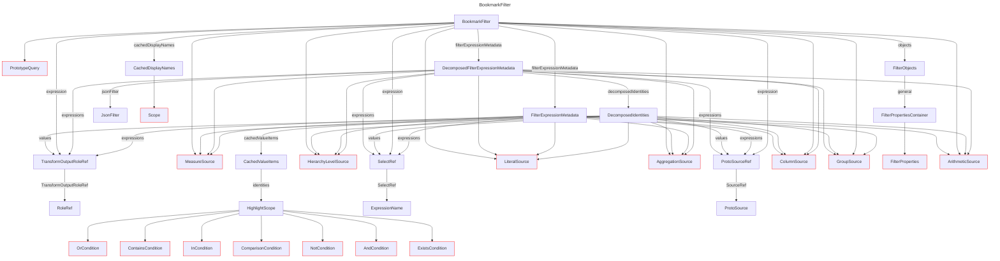

```mermaid
---
title: BookmarkFilter
---
graph 
2430071874368["ComparisonCondition"]
style 2430071874368 stroke:#ff0000,stroke-width:1px
2430071820688["RoleRef"]
2430071981728["DecomposedIdentities"]
2430071951472["PrototypeQuery"]
style 2430071951472 stroke:#ff0000,stroke-width:1px
2430071814832["TransformOutputRoleRef"]
2430071978800["HighlightScope"]
2430071366800["ExpressionName"]
2430071878272["ExistsCondition"]
style 2430071878272 stroke:#ff0000,stroke-width:1px
2430071359968["MeasureSource"]
style 2430071359968 stroke:#ff0000,stroke-width:1px
2430071876320["AndCondition"]
style 2430071876320 stroke:#ff0000,stroke-width:1px
2430071356064["SelectRef"]
2430071997344["BookmarkFilter"]
2430072004176["DecomposedFilterExpressionMetadata"]
2430071363872["HierarchyLevelSource"]
style 2430071363872 stroke:#ff0000,stroke-width:1px
2430071980752["CachedValueItems"]
2430071854848["InCondition"]
style 2430071854848 stroke:#ff0000,stroke-width:1px
2430071976848["FilterExpressionMetadata"]
2430071944640["FilterObjects"]
2430071879248["OrCondition"]
style 2430071879248 stroke:#ff0000,stroke-width:1px
2430071979776["JsonFilter"]
2430071816784["LiteralSource"]
style 2430071816784 stroke:#ff0000,stroke-width:1px
2430071960256["Scope"]
style 2430071960256 stroke:#ff0000,stroke-width:1px
2430071358016["AggregationSource"]
style 2430071358016 stroke:#ff0000,stroke-width:1px
2430071933904["FilterPropertiesContainer"]
2430071825568["ProtoSourceRef"]
2430071365824["ColumnSource"]
style 2430071365824 stroke:#ff0000,stroke-width:1px
2430071846064["ContainsCondition"]
style 2430071846064 stroke:#ff0000,stroke-width:1px
2430071808976["GroupSource"]
style 2430071808976 stroke:#ff0000,stroke-width:1px
2430071819712["ProtoSource"]
2430071880224["NotCondition"]
style 2430071880224 stroke:#ff0000,stroke-width:1px
2430071973920["CachedDisplayNames"]
2430071915360["FilterProperties"]
style 2430071915360 stroke:#ff0000,stroke-width:1px
2430071382416["ArithmeticSource"]
style 2430071382416 stroke:#ff0000,stroke-width:1px
2430071976848 ---> 2430071382416
2430071933904 ---> 2430071915360
2430071978800 ---> 2430071879248
2430071997344 ---> 2430071816784
2430071980752 --->|identities| 2430071978800
2430072004176 --->|expressions| 2430071825568
2430072004176 --->|expressions| 2430071356064
2430071981728 --->|values| 2430071825568
2430072004176 ---> 2430071808976
2430071976848 --->|expressions| 2430071825568
2430071976848 ---> 2430071365824
2430071978800 ---> 2430071846064
2430071981728 --->|values| 2430071356064
2430071981728 --->|values| 2430071814832
2430071997344 --->|expression| 2430071814832
2430071981728 ---> 2430071365824
2430071997344 ---> 2430071363872
2430071825568 --->|SourceRef| 2430071819712
2430071981728 ---> 2430071808976
2430071997344 ---> 2430071359968
2430071981728 ---> 2430071359968
2430071997344 ---> 2430071382416
2430071997344 ---> 2430071808976
2430071814832 --->|TransformOutputRoleRef| 2430071820688
2430071997344 ---> 2430071358016
2430072004176 ---> 2430071816784
2430072004176 --->|decomposedIdentities| 2430071981728
2430071944640 --->|general| 2430071933904
2430071978800 ---> 2430071854848
2430071978800 ---> 2430071874368
2430071997344 --->|expression| 2430071825568
2430071997344 --->|expression| 2430071356064
2430071981728 ---> 2430071382416
2430071997344 ---> 2430071365824
2430071997344 --->|cachedDisplayNames| 2430071973920
2430071978800 ---> 2430071880224
2430072004176 ---> 2430071359968
2430071981728 ---> 2430071363872
2430071973920 ---> 2430071960256
2430071356064 --->|SelectRef| 2430071366800
2430071976848 ---> 2430071808976
2430071976848 ---> 2430071363872
2430071976848 ---> 2430071359968
2430072004176 ---> 2430071363872
2430072004176 ---> 2430071382416
2430071976848 --->|cachedValueItems| 2430071980752
2430071976848 --->|expressions| 2430071356064
2430072004176 ---> 2430071365824
2430071997344 --->|objects| 2430071944640
2430071997344 --->|filterExpressionMetadata| 2430072004176
2430072004176 --->|expressions| 2430071814832
2430071997344 ---> 2430071951472
2430071976848 ---> 2430071816784
2430071997344 --->|filterExpressionMetadata| 2430071976848
2430071981728 ---> 2430071358016
2430071976848 ---> 2430071358016
2430072004176 ---> 2430071358016
2430071981728 ---> 2430071816784
2430071978800 ---> 2430071876320
2430072004176 --->|jsonFilter| 2430071979776
2430071978800 ---> 2430071878272
2430071976848 --->|expressions| 2430071814832
```