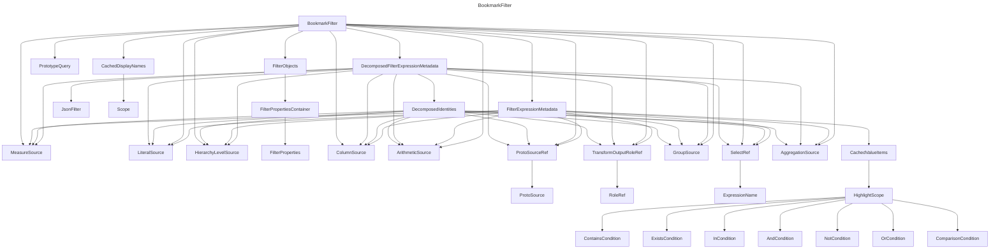

```mermaid
---
title: BookmarkFilter
---
graph 
2722076137744["FilterExpressionMetadata"]
2721642009152["MeasureSource"]
2721642039408["ProtoSource"]
2721642083328["InCondition"]
2721642022816["LiteralSource"]
2721642040384["RoleRef"]
2722076087968["FilterObjects"]
2721642012080["HierarchyLevelSource"]
2721641843232["AndCondition"]
2721641893008["FilterProperties"]
2721642014032["ColumnSource"]
2721642013056["ExpressionName"]
2721642031600["ArithmeticSource"]
2721642084304["NotCondition"]
2721642024768["TransformOutputRoleRef"]
2721642023792["ProtoSourceRef"]
2721642035504["GroupSource"]
2722076123104["PrototypeQuery"]
2722076147504["DecomposedFilterExpressionMetadata"]
2722076124080["CachedDisplayNames"]
2722076135792["CachedValueItems"]
2722076133840["HighlightScope"]
2721641844208["OrCondition"]
2721641879344["FilterPropertiesContainer"]
2722076144576["JsonFilter"]
2721642095040["ComparisonCondition"]
2722076159216["BookmarkFilter"]
2722076120176["Scope"]
2722076131888["DecomposedIdentities"]
2721642003296["AggregationSource"]
2721641850064["ExistsCondition"]
2721642068688["ContainsCondition"]
2721642016960["SelectRef"]
2722076159216 ---> 2721642012080
2722076147504 ---> 2722076144576
2722076147504 ---> 2721642022816
2722076131888 ---> 2721642003296
2722076131888 ---> 2721642035504
2722076147504 ---> 2721642016960
2722076159216 ---> 2721642016960
2722076137744 ---> 2721642035504
2722076159216 ---> 2721642014032
2722076131888 ---> 2721642012080
2722076131888 ---> 2721642031600
2722076147504 ---> 2722076131888
2722076159216 ---> 2722076137744
2722076137744 ---> 2722076135792
2722076131888 ---> 2721642022816
2722076133840 ---> 2721642068688
2722076133840 ---> 2721641850064
2722076131888 ---> 2721642024768
2722076159216 ---> 2722076087968
2722076147504 ---> 2721642023792
2722076159216 ---> 2722076147504
2722076159216 ---> 2722076123104
2722076147504 ---> 2721642035504
2722076087968 ---> 2721641879344
2722076133840 ---> 2721642083328
2722076159216 ---> 2721642035504
2722076159216 ---> 2722076124080
2722076147504 ---> 2721642003296
2721642024768 ---> 2721642040384
2721642023792 ---> 2721642039408
2722076147504 ---> 2721642024768
2722076147504 ---> 2721642031600
2721642016960 ---> 2721642013056
2722076159216 ---> 2721642024768
2722076159216 ---> 2721642022816
2722076131888 ---> 2721642016960
2722076137744 ---> 2721642012080
2722076147504 ---> 2721642014032
2722076131888 ---> 2721642023792
2722076131888 ---> 2721642014032
2722076137744 ---> 2721642022816
2722076159216 ---> 2721642009152
2722076133840 ---> 2721641843232
2722076137744 ---> 2721642009152
2722076137744 ---> 2721642003296
2722076159216 ---> 2721642023792
2722076137744 ---> 2721642014032
2722076137744 ---> 2721642031600
2721641879344 ---> 2721641893008
2722076131888 ---> 2721642009152
2722076159216 ---> 2721642003296
2722076137744 ---> 2721642023792
2722076124080 ---> 2722076120176
2722076133840 ---> 2721642084304
2722076147504 ---> 2721642012080
2722076137744 ---> 2721642024768
2722076133840 ---> 2721641844208
2722076159216 ---> 2721642031600
2722076137744 ---> 2721642016960
2722076133840 ---> 2721642095040
2722076147504 ---> 2721642009152
2722076135792 ---> 2722076133840
```