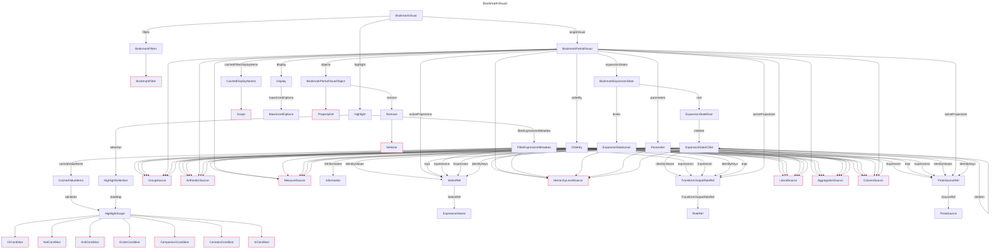

```mermaid
---
title: BookmarkVisual
---
graph 
2430071978800["HighlightScope"]
2430071814832["TransformOutputRoleRef"]
2430071366800["ExpressionName"]
2430071878272["ExistsCondition"]
style 2430071878272 stroke:#ff0000,stroke-width:1px
2430514836224["Highlight"]
2430514863552["Parameter"]
2430071876320["AndCondition"]
style 2430071876320 stroke:#ff0000,stroke-width:1px
2430514834272["BookmarkFilters"]
2430071997344["BookmarkFilter"]
style 2430071997344 stroke:#ff0000,stroke-width:1px
2430071879248["OrCondition"]
style 2430071879248 stroke:#ff0000,stroke-width:1px
2430514842080["BookmarkPartialVisualObject"]
2430514852816["BookmarkVisual"]
2430071825568["ProtoSourceRef"]
2430071846064["ContainsCondition"]
style 2430071846064 stroke:#ff0000,stroke-width:1px
2430071808976["GroupSource"]
style 2430071808976 stroke:#ff0000,stroke-width:1px
2430071813856["ExpansionStateChild"]
2430071973920["CachedDisplayNames"]
2430071382416["ArithmeticSource"]
style 2430071382416 stroke:#ff0000,stroke-width:1px
2430071874368["ComparisonCondition"]
style 2430071874368 stroke:#ff0000,stroke-width:1px
2430071820688["RoleRef"]
2430514824512["Remove"]
2430071943664["Orderby"]
2430071823616["ExpansionStateRoot"]
2430071359968["MeasureSource"]
style 2430071359968 stroke:#ff0000,stroke-width:1px
2430071817760["Information"]
2430071356064["SelectRef"]
2430514850864["BookmarkPartialVisual"]
2430071363872["HierarchyLevelSource"]
style 2430071363872 stroke:#ff0000,stroke-width:1px
2430071980752["CachedValueItems"]
2430071854848["InCondition"]
style 2430071854848 stroke:#ff0000,stroke-width:1px
2430071976848["FilterExpressionMetadata"]
2430071816784["LiteralSource"]
style 2430071816784 stroke:#ff0000,stroke-width:1px
2430071960256["Scope"]
style 2430071960256 stroke:#ff0000,stroke-width:1px
2430071358016["AggregationSource"]
style 2430071358016 stroke:#ff0000,stroke-width:1px
2430071745536["Selector"]
style 2430071745536 stroke:#ff0000,stroke-width:1px
2430071365824["ColumnSource"]
style 2430071365824 stroke:#ff0000,stroke-width:1px
2430071819712["ProtoSource"]
2430071809952["ExpansionStateLevel"]
2430514844032["BookmarkExpansionState"]
2430071880224["NotCondition"]
style 2430071880224 stroke:#ff0000,stroke-width:1px
2430514839152["MaximizedOptions"]
2430514815728["PropertyDef"]
style 2430514815728 stroke:#ff0000,stroke-width:1px
2430514819632["HighlightSelection"]
2430514840128["Display"]
2430514850864 --->|display| 2430514840128
2430071813856 --->|children| 2430071813856
2430071980752 --->|identities| 2430071978800
2430071823616 --->|children| 2430071813856
2430514819632 --->|dataMap| 2430071978800
2430514850864 --->|objects| 2430514842080
2430071943664 ---> 2430071365824
2430071809952 --->|AIInformation| 2430071817760
2430514840128 --->|maximizedOptions| 2430514839152
2430071943664 --->|Expression| 2430071825568
2430071976848 --->|cachedValueItems| 2430071980752
2430071813856 --->|identityValues| 2430071356064
2430071943664 ---> 2430071382416
2430514842080 --->|remove| 2430514824512
2430514836224 --->|filterExpressionMetadata| 2430071976848
2430071813856 --->|identityValues| 2430071814832
2430071809952 ---> 2430071365824
2430071976848 --->|expressions| 2430071814832
2430071976848 ---> 2430071382416
2430071943664 ---> 2430071363872
2430071978800 ---> 2430071879248
2430514850864 ---> 2430071358016
2430071976848 ---> 2430071365824
2430514850864 ---> 2430071363872
2430071943664 --->|Expression| 2430071814832
2430514850864 ---> 2430071816784
2430514850864 --->|activeProjections| 2430071356064
2430071978800 ---> 2430071880224
2430071973920 ---> 2430071960256
2430071976848 ---> 2430071808976
2430071976848 ---> 2430071363872
2430514852816 --->|filters| 2430514834272
2430514850864 --->|parameters| 2430514863552
2430514863552 ---> 2430071382416
2430514863552 --->|expr| 2430071825568
2430071943664 ---> 2430071358016
2430071943664 ---> 2430071359968
2430514850864 ---> 2430071359968
2430071978800 ---> 2430071876320
2430071978800 ---> 2430071878272
2430071943664 ---> 2430071816784
2430071813856 ---> 2430071808976
2430071976848 ---> 2430071359968
2430514863552 ---> 2430071808976
2430071809952 ---> 2430071363872
2430071976848 --->|expressions| 2430071825568
2430071809952 --->|identityKeys| 2430071814832
2430071813856 --->|identityValues| 2430071825568
2430071825568 --->|SourceRef| 2430071819712
2430514850864 ---> 2430071808976
2430514863552 --->|expr| 2430071356064
2430514850864 --->|cachedFilterDisplayItems| 2430071973920
2430071978800 ---> 2430071874368
2430514850864 ---> 2430071382416
2430071809952 ---> 2430071808976
2430514824512 ---> 2430071745536
2430514844032 --->|levels| 2430071809952
2430071356064 --->|SelectRef| 2430071366800
2430514850864 --->|orderBy| 2430071943664
2430071976848 --->|expressions| 2430071356064
2430071943664 --->|Expression| 2430071356064
2430514863552 ---> 2430071363872
2430514850864 --->|activeProjections| 2430071825568
2430514863552 --->|expr| 2430071814832
2430071809952 ---> 2430071359968
2430514863552 ---> 2430071365824
2430071809952 ---> 2430071382416
2430514844032 --->|root| 2430071823616
2430514850864 ---> 2430071365824
2430514842080 ---> 2430514815728
2430514863552 ---> 2430071359968
2430071978800 ---> 2430071846064
2430071809952 ---> 2430071358016
2430514852816 --->|singleVisual| 2430514850864
2430071809952 --->|identityKeys| 2430071356064
2430071813856 ---> 2430071359968
2430514834272 ---> 2430071997344
2430514836224 --->|selection| 2430514819632
2430071813856 ---> 2430071365824
2430071814832 --->|TransformOutputRoleRef| 2430071820688
2430071978800 ---> 2430071854848
2430514863552 ---> 2430071358016
2430071813856 ---> 2430071363872
2430514850864 --->|expansionStates| 2430514844032
2430071809952 --->|identityKeys| 2430071825568
2430514852816 --->|highlight| 2430514836224
2430514850864 --->|activeProjections| 2430071814832
2430071813856 ---> 2430071358016
2430071809952 ---> 2430071816784
2430071813856 ---> 2430071382416
2430071813856 ---> 2430071816784
2430071943664 ---> 2430071808976
2430071976848 ---> 2430071816784
2430514863552 ---> 2430071816784
2430071976848 ---> 2430071358016
```