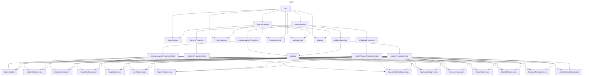

```mermaid
---
title: Card
---
graph 
2721641876416["ColumnExpression"]
2722144625952["Card"]
2721641835424["LiteralExpression"]
2722144618144["CardProperties"]
2722144606432["_LabelsPropertiesHelper"]
2721641858848["LinearGradient2Expression"]
2721641839328["AggregationExpression"]
2722144604480["_GeneralPropertiesHelper"]
2721641889104["GeoJsonExpression"]
2722076049904["QueryOptions"]
2721641891056["AlgorithmExpression"]
2721641892032["ExpressionList"]
2722144609360["CategoryLabelsProperties"]
2722076168976["Selector"]
2721641883248["SelectRefExpression"]
2722076123104["PrototypeQuery"]
2721641874464["SolidColorExpression"]
2721641886176["ImageExpression"]
2721641884224["ResourcePackageAccess"]
2722144624000["WordWrapProperties"]
2722076034288["ProjectionConfig"]
2721641852016["MeasureExpression"]
2722076033312["VCProperties"]
2721641878368["ImageKindExpression"]
2722076045024["Display"]
2722113511200["ColumnProperty"]
2722144614240["LabelsProperties"]
2722144598624["_CategoryLabelsPropertiesHelper"]
2722144605456["GeneralProperties"]
2721641859824["LinearGradient3Expression"]
2722144616192["_WordWrapperPropertiesHelper"]
2722144598624 ---> 2721641878368
2722144606432 ---> 2721641892032
2722113511200 ---> 2722076045024
2722144616192 ---> 2721641874464
2722144614240 ---> 2722144606432
2722144625952 ---> 2722076034288
2722144606432 ---> 2721641891056
2722144606432 ---> 2721641858848
2722144598624 ---> 2721641892032
2722144606432 ---> 2721641889104
2722113511200 ---> 2722076049904
2722144606432 ---> 2721641884224
2722144606432 ---> 2721641886176
2722113511200 ---> 2722076123104
2722144598624 ---> 2721641874464
2722144609360 ---> 2722144598624
2722144616192 ---> 2721641835424
2722144616192 ---> 2721641852016
2722144606432 ---> 2721641874464
2722144616192 ---> 2721641889104
2722144598624 ---> 2721641889104
2722144618144 ---> 2722144624000
2722144625952 ---> 2722076123104
2722144625952 ---> 2722076049904
2722144618144 ---> 2722144605456
2722144616192 ---> 2721641839328
2722144616192 ---> 2721641892032
2722144606432 ---> 2721641839328
2722144618144 ---> 2722144614240
2722144606432 ---> 2721641876416
2722144606432 ---> 2721641878368
2722144624000 ---> 2722144616192
2722144616192 ---> 2721641878368
2722144616192 ---> 2721641886176
2722144616192 ---> 2721641883248
2722144616192 ---> 2721641859824
2722113511200 ---> 2722076033312
2722144616192 ---> 2721641884224
2722144598624 ---> 2721641886176
2722144625952 ---> 2722144618144
2722144618144 ---> 2722144609360
2722144616192 ---> 2721641858848
2722144605456 ---> 2722144604480
2722144598624 ---> 2721641876416
2722144598624 ---> 2721641883248
2722144625952 ---> 2722076045024
2722144614240 ---> 2722076168976
2722144625952 ---> 2722113511200
2722144598624 ---> 2721641859824
2722144606432 ---> 2721641835424
2722144616192 ---> 2721641891056
2722144606432 ---> 2721641852016
2722144598624 ---> 2721641835424
2722144609360 ---> 2722076168976
2722144598624 ---> 2721641891056
2722144598624 ---> 2721641858848
2722144598624 ---> 2721641852016
2722144606432 ---> 2721641883248
2722144616192 ---> 2721641876416
2722113511200 ---> 2722076034288
2722144606432 ---> 2721641859824
2722144598624 ---> 2721641839328
2722144625952 ---> 2722076033312
2722144598624 ---> 2721641884224
```