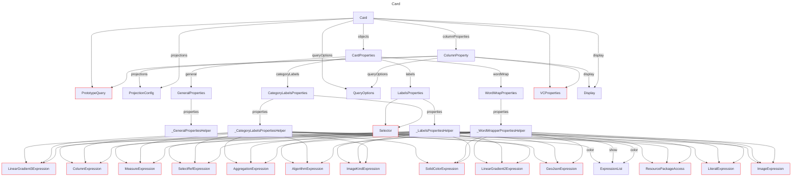

```mermaid
---
title: Card
---
graph 
2430071951472["PrototypeQuery"]
style 2430071951472 stroke:#ff0000,stroke-width:1px
2430071907552["SolidColorExpression"]
style 2430071907552 stroke:#ff0000,stroke-width:1px
2430071930000["AlgorithmExpression"]
style 2430071930000 stroke:#ff0000,stroke-width:1px
2430552819776["_GeneralPropertiesHelper"]
2430071921216["ResourcePackageAccess"]
style 2430071921216 stroke:#ff0000,stroke-width:1px
2430071926096["ImageKindExpression"]
style 2430071926096 stroke:#ff0000,stroke-width:1px
2430552678256["ColumnProperty"]
2430514799136["ProjectionConfig"]
2430071925120["ColumnExpression"]
style 2430071925120 stroke:#ff0000,stroke-width:1px
2430071920240["LinearGradient2Expression"]
style 2430071920240 stroke:#ff0000,stroke-width:1px
2430071930976["ExpressionList"]
2430552816848["GeneralProperties"]
2430552827584["CategoryLabelsProperties"]
2430071910480["LinearGradient3Expression"]
style 2430071910480 stroke:#ff0000,stroke-width:1px
2430514817680["QueryOptions"]
2430071888032["MeasureExpression"]
style 2430071888032 stroke:#ff0000,stroke-width:1px
2430552833440["WordWrapProperties"]
2430552796352["_CategoryLabelsPropertiesHelper"]
2430552837344["CardProperties"]
2430071923168["SelectRefExpression"]
style 2430071923168 stroke:#ff0000,stroke-width:1px
2430071919264["ImageExpression"]
style 2430071919264 stroke:#ff0000,stroke-width:1px
2430071745536["Selector"]
style 2430071745536 stroke:#ff0000,stroke-width:1px
2430552826608["LabelsProperties"]
2430071889008["AggregationExpression"]
style 2430071889008 stroke:#ff0000,stroke-width:1px
2430071918288["GeoJsonExpression"]
style 2430071918288 stroke:#ff0000,stroke-width:1px
2430514805968["VCProperties"]
style 2430514805968 stroke:#ff0000,stroke-width:1px
2430552843200["Card"]
2430514810848["Display"]
2430071887056["LiteralExpression"]
style 2430071887056 stroke:#ff0000,stroke-width:1px
2430552830512["_WordWrapperPropertiesHelper"]
2430552823680["_LabelsPropertiesHelper"]
2430552796352 ---> 2430071918288
2430552796352 ---> 2430071887056
2430552823680 ---> 2430071910480
2430552823680 ---> 2430071925120
2430552796352 ---> 2430071889008
2430552823680 ---> 2430071888032
2430552830512 ---> 2430071920240
2430552837344 --->|labels| 2430552826608
2430552827584 --->|properties| 2430552796352
2430552796352 --->|color| 2430071930976
2430552843200 ---> 2430514805968
2430552837344 --->|wordWrap| 2430552833440
2430552796352 ---> 2430071925120
2430552796352 ---> 2430071907552
2430552830512 ---> 2430071925120
2430552830512 --->|show| 2430071930976
2430552830512 ---> 2430071921216
2430552843200 --->|queryOptions| 2430514817680
2430552837344 --->|general| 2430552816848
2430552843200 ---> 2430071951472
2430552678256 --->|display| 2430514810848
2430552823680 ---> 2430071923168
2430552678256 --->|queryOptions| 2430514817680
2430552830512 ---> 2430071926096
2430552823680 ---> 2430071889008
2430552796352 ---> 2430071923168
2430552823680 ---> 2430071930000
2430552843200 --->|objects| 2430552837344
2430552823680 ---> 2430071926096
2430552830512 ---> 2430071907552
2430552843200 --->|columnProperties| 2430552678256
2430552796352 ---> 2430071919264
2430552826608 --->|properties| 2430552823680
2430552678256 --->|projections| 2430514799136
2430552833440 --->|properties| 2430552830512
2430552823680 ---> 2430071907552
2430552678256 ---> 2430514805968
2430552678256 ---> 2430071951472
2430552823680 ---> 2430071920240
2430552796352 ---> 2430071888032
2430552816848 --->|properties| 2430552819776
2430552826608 ---> 2430071745536
2430552823680 ---> 2430071918288
2430552823680 --->|color| 2430071930976
2430552796352 ---> 2430071930000
2430552796352 ---> 2430071910480
2430552830512 ---> 2430071887056
2430552830512 ---> 2430071910480
2430552837344 --->|categoryLabels| 2430552827584
2430552830512 ---> 2430071888032
2430552830512 ---> 2430071930000
2430552796352 ---> 2430071926096
2430552796352 ---> 2430071921216
2430552830512 ---> 2430071919264
2430552843200 --->|display| 2430514810848
2430552830512 ---> 2430071918288
2430552796352 ---> 2430071920240
2430552843200 --->|projections| 2430514799136
2430552827584 ---> 2430071745536
2430552823680 ---> 2430071921216
2430552823680 ---> 2430071887056
2430552830512 ---> 2430071923168
2430552823680 ---> 2430071919264
2430552830512 ---> 2430071889008
```