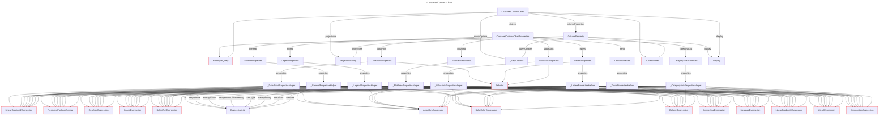

```mermaid
---
title: ClusteredColumnChart
---
graph 
2430552595296["_LabelsPropertiesHelper"]
2430071951472["PrototypeQuery"]
style 2430071951472 stroke:#ff0000,stroke-width:1px
2430071907552["SolidColorExpression"]
style 2430071907552 stroke:#ff0000,stroke-width:1px
2430552603104["GeneralProperties"]
2430071930000["AlgorithmExpression"]
style 2430071930000 stroke:#ff0000,stroke-width:1px
2430552621648["_PlotAreaPropertiesHelper"]
2430071921216["ResourcePackageAccess"]
style 2430071921216 stroke:#ff0000,stroke-width:1px
2430071926096["ImageKindExpression"]
style 2430071926096 stroke:#ff0000,stroke-width:1px
2430552600176["DataPointProperties"]
2430552847104["_DataPointPropertiesHelper"]
2430552678256["ColumnProperty"]
2430514799136["ProjectionConfig"]
2430552623600["PlotAreaProperties"]
2430071925120["ColumnExpression"]
style 2430071925120 stroke:#ff0000,stroke-width:1px
2430071920240["LinearGradient2Expression"]
style 2430071920240 stroke:#ff0000,stroke-width:1px
2430552615792["LegendProperties"]
2430071930976["ExpressionList"]
2430071910480["LinearGradient3Expression"]
style 2430071910480 stroke:#ff0000,stroke-width:1px
2430514817680["QueryOptions"]
2430071888032["MeasureExpression"]
style 2430071888032 stroke:#ff0000,stroke-width:1px
2430552610912["_LegendPropertiesHelper"]
2430552625552["TrendProperties"]
2430071923168["SelectRefExpression"]
style 2430071923168 stroke:#ff0000,stroke-width:1px
2430552611888["LabelsProperties"]
2430552629456["ClusteredColumnChartProperties"]
2430071919264["ImageExpression"]
style 2430071919264 stroke:#ff0000,stroke-width:1px
2430552593344["_GeneralPropertiesHelper"]
2430552646048["ClusteredColumnChart"]
2430552850032["CategoryAxisProperties"]
2430071745536["Selector"]
style 2430071745536 stroke:#ff0000,stroke-width:1px
2430071889008["AggregationExpression"]
style 2430071889008 stroke:#ff0000,stroke-width:1px
2430552636288["_TrendPropertiesHelper"]
2430071918288["GeoJsonExpression"]
style 2430071918288 stroke:#ff0000,stroke-width:1px
2430514805968["VCProperties"]
style 2430514805968 stroke:#ff0000,stroke-width:1px
2430552644096["ValueAxisProperties"]
2430514810848["Display"]
2430071887056["LiteralExpression"]
style 2430071887056 stroke:#ff0000,stroke-width:1px
2430552844176["_CategoryAxisPropertiesHelper"]
2430552643120["_ValueAxisPropertiesHelper"]
2430552646048 --->|queryOptions| 2430514817680
2430552610912 ---> 2430071907552
2430552603104 --->|properties| 2430552593344
2430552850032 --->|properties| 2430552844176
2430552615792 --->|properties| 2430552610912
2430552629456 --->|dataPoint| 2430552600176
2430552847104 ---> 2430071920240
2430552595296 ---> 2430071920240
2430552593344 ---> 2430071887056
2430552847104 ---> 2430071921216
2430552593344 ---> 2430071930000
2430552593344 ---> 2430071918288
2430552595296 ---> 2430071919264
2430552610912 ---> 2430071887056
2430552593344 ---> 2430071889008
2430552636288 ---> 2430071920240
2430552678256 --->|display| 2430514810848
2430552629456 --->|labels| 2430552611888
2430552623600 --->|properties| 2430552621648
2430552636288 ---> 2430071918288
2430552600176 --->|properties| 2430552847104
2430552636288 ---> 2430071926096
2430552847104 ---> 2430071918288
2430552646048 --->|columnProperties| 2430552678256
2430552847104 ---> 2430071919264
2430552646048 --->|display| 2430514810848
2430552621648 ---> 2430071887056
2430552646048 ---> 2430514805968
2430552593344 ---> 2430071921216
2430552629456 --->|categoryAxis| 2430552850032
2430552844176 ---> 2430071926096
2430552610912 ---> 2430071925120
2430552847104 ---> 2430071923168
2430552593344 ---> 2430071888032
2430552593344 ---> 2430071925120
2430552621648 ---> 2430071919264
2430552629456 --->|valueAxis| 2430552644096
2430552847104 --->|fill| 2430071930976
2430552621648 ---> 2430071920240
2430552610912 ---> 2430071926096
2430552643120 ---> 2430071921216
2430552847104 ---> 2430071930000
2430552644096 --->|properties| 2430552643120
2430552621648 ---> 2430071888032
2430552643120 ---> 2430071907552
2430552595296 ---> 2430071921216
2430552847104 ---> 2430071907552
2430552621648 ---> 2430071918288
2430552643120 ---> 2430071930000
2430552643120 ---> 2430071926096
2430552636288 ---> 2430071923168
2430552643120 ---> 2430071910480
2430552643120 ---> 2430071920240
2430552610912 ---> 2430071930000
2430552610912 ---> 2430071919264
2430552643120 ---> 2430071919264
2430552844176 ---> 2430071907552
2430552844176 ---> 2430071887056
2430552844176 ---> 2430071921216
2430552643120 ---> 2430071918288
2430552593344 ---> 2430071920240
2430552621648 ---> 2430071930000
2430552847104 ---> 2430071925120
2430552600176 ---> 2430071745536
2430552595296 ---> 2430071888032
2430552595296 ---> 2430071925120
2430552844176 ---> 2430071918288
2430552625552 --->|properties| 2430552636288
2430552646048 --->|objects| 2430552629456
2430552643120 ---> 2430071887056
2430552593344 --->|responsive| 2430071930976
2430552595296 ---> 2430071889008
2430552636288 --->|displayName| 2430071930976
2430552629456 --->|trend| 2430552625552
2430552636288 ---> 2430071930000
2430552610912 ---> 2430071888032
2430552611888 ---> 2430071745536
2430552595296 ---> 2430071926096
2430552844176 ---> 2430071888032
2430552844176 ---> 2430071919264
2430552646048 --->|projections| 2430514799136
2430552678256 ---> 2430514805968
2430552678256 ---> 2430071951472
2430552636288 ---> 2430071925120
2430552595296 --->|backgroundTransparency| 2430071930976
2430552621648 ---> 2430071910480
2430552593344 ---> 2430071919264
2430552844176 ---> 2430071889008
2430552610912 ---> 2430071923168
2430552610912 ---> 2430071889008
2430552844176 --->|axisType| 2430071930976
2430552847104 ---> 2430071926096
2430552595296 ---> 2430071918288
2430552629456 --->|general| 2430552603104
2430552621648 ---> 2430071921216
2430552636288 ---> 2430071888032
2430552610912 ---> 2430071910480
2430552621648 --->|transparency| 2430071930976
2430552595296 ---> 2430071907552
2430552621648 ---> 2430071925120
2430552847104 ---> 2430071888032
2430552643120 --->|axisScale| 2430071930976
2430552844176 ---> 2430071923168
2430552629456 --->|plotArea| 2430552623600
2430552844176 ---> 2430071930000
2430552636288 ---> 2430071887056
2430552844176 ---> 2430071925120
2430552643120 ---> 2430071923168
2430552636288 ---> 2430071910480
2430552636288 ---> 2430071919264
2430552643120 ---> 2430071889008
2430552621648 ---> 2430071923168
2430552593344 ---> 2430071923168
2430552621648 ---> 2430071907552
2430552643120 ---> 2430071925120
2430552678256 --->|queryOptions| 2430514817680
2430552847104 ---> 2430071910480
2430552847104 ---> 2430071887056
2430552621648 ---> 2430071889008
2430552610912 --->|fontSize| 2430071930976
2430552678256 --->|projections| 2430514799136
2430552593344 ---> 2430071910480
2430552621648 ---> 2430071926096
2430552636288 ---> 2430071889008
2430552610912 ---> 2430071920240
2430552595296 ---> 2430071930000
2430552636288 ---> 2430071921216
2430552595296 ---> 2430071887056
2430552593344 ---> 2430071907552
2430552593344 ---> 2430071926096
2430552643120 ---> 2430071888032
2430552611888 --->|properties| 2430552595296
2430552644096 ---> 2430071745536
2430552595296 ---> 2430071923168
2430552847104 ---> 2430071889008
2430552646048 ---> 2430071951472
2430552636288 ---> 2430071907552
2430552610912 ---> 2430071921216
2430552844176 ---> 2430071920240
2430552610912 ---> 2430071918288
2430552595296 ---> 2430071910480
2430552844176 ---> 2430071910480
2430552629456 --->|legend| 2430552615792
```