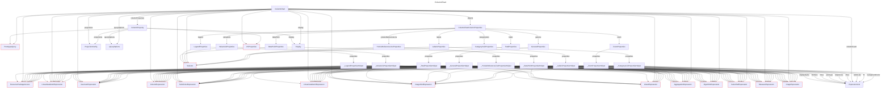

```mermaid
---
title: ColumnChart
---
graph 
2430071907552["SolidColorExpression"]
style 2430071907552 stroke:#ff0000,stroke-width:1px
2430071951472["PrototypeQuery"]
style 2430071951472 stroke:#ff0000,stroke-width:1px
2430591944192["ZoomProperties"]
2430071930000["AlgorithmExpression"]
style 2430071930000 stroke:#ff0000,stroke-width:1px
2430591921744["_Y1AxisReferenceLinePropertiesHelper"]
2430591898320["LegendProperties"]
2430591906128["_LegendPropertiesHelper"]
2430071921216["ResourcePackageAccess"]
style 2430071921216 stroke:#ff0000,stroke-width:1px
2430071926096["ImageKindExpression"]
style 2430071926096 stroke:#ff0000,stroke-width:1px
2430591924672["Y1AxisReferenceLineProperties"]
2430552678256["ColumnProperty"]
2430514799136["ProjectionConfig"]
2430071925120["ColumnExpression"]
style 2430071925120 stroke:#ff0000,stroke-width:1px
2430591900272["_LabelsPropertiesHelper"]
2430071920240["LinearGradient2Expression"]
style 2430071920240 stroke:#ff0000,stroke-width:1px
2430071930976["ExpressionList"]
2430591945168["ColumnChartColumnProperties"]
2430591904176["_TotalPropertiesHelper"]
2430071910480["LinearGradient3Expression"]
style 2430071910480 stroke:#ff0000,stroke-width:1px
2430071888032["MeasureExpression"]
style 2430071888032 stroke:#ff0000,stroke-width:1px
2430514817680["QueryOptions"]
2430591926624["_ValueAxisPropertiesHelper"]
2430591887584["GeneralProperties"]
2430071923168["SelectRefExpression"]
style 2430071923168 stroke:#ff0000,stroke-width:1px
2430591874896["CategoryAxisProperties"]
2430591894416["TotalProperties"]
2430071919264["ImageExpression"]
style 2430071919264 stroke:#ff0000,stroke-width:1px
2430591915888["ValueAxisProperties"]
2430071745536["Selector"]
style 2430071745536 stroke:#ff0000,stroke-width:1px
2430591935408["ColumnChart"]
2430071889008["AggregationExpression"]
style 2430071889008 stroke:#ff0000,stroke-width:1px
2430552634336["_CategoryAxisPropertiesHelper"]
2430071918288["GeoJsonExpression"]
style 2430071918288 stroke:#ff0000,stroke-width:1px
2430591901248["LabelsProperties"]
2430591870992["_DataPointPropertiesHelper"]
2430514805968["VCProperties"]
style 2430514805968 stroke:#ff0000,stroke-width:1px
2430591872944["DataPointProperties"]
2430591929552["_ZoomPropertiesHelper"]
2430591879776["_GeneralPropertiesHelper"]
2430514810848["Display"]
2430071887056["LiteralExpression"]
style 2430071887056 stroke:#ff0000,stroke-width:1px
2430591945168 --->|dataPoint| 2430591872944
2430591945168 --->|totals| 2430591894416
2430591926624 ---> 2430071887056
2430591870992 ---> 2430071918288
2430591935408 ---> 2430514805968
2430591906128 ---> 2430071889008
2430591900272 ---> 2430071889008
2430591921744 ---> 2430071920240
2430591929552 ---> 2430071923168
2430591900272 ---> 2430071919264
2430591906128 ---> 2430071930000
2430591921744 --->|displayName| 2430071930976
2430591872944 ---> 2430071745536
2430591879776 ---> 2430071907552
2430591926624 ---> 2430071907552
2430552678256 --->|display| 2430514810848
2430591929552 ---> 2430071919264
2430591921744 ---> 2430071930000
2430591900272 ---> 2430071923168
2430591870992 ---> 2430071921216
2430591879776 ---> 2430071920240
2430591935408 ---> 2430071921216
2430591900272 ---> 2430071921216
2430591921744 ---> 2430071921216
2430591898320 ---> 2430071745536
2430591935408 ---> 2430071920240
2430591929552 ---> 2430071921216
2430591879776 ---> 2430071926096
2430591929552 ---> 2430071918288
2430591894416 --->|properties| 2430591904176
2430591904176 ---> 2430071910480
2430591906128 --->|fontSize| 2430071930976
2430591906128 ---> 2430071923168
2430591935408 ---> 2430071918288
2430591879776 ---> 2430071887056
2430591935408 ---> 2430071925120
2430591870992 ---> 2430071920240
2430591945168 --->|y1AxisReferenceLine| 2430591924672
2430591915888 ---> 2430071745536
2430591921744 ---> 2430071918288
2430591926624 ---> 2430071925120
2430591926624 ---> 2430071919264
2430552634336 ---> 2430071889008
2430591904176 ---> 2430071926096
2430591935408 ---> 2430071907552
2430591904176 ---> 2430071921216
2430591929552 ---> 2430071930000
2430591935408 --->|projections| 2430514799136
2430591904176 ---> 2430071923168
2430552634336 ---> 2430071925120
2430591926624 ---> 2430071888032
2430591935408 ---> 2430071910480
2430552634336 ---> 2430071921216
2430591921744 ---> 2430071923168
2430591926624 ---> 2430071889008
2430591935408 ---> 2430071745536
2430591879776 ---> 2430071921216
2430591904176 --->|show| 2430071930976
2430591926624 ---> 2430071918288
2430591870992 ---> 2430071889008
2430591929552 ---> 2430071925120
2430591935408 ---> 2430071926096
2430591935408 --->|columnProperties| 2430552678256
2430552634336 ---> 2430071888032
2430591926624 ---> 2430071926096
2430591906128 ---> 2430071888032
2430591904176 ---> 2430071919264
2430591870992 ---> 2430071887056
2430591879776 ---> 2430071889008
2430591874896 ---> 2430071745536
2430591904176 ---> 2430071887056
2430591870992 ---> 2430071910480
2430591945168 --->|zoom| 2430591944192
2430591906128 ---> 2430071887056
2430591944192 --->|properties| 2430591929552
2430591900272 ---> 2430071907552
2430591906128 ---> 2430071919264
2430591879776 ---> 2430071925120
2430591904176 ---> 2430071930000
2430591900272 ---> 2430071920240
2430591900272 ---> 2430071910480
2430591935408 ---> 2430071887056
2430591929552 ---> 2430071887056
2430591904176 ---> 2430071907552
2430591921744 ---> 2430071888032
2430591870992 ---> 2430071907552
2430591935408 --->|objects| 2430591945168
2430591924672 --->|properties| 2430591921744
2430591921744 ---> 2430071926096
2430591900272 ---> 2430071888032
2430552634336 ---> 2430071907552
2430591926624 ---> 2430071930000
2430591906128 ---> 2430071920240
2430591870992 ---> 2430071930000
2430591935408 ---> 2430071888032
2430591901248 --->|properties| 2430591900272
2430591935408 ---> 2430071919264
2430591870992 ---> 2430071926096
2430591945168 --->|general| 2430591887584
2430591879776 ---> 2430071930000
2430591906128 ---> 2430071926096
2430552678256 ---> 2430514805968
2430552678256 ---> 2430071951472
2430552634336 ---> 2430071923168
2430591906128 ---> 2430071925120
2430591906128 ---> 2430071907552
2430591921744 ---> 2430071889008
2430591904176 ---> 2430071925120
2430591945168 --->|labels| 2430591901248
2430591900272 ---> 2430071930000
2430591879776 ---> 2430071888032
2430591872944 --->|properties| 2430591870992
2430591879776 ---> 2430071919264
2430591904176 ---> 2430071889008
2430591921744 ---> 2430071910480
2430591879776 ---> 2430071910480
2430591906128 ---> 2430071921216
2430552634336 ---> 2430071910480
2430552634336 --->|axisType| 2430071930976
2430591929552 ---> 2430071926096
2430591921744 ---> 2430071925120
2430591915888 --->|properties| 2430591926624
2430591929552 ---> 2430071920240
2430552634336 ---> 2430071887056
2430591945168 --->|categoryAxis| 2430591874896
2430552634336 ---> 2430071919264
2430591904176 ---> 2430071918288
2430591900272 ---> 2430071926096
2430591900272 ---> 2430071887056
2430591929552 ---> 2430071889008
2430591945168 --->|valueAxis| 2430591915888
2430591935408 --->|display| 2430514810848
2430591926624 ---> 2430071920240
2430591870992 ---> 2430071923168
2430591898320 --->|properties| 2430591906128
2430591904176 ---> 2430071920240
2430591906128 ---> 2430071910480
2430591929552 ---> 2430071907552
2430591929552 ---> 2430071910480
2430552678256 --->|queryOptions| 2430514817680
2430591901248 ---> 2430071745536
2430591870992 ---> 2430071888032
2430591874896 --->|properties| 2430552634336
2430552634336 ---> 2430071930000
2430591921744 ---> 2430071907552
2430591870992 ---> 2430071919264
2430591921744 ---> 2430071887056
2430591929552 ---> 2430071888032
2430552678256 --->|projections| 2430514799136
2430591906128 ---> 2430071918288
2430591879776 --->|responsive| 2430071930976
2430552634336 ---> 2430071926096
2430591935408 ---> 2430071951472
2430591935408 ---> 2430071930000
2430591929552 --->|show| 2430071930976
2430591935408 --->|queryOptions| 2430514817680
2430591935408 --->|columnCount| 2430071930976
2430591887584 --->|properties| 2430591879776
2430591926624 ---> 2430071921216
2430591870992 ---> 2430071925120
2430591926624 ---> 2430071910480
2430591926624 --->|axisScale| 2430071930976
2430591904176 ---> 2430071888032
2430591935408 ---> 2430071889008
2430591870992 --->|fill| 2430071930976
2430591900272 ---> 2430071918288
2430591945168 --->|legend| 2430591898320
2430591900272 ---> 2430071925120
2430552634336 ---> 2430071918288
2430591879776 ---> 2430071923168
2430591921744 ---> 2430071919264
2430591926624 ---> 2430071923168
2430591879776 ---> 2430071918288
2430591935408 ---> 2430071923168
2430591924672 ---> 2430071745536
2430591900272 --->|backgroundColor| 2430071930976
2430552634336 ---> 2430071920240
```