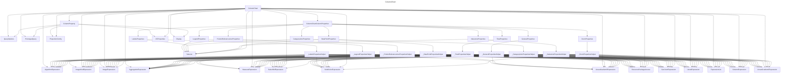

```mermaid
---
title: ColumnChart
---
graph 
2721641876416["ColumnExpression"]
2722144458080["_GeneralPropertiesHelper"]
2721641835424["LiteralExpression"]
2722144420016["_CategoryAxisPropertiesHelper"]
2721641858848["LinearGradient2Expression"]
2721641839328["AggregationExpression"]
2721641889104["GeoJsonExpression"]
2722144444416["_DataPointPropertiesHelper"]
2722076049904["QueryOptions"]
2721641891056["AlgorithmExpression"]
2721641892032["ExpressionList"]
2722144499072["_ZoomPropertiesHelper"]
2722076168976["Selector"]
2722144481504["_ValueAxisPropertiesHelper"]
2722144494192["_Y1AxisReferenceLinePropertiesHelper"]
2722144509808["ColumnChartColumnProperties"]
2721641874464["SolidColorExpression"]
2721641883248["SelectRefExpression"]
2722076123104["PrototypeQuery"]
2722144446368["LabelsProperties"]
2722144464912["_LegendPropertiesHelper"]
2722144474672["_TotalPropertiesHelper"]
2721641884224["ResourcePackageAccess"]
2722076034288["ProjectionConfig"]
2722144438560["CategoryAxisProperties"]
2722144450272["_LabelsPropertiesHelper"]
2722144461008["GeneralProperties"]
2722144467840["TotalProperties"]
2722144502000["ZoomProperties"]
2721641852016["MeasureExpression"]
2722076033312["VCProperties"]
2721641878368["ImageKindExpression"]
2722076045024["Display"]
2722144476624["LegendProperties"]
2722113511200["ColumnProperty"]
2722144491264["ValueAxisProperties"]
2721641859824["LinearGradient3Expression"]
2722144492240["Y1AxisReferenceLineProperties"]
2721641886176["ImageExpression"]
2722144508832["ColumnChart"]
2722144448320["DataPointProperties"]
2722144444416 ---> 2721641883248
2722144509808 ---> 2722144461008
2722144492240 ---> 2722076168976
2722144474672 ---> 2721641884224
2722144450272 ---> 2721641876416
2722144444416 ---> 2721641892032
2722144481504 ---> 2721641892032
2722144491264 ---> 2722144481504
2722144494192 ---> 2721641878368
2722144508832 ---> 2721641891056
2722144474672 ---> 2721641876416
2722144458080 ---> 2721641883248
2722144464912 ---> 2721641883248
2722144494192 ---> 2721641835424
2722144481504 ---> 2721641876416
2722144420016 ---> 2721641884224
2722144476624 ---> 2722076168976
2722144450272 ---> 2721641889104
2722144464912 ---> 2721641835424
2722144420016 ---> 2721641886176
2722144467840 ---> 2722144474672
2722144508832 ---> 2721641878368
2722144450272 ---> 2721641859824
2722144481504 ---> 2721641878368
2722144508832 ---> 2721641886176
2722144508832 ---> 2722076049904
2722144444416 ---> 2721641852016
2722144508832 ---> 2722076123104
2722144494192 ---> 2721641852016
2722144508832 ---> 2721641839328
2722144464912 ---> 2721641874464
2722144450272 ---> 2721641878368
2722144444416 ---> 2721641886176
2722144474672 ---> 2721641839328
2722113511200 ---> 2722076034288
2722144420016 ---> 2721641874464
2722144444416 ---> 2721641878368
2722144450272 ---> 2721641886176
2722144444416 ---> 2721641858848
2722144481504 ---> 2721641889104
2722144508832 ---> 2721641852016
2722144458080 ---> 2721641874464
2722144509808 ---> 2722144448320
2722144464912 ---> 2721641892032
2722144464912 ---> 2721641876416
2722113511200 ---> 2722076049904
2722144458080 ---> 2721641859824
2722144420016 ---> 2721641852016
2722144464912 ---> 2721641839328
2722144492240 ---> 2722144494192
2722144509808 ---> 2722144446368
2722144450272 ---> 2721641891056
2722144494192 ---> 2721641891056
2722144508832 ---> 2722144509808
2722144499072 ---> 2721641886176
2722144499072 ---> 2721641891056
2722144508832 ---> 2722076045024
2722113511200 ---> 2722076033312
2722144458080 ---> 2721641884224
2722144458080 ---> 2721641889104
2722144494192 ---> 2721641876416
2722144494192 ---> 2721641859824
2722144499072 ---> 2721641892032
2722144508832 ---> 2721641876416
2722144474672 ---> 2721641886176
2722144450272 ---> 2721641858848
2722144464912 ---> 2721641889104
2722144448320 ---> 2722144444416
2722144450272 ---> 2721641839328
2722144450272 ---> 2721641835424
2722144508832 ---> 2721641859824
2722144499072 ---> 2721641878368
2722144474672 ---> 2721641852016
2722144494192 ---> 2721641839328
2722144474672 ---> 2721641891056
2722144508832 ---> 2722113511200
2722144464912 ---> 2721641891056
2722144474672 ---> 2721641883248
2722144450272 ---> 2721641883248
2722144494192 ---> 2721641858848
2722144509808 ---> 2722144476624
2722144420016 ---> 2721641883248
2722144458080 ---> 2721641835424
2722113511200 ---> 2722076045024
2722144458080 ---> 2721641891056
2722144464912 ---> 2721641884224
2722144420016 ---> 2721641892032
2722144499072 ---> 2721641884224
2722144509808 ---> 2722144502000
2722144450272 ---> 2721641874464
2722144508832 ---> 2722076034288
2722144508832 ---> 2722076033312
2722144444416 ---> 2721641835424
2722144481504 ---> 2721641874464
2722144450272 ---> 2721641852016
2722144509808 ---> 2722144438560
2722144474672 ---> 2721641859824
2722144499072 ---> 2721641852016
2722144438560 ---> 2722144420016
2722144481504 ---> 2721641859824
2722144458080 ---> 2721641886176
2722144508832 ---> 2721641892032
2722144444416 ---> 2721641874464
2722144450272 ---> 2721641892032
2722144508832 ---> 2721641835424
2722144509808 ---> 2722144467840
2722144481504 ---> 2721641884224
2722144420016 ---> 2721641835424
2722144450272 ---> 2721641884224
2722144458080 ---> 2721641839328
2722144420016 ---> 2721641858848
2722144446368 ---> 2722144450272
2722144458080 ---> 2721641892032
2722144458080 ---> 2721641878368
2722144464912 ---> 2721641858848
2722144474672 ---> 2721641835424
2722144461008 ---> 2722144458080
2722144476624 ---> 2722144464912
2722144474672 ---> 2721641892032
2722144494192 ---> 2721641874464
2722144474672 ---> 2721641889104
2722144481504 ---> 2721641883248
2722144509808 ---> 2722144491264
2722144438560 ---> 2722076168976
2722144508832 ---> 2721641884224
2722144481504 ---> 2721641886176
2722144444416 ---> 2721641884224
2722144458080 ---> 2721641852016
2722144444416 ---> 2721641876416
2722144494192 ---> 2721641889104
2722144499072 ---> 2721641876416
2722144464912 ---> 2721641859824
2722144499072 ---> 2721641839328
2722113511200 ---> 2722076123104
2722144420016 ---> 2721641859824
2722144494192 ---> 2721641892032
2722144481504 ---> 2721641858848
2722144474672 ---> 2721641874464
2722144508832 ---> 2721641858848
2722144464912 ---> 2721641852016
2722144508832 ---> 2721641874464
2722144446368 ---> 2722076168976
2722144420016 ---> 2721641878368
2722144420016 ---> 2721641839328
2722144499072 ---> 2721641874464
2722144481504 ---> 2721641891056
2722144444416 ---> 2721641839328
2722144481504 ---> 2721641852016
2722144420016 ---> 2721641876416
2722144494192 ---> 2721641886176
2722144420016 ---> 2721641891056
2722144494192 ---> 2721641883248
2722144508832 ---> 2721641883248
2722144481504 ---> 2721641835424
2722144499072 ---> 2721641883248
2722144458080 ---> 2721641876416
2722144420016 ---> 2721641889104
2722144494192 ---> 2721641884224
2722144491264 ---> 2722076168976
2722144509808 ---> 2722144492240
2722144474672 ---> 2721641858848
2722144444416 ---> 2721641889104
2722144464912 ---> 2721641878368
2722144499072 ---> 2721641889104
2722144444416 ---> 2721641891056
2722144448320 ---> 2722076168976
2722144508832 ---> 2721641889104
2722144499072 ---> 2721641859824
2722144499072 ---> 2721641858848
2722144464912 ---> 2721641886176
2722144502000 ---> 2722144499072
2722144444416 ---> 2721641859824
2722144508832 ---> 2722076168976
2722144458080 ---> 2721641858848
2722144474672 ---> 2721641878368
2722144499072 ---> 2721641835424
2722144481504 ---> 2721641839328
```