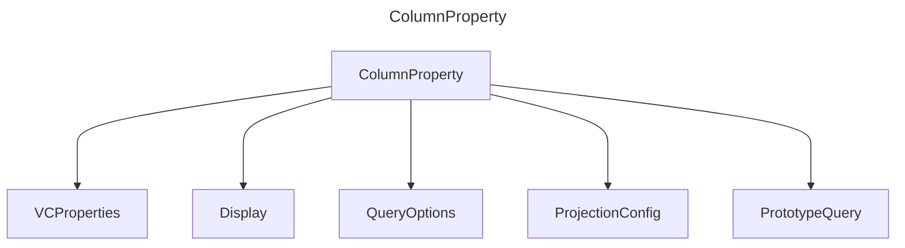

```mermaid
---
title: ColumnProperty
---
graph 
2722076034288["ProjectionConfig"]
2722076033312["VCProperties"]
2722076045024["Display"]
2722076123104["PrototypeQuery"]
2722076049904["QueryOptions"]
2722113511200["ColumnProperty"]
2722113511200 ---> 2722076033312
2722113511200 ---> 2722076045024
2722113511200 ---> 2722076049904
2722113511200 ---> 2722076034288
2722113511200 ---> 2722076123104
```