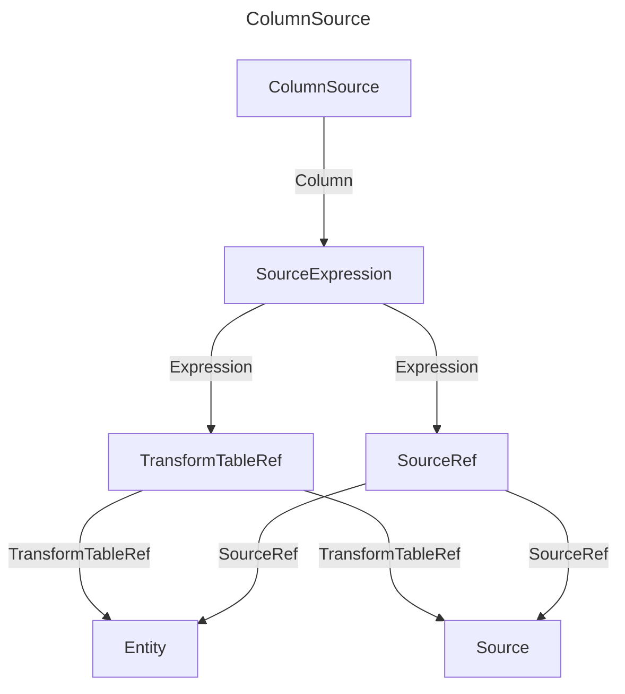

```mermaid
---
title: ColumnSource
---
graph 
2430071365824["ColumnSource"]
2430071339472["SourceExpression"]
2430071355088["SourceRef"]
2430071344352["Source"]
2430071338496["TransformTableRef"]
2430071353136["Entity"]
2430071365824 --->|Column| 2430071339472
2430071339472 --->|Expression| 2430071338496
2430071338496 --->|TransformTableRef| 2430071353136
2430071339472 --->|Expression| 2430071355088
2430071338496 --->|TransformTableRef| 2430071344352
2430071355088 --->|SourceRef| 2430071344352
2430071355088 --->|SourceRef| 2430071353136
```