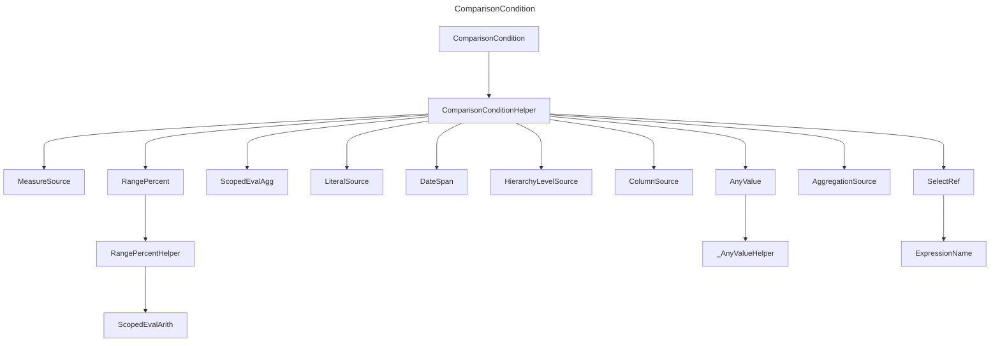

```mermaid
---
title: ComparisonCondition
---
graph 
2721642009152["MeasureSource"]
2721642086256["RangePercent"]
2721642007200["ScopedEvalAgg"]
2721642022816["LiteralSource"]
2721642080400["RangePercentHelper"]
2721642076496["DateSpan"]
2721642091136["ComparisonConditionHelper"]
2721642056976["_AnyValueHelper"]
2721642012080["HierarchyLevelSource"]
2721642030624["ScopedEvalArith"]
2721642095040["ComparisonCondition"]
2721642014032["ColumnSource"]
2721642059904["AnyValue"]
2721642013056["ExpressionName"]
2721642003296["AggregationSource"]
2721642016960["SelectRef"]
2721642095040 ---> 2721642091136
2721642091136 ---> 2721642059904
2721642016960 ---> 2721642013056
2721642091136 ---> 2721642022816
2721642091136 ---> 2721642012080
2721642086256 ---> 2721642080400
2721642091136 ---> 2721642086256
2721642091136 ---> 2721642003296
2721642091136 ---> 2721642014032
2721642059904 ---> 2721642056976
2721642091136 ---> 2721642076496
2721642080400 ---> 2721642030624
2721642091136 ---> 2721642009152
2721642091136 ---> 2721642007200
2721642091136 ---> 2721642016960
```