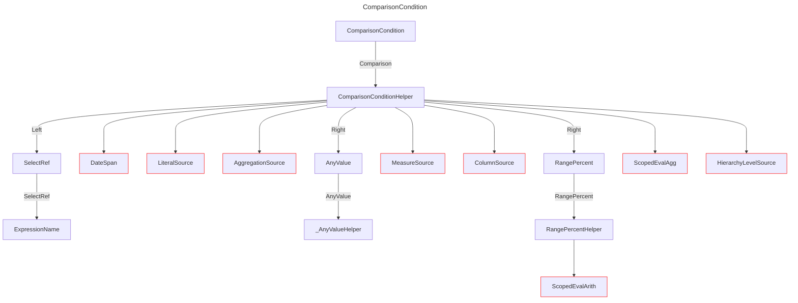

```mermaid
---
title: ComparisonCondition
---
graph 
2430071874368["ComparisonCondition"]
2430071826544["AnyValue"]
2430071852896["DateSpan"]
style 2430071852896 stroke:#ff0000,stroke-width:1px
2430071816784["LiteralSource"]
style 2430071816784 stroke:#ff0000,stroke-width:1px
2430071366800["ExpressionName"]
2430071358016["AggregationSource"]
style 2430071358016 stroke:#ff0000,stroke-width:1px
2430071858752["RangePercent"]
2430071837280["_AnyValueHelper"]
2430071359968["MeasureSource"]
style 2430071359968 stroke:#ff0000,stroke-width:1px
2430071365824["ColumnSource"]
style 2430071365824 stroke:#ff0000,stroke-width:1px
2430071356064["SelectRef"]
2430071848992["ComparisonConditionHelper"]
2430071371680["ScopedEvalAgg"]
style 2430071371680 stroke:#ff0000,stroke-width:1px
2430071848016["RangePercentHelper"]
2430071376560["ScopedEvalArith"]
style 2430071376560 stroke:#ff0000,stroke-width:1px
2430071363872["HierarchyLevelSource"]
style 2430071363872 stroke:#ff0000,stroke-width:1px
2430071848992 --->|Right| 2430071826544
2430071848992 ---> 2430071363872
2430071848992 ---> 2430071358016
2430071848992 ---> 2430071852896
2430071848992 ---> 2430071816784
2430071848992 --->|Left| 2430071356064
2430071356064 --->|SelectRef| 2430071366800
2430071848992 --->|Right| 2430071858752
2430071848016 ---> 2430071376560
2430071848992 ---> 2430071365824
2430071848992 ---> 2430071371680
2430071848992 ---> 2430071359968
2430071874368 --->|Comparison| 2430071848992
2430071826544 --->|AnyValue| 2430071837280
2430071858752 --->|RangePercent| 2430071848016
```