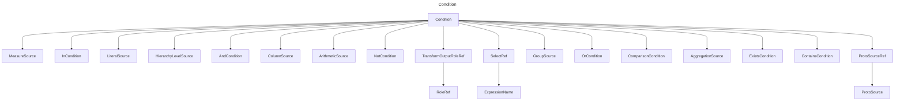

```mermaid
---
title: Condition
---
graph 
2721642009152["MeasureSource"]
2721641845184["Condition"]
2721642039408["ProtoSource"]
2721642083328["InCondition"]
2721642022816["LiteralSource"]
2721642040384["RoleRef"]
2721642012080["HierarchyLevelSource"]
2721641843232["AndCondition"]
2721642014032["ColumnSource"]
2721642013056["ExpressionName"]
2721642031600["ArithmeticSource"]
2721642084304["NotCondition"]
2721642024768["TransformOutputRoleRef"]
2721642023792["ProtoSourceRef"]
2721642035504["GroupSource"]
2721641844208["OrCondition"]
2721642095040["ComparisonCondition"]
2721642003296["AggregationSource"]
2721641850064["ExistsCondition"]
2721642068688["ContainsCondition"]
2721642016960["SelectRef"]
2721641845184 ---> 2721642068688
2721641845184 ---> 2721642014032
2721641845184 ---> 2721641843232
2721641845184 ---> 2721642035504
2721641845184 ---> 2721641850064
2721641845184 ---> 2721642024768
2721641845184 ---> 2721642003296
2721641845184 ---> 2721642009152
2721641845184 ---> 2721642022816
2721641845184 ---> 2721642031600
2721641845184 ---> 2721642083328
2721642024768 ---> 2721642040384
2721641845184 ---> 2721642016960
2721642023792 ---> 2721642039408
2721642016960 ---> 2721642013056
2721641845184 ---> 2721642095040
2721641845184 ---> 2721642023792
2721641845184 ---> 2721641844208
2721641845184 ---> 2721642012080
2721641845184 ---> 2721642084304
```