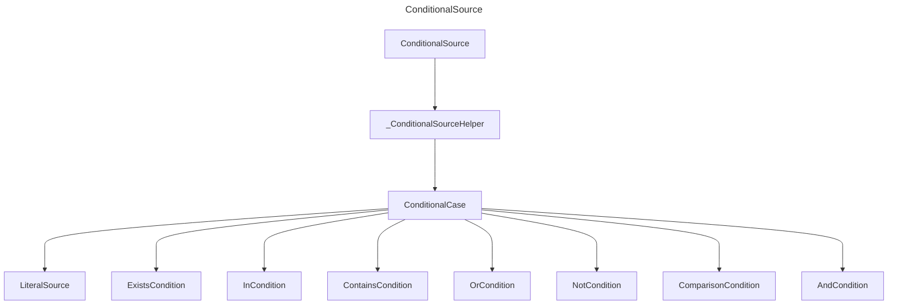

```mermaid
---
title: ConditionalSource
---
graph 
2721641856896["ConditionalCase"]
2721641843232["AndCondition"]
2721642095040["ComparisonCondition"]
2721641866656["_ConditionalSourceHelper"]
2721642083328["InCondition"]
2721642022816["LiteralSource"]
2721641850064["ExistsCondition"]
2721642084304["NotCondition"]
2721642068688["ContainsCondition"]
2721641862752["ConditionalSource"]
2721641844208["OrCondition"]
2721641866656 ---> 2721641856896
2721641856896 ---> 2721642022816
2721641856896 ---> 2721641850064
2721641856896 ---> 2721642083328
2721641862752 ---> 2721641866656
2721641856896 ---> 2721642068688
2721641856896 ---> 2721641844208
2721641856896 ---> 2721642084304
2721641856896 ---> 2721642095040
2721641856896 ---> 2721641843232
```