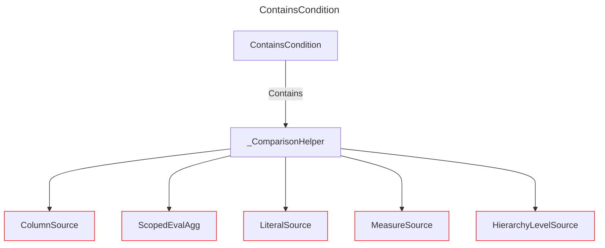

```mermaid
---
title: ContainsCondition
---
graph 
2430071846064["ContainsCondition"]
2430071365824["ColumnSource"]
style 2430071365824 stroke:#ff0000,stroke-width:1px
2430071371680["ScopedEvalAgg"]
style 2430071371680 stroke:#ff0000,stroke-width:1px
2430071816784["LiteralSource"]
style 2430071816784 stroke:#ff0000,stroke-width:1px
2430071832400["_ComparisonHelper"]
2430071363872["HierarchyLevelSource"]
style 2430071363872 stroke:#ff0000,stroke-width:1px
2430071359968["MeasureSource"]
style 2430071359968 stroke:#ff0000,stroke-width:1px
2430071832400 ---> 2430071365824
2430071846064 --->|Contains| 2430071832400
2430071832400 ---> 2430071371680
2430071832400 ---> 2430071816784
2430071832400 ---> 2430071359968
2430071832400 ---> 2430071363872
```