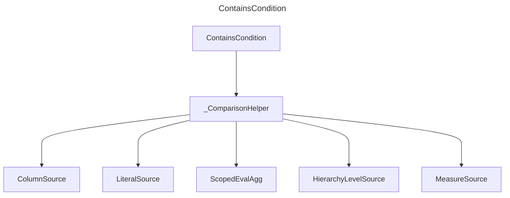

```mermaid
---
title: ContainsCondition
---
graph 
2721642060880["_ComparisonHelper"]
2721642009152["MeasureSource"]
2721642012080["HierarchyLevelSource"]
2721642007200["ScopedEvalAgg"]
2721642014032["ColumnSource"]
2721642022816["LiteralSource"]
2721642068688["ContainsCondition"]
2721642060880 ---> 2721642014032
2721642068688 ---> 2721642060880
2721642060880 ---> 2721642022816
2721642060880 ---> 2721642007200
2721642060880 ---> 2721642012080
2721642060880 ---> 2721642009152
```