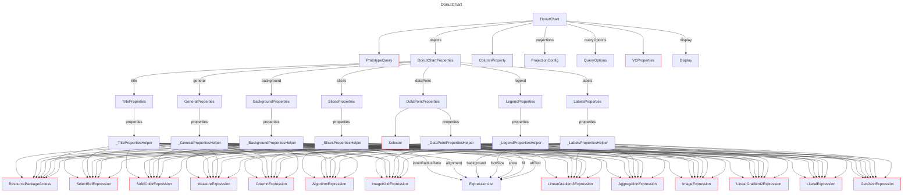

```mermaid
---
title: DonutChart
---
graph 
2430591732400["_TitlePropertiesHelper"]
2430591719712["_SlicesPropertiesHelper"]
2430071951472["PrototypeQuery"]
style 2430071951472 stroke:#ff0000,stroke-width:1px
2430071907552["SolidColorExpression"]
style 2430071907552 stroke:#ff0000,stroke-width:1px
2430591723616["DonutChartProperties"]
2430591737280["TitleProperties"]
2430071930000["AlgorithmExpression"]
style 2430071930000 stroke:#ff0000,stroke-width:1px
2430591705072["_LegendPropertiesHelper"]
2430071921216["ResourcePackageAccess"]
style 2430071921216 stroke:#ff0000,stroke-width:1px
2430071926096["ImageKindExpression"]
style 2430071926096 stroke:#ff0000,stroke-width:1px
2430552678256["ColumnProperty"]
style 2430552678256 stroke:#ff0000,stroke-width:1px
2430514799136["ProjectionConfig"]
2430071925120["ColumnExpression"]
style 2430071925120 stroke:#ff0000,stroke-width:1px
2430591716784["LegendProperties"]
2430071920240["LinearGradient2Expression"]
style 2430071920240 stroke:#ff0000,stroke-width:1px
2430071930976["ExpressionList"]
2430071910480["LinearGradient3Expression"]
style 2430071910480 stroke:#ff0000,stroke-width:1px
2430514817680["QueryOptions"]
2430591698240["_GeneralPropertiesHelper"]
2430591708976["LabelsProperties"]
2430071888032["MeasureExpression"]
style 2430071888032 stroke:#ff0000,stroke-width:1px
2430591712880["GeneralProperties"]
2430591697264["DataPointProperties"]
2430071923168["SelectRefExpression"]
style 2430071923168 stroke:#ff0000,stroke-width:1px
2430071919264["ImageExpression"]
style 2430071919264 stroke:#ff0000,stroke-width:1px
2430071745536["Selector"]
style 2430071745536 stroke:#ff0000,stroke-width:1px
2430591687504["BackgroundProperties"]
2430591729472["SlicesProperties"]
2430071889008["AggregationExpression"]
style 2430071889008 stroke:#ff0000,stroke-width:1px
2430591941264["_BackgroundPropertiesHelper"]
2430071918288["GeoJsonExpression"]
style 2430071918288 stroke:#ff0000,stroke-width:1px
2430514805968["VCProperties"]
style 2430514805968 stroke:#ff0000,stroke-width:1px
2430591728496["DonutChart"]
2430591701168["_LabelsPropertiesHelper"]
2430514810848["Display"]
2430071887056["LiteralExpression"]
style 2430071887056 stroke:#ff0000,stroke-width:1px
2430591692384["_DataPointPropertiesHelper"]
2430591705072 ---> 2430071923168
2430591723616 --->|general| 2430591712880
2430591701168 ---> 2430071887056
2430591698240 ---> 2430071930000
2430591941264 ---> 2430071926096
2430591719712 ---> 2430071907552
2430591705072 ---> 2430071888032
2430591701168 ---> 2430071921216
2430591941264 ---> 2430071919264
2430591705072 ---> 2430071907552
2430591698240 --->|altText| 2430071930976
2430591701168 ---> 2430071888032
2430591698240 ---> 2430071907552
2430591719712 ---> 2430071923168
2430591941264 ---> 2430071925120
2430591732400 ---> 2430071921216
2430591719712 ---> 2430071910480
2430591701168 ---> 2430071919264
2430591701168 ---> 2430071930000
2430591705072 ---> 2430071925120
2430591723616 --->|background| 2430591687504
2430591705072 ---> 2430071887056
2430591732400 ---> 2430071930000
2430591692384 --->|fill| 2430071930976
2430591728496 ---> 2430071951472
2430591692384 ---> 2430071889008
2430591698240 ---> 2430071888032
2430591941264 ---> 2430071910480
2430591723616 --->|legend| 2430591716784
2430591692384 ---> 2430071907552
2430591698240 ---> 2430071910480
2430591701168 ---> 2430071926096
2430591692384 ---> 2430071888032
2430591941264 --->|show| 2430071930976
2430591941264 ---> 2430071889008
2430591687504 --->|properties| 2430591941264
2430591701168 ---> 2430071923168
2430591701168 ---> 2430071910480
2430591692384 ---> 2430071921216
2430591705072 ---> 2430071919264
2430591692384 ---> 2430071923168
2430591692384 ---> 2430071930000
2430591728496 ---> 2430552678256
2430591692384 ---> 2430071925120
2430591705072 ---> 2430071920240
2430591719712 ---> 2430071926096
2430591941264 ---> 2430071907552
2430591719712 ---> 2430071925120
2430591723616 --->|title| 2430591737280
2430591719712 ---> 2430071921216
2430591705072 ---> 2430071921216
2430591698240 ---> 2430071925120
2430591719712 ---> 2430071889008
2430591701168 ---> 2430071889008
2430591716784 --->|properties| 2430591705072
2430591698240 ---> 2430071887056
2430591692384 ---> 2430071926096
2430591705072 --->|fontSize| 2430071930976
2430591705072 ---> 2430071910480
2430591705072 ---> 2430071889008
2430591701168 ---> 2430071920240
2430591732400 ---> 2430071920240
2430591732400 ---> 2430071926096
2430591723616 --->|slices| 2430591729472
2430591701168 --->|background| 2430071930976
2430591697264 --->|properties| 2430591692384
2430591941264 ---> 2430071930000
2430591692384 ---> 2430071920240
2430591698240 ---> 2430071920240
2430591719712 ---> 2430071918288
2430591732400 ---> 2430071889008
2430591732400 ---> 2430071923168
2430591728496 ---> 2430514805968
2430591719712 ---> 2430071919264
2430591728496 --->|display| 2430514810848
2430591701168 ---> 2430071918288
2430591732400 ---> 2430071888032
2430591701168 ---> 2430071907552
2430591941264 ---> 2430071921216
2430591698240 ---> 2430071923168
2430591732400 ---> 2430071925120
2430591692384 ---> 2430071918288
2430591698240 ---> 2430071919264
2430591728496 --->|projections| 2430514799136
2430591719712 ---> 2430071920240
2430591732400 ---> 2430071910480
2430591698240 ---> 2430071926096
2430591732400 ---> 2430071918288
2430591723616 --->|labels| 2430591708976
2430591692384 ---> 2430071919264
2430591941264 ---> 2430071920240
2430591941264 ---> 2430071887056
2430591701168 ---> 2430071925120
2430591698240 ---> 2430071921216
2430591732400 --->|alignment| 2430071930976
2430591712880 --->|properties| 2430591698240
2430591719712 ---> 2430071888032
2430591941264 ---> 2430071923168
2430591723616 --->|dataPoint| 2430591697264
2430591692384 ---> 2430071910480
2430591692384 ---> 2430071887056
2430591698240 ---> 2430071918288
2430591708976 --->|properties| 2430591701168
2430591705072 ---> 2430071930000
2430591728496 --->|queryOptions| 2430514817680
2430591705072 ---> 2430071918288
2430591732400 ---> 2430071887056
2430591941264 ---> 2430071888032
2430591737280 --->|properties| 2430591732400
2430591705072 ---> 2430071926096
2430591729472 --->|properties| 2430591719712
2430591697264 ---> 2430071745536
2430591719712 --->|innerRadiusRatio| 2430071930976
2430591728496 --->|objects| 2430591723616
2430591719712 ---> 2430071887056
2430591941264 ---> 2430071918288
2430591732400 ---> 2430071919264
2430591698240 ---> 2430071889008
2430591719712 ---> 2430071930000
2430591732400 ---> 2430071907552
```