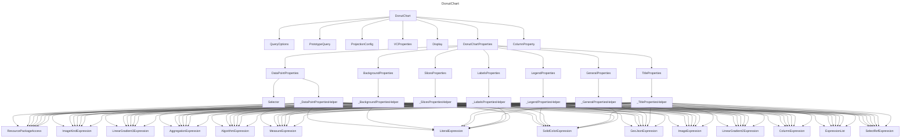

```mermaid
---
title: DonutChart
---
graph 
2721641876416["ColumnExpression"]
2721641835424["LiteralExpression"]
2721641858848["LinearGradient2Expression"]
2722144541040["LabelsProperties"]
2721641839328["AggregationExpression"]
2721641889104["GeoJsonExpression"]
2722076049904["QueryOptions"]
2722178322480["DonutChart"]
2721641891056["AlgorithmExpression"]
2721641892032["ExpressionList"]
2722076168976["Selector"]
2721641883248["SelectRefExpression"]
2722076123104["PrototypeQuery"]
2721641874464["SolidColorExpression"]
2722144546896["_TitlePropertiesHelper"]
2721641884224["ResourcePackageAccess"]
2722144505904["_DataPointPropertiesHelper"]
2722076034288["ProjectionConfig"]
2722144558608["_SlicesPropertiesHelper"]
2722144547872["TitleProperties"]
2722144516640["BackgroundProperties"]
2722144553728["SlicesProperties"]
2722144513712["_BackgroundPropertiesHelper"]
2722144544944["_LegendPropertiesHelper"]
2721641852016["MeasureExpression"]
2722076033312["VCProperties"]
2721641878368["ImageKindExpression"]
2722076045024["Display"]
2722178336144["DonutChartProperties"]
2722113511200["ColumnProperty"]
2722144538112["_LabelsPropertiesHelper"]
2722144535184["GeneralProperties"]
2721641859824["LinearGradient3Expression"]
2722144550800["LegendProperties"]
2721641886176["ImageExpression"]
2722144526400["DataPointProperties"]
2722144531280["_GeneralPropertiesHelper"]
2722144546896 ---> 2721641884224
2722144505904 ---> 2721641884224
2722144544944 ---> 2721641892032
2722144513712 ---> 2721641874464
2722144553728 ---> 2722144558608
2722144531280 ---> 2721641884224
2722144505904 ---> 2721641839328
2722144538112 ---> 2721641883248
2722144531280 ---> 2721641839328
2722144531280 ---> 2721641891056
2722144538112 ---> 2721641858848
2722144513712 ---> 2721641892032
2722144505904 ---> 2721641858848
2722144505904 ---> 2721641883248
2722178336144 ---> 2722144547872
2722144516640 ---> 2722144513712
2722178336144 ---> 2722144516640
2722144558608 ---> 2721641878368
2722144535184 ---> 2722144531280
2722144505904 ---> 2721641891056
2722144558608 ---> 2721641884224
2722144558608 ---> 2721641874464
2722144505904 ---> 2721641878368
2722144558608 ---> 2721641891056
2722144538112 ---> 2721641859824
2722144538112 ---> 2721641884224
2722144544944 ---> 2721641858848
2722178336144 ---> 2722144553728
2722144558608 ---> 2721641859824
2722144558608 ---> 2721641883248
2722144546896 ---> 2721641878368
2722144546896 ---> 2721641859824
2722144513712 ---> 2721641883248
2722144546896 ---> 2721641839328
2722144513712 ---> 2721641886176
2722144531280 ---> 2721641878368
2722178322480 ---> 2722076123104
2722144558608 ---> 2721641839328
2722144505904 ---> 2721641859824
2722144544944 ---> 2721641878368
2722144505904 ---> 2721641886176
2722144505904 ---> 2721641835424
2722178336144 ---> 2722144535184
2722144538112 ---> 2721641886176
2722144538112 ---> 2721641878368
2722178336144 ---> 2722144550800
2722144513712 ---> 2721641835424
2722178322480 ---> 2722076034288
2722144544944 ---> 2721641889104
2722144544944 ---> 2721641874464
2722144526400 ---> 2722144505904
2722144544944 ---> 2721641883248
2722178336144 ---> 2722144526400
2722144538112 ---> 2721641874464
2722144544944 ---> 2721641891056
2722144544944 ---> 2721641835424
2722144513712 ---> 2721641889104
2722144513712 ---> 2721641839328
2722144544944 ---> 2721641886176
2722144541040 ---> 2722144538112
2722144505904 ---> 2721641889104
2722144513712 ---> 2721641891056
2722144538112 ---> 2721641889104
2722144558608 ---> 2721641886176
2722144513712 ---> 2721641876416
2722178322480 ---> 2722076049904
2722144546896 ---> 2721641891056
2722144505904 ---> 2721641852016
2722144538112 ---> 2721641852016
2722144538112 ---> 2721641891056
2722144531280 ---> 2721641889104
2722144546896 ---> 2721641852016
2722144505904 ---> 2721641876416
2722144546896 ---> 2721641835424
2722144513712 ---> 2721641858848
2722144531280 ---> 2721641835424
2722144546896 ---> 2721641874464
2722144531280 ---> 2721641852016
2722144513712 ---> 2721641852016
2722144558608 ---> 2721641876416
2722144513712 ---> 2721641859824
2722144547872 ---> 2722144546896
2722144546896 ---> 2721641889104
2722178322480 ---> 2722178336144
2722144505904 ---> 2721641874464
2722144558608 ---> 2721641892032
2722144544944 ---> 2721641884224
2722144538112 ---> 2721641839328
2722144538112 ---> 2721641835424
2722144526400 ---> 2722076168976
2722144550800 ---> 2722144544944
2722144531280 ---> 2721641886176
2722144531280 ---> 2721641859824
2722144538112 ---> 2721641876416
2722144531280 ---> 2721641892032
2722144558608 ---> 2721641852016
2722144558608 ---> 2721641889104
2722178322480 ---> 2722113511200
2722144505904 ---> 2721641892032
2722144531280 ---> 2721641876416
2722144544944 ---> 2721641859824
2722144544944 ---> 2721641852016
2722144531280 ---> 2721641883248
2722178336144 ---> 2722144541040
2722144531280 ---> 2721641858848
2722144513712 ---> 2721641884224
2722144558608 ---> 2721641858848
2722144531280 ---> 2721641874464
2722144558608 ---> 2721641835424
2722144538112 ---> 2721641892032
2722144546896 ---> 2721641886176
2722178322480 ---> 2722076033312
2722178322480 ---> 2722076045024
2722144544944 ---> 2721641876416
2722144546896 ---> 2721641858848
2722144513712 ---> 2721641878368
2722144546896 ---> 2721641876416
2722144546896 ---> 2721641892032
2722144544944 ---> 2721641839328
2722144546896 ---> 2721641883248
```