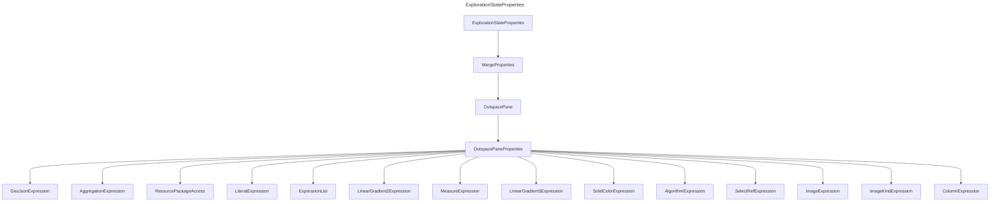

```mermaid
---
title: ExplorationStateProperties
---
graph 
2721641876416["ColumnExpression"]
2721641884224["ResourcePackageAccess"]
2721641835424["LiteralExpression"]
2722113629296["MergeProperties"]
2721641858848["LinearGradient2Expression"]
2721641852016["MeasureExpression"]
2721641839328["AggregationExpression"]
2721641878368["ImageKindExpression"]
2721641889104["GeoJsonExpression"]
2721641891056["AlgorithmExpression"]
2721641892032["ExpressionList"]
2722113615632["ExplorationStateProperties"]
2721641859824["LinearGradient3Expression"]
2722113626368["OutspacePane"]
2722113611728["OutspacePaneProperties"]
2721641886176["ImageExpression"]
2721641883248["SelectRefExpression"]
2721641874464["SolidColorExpression"]
2722113611728 ---> 2721641889104
2722113629296 ---> 2722113626368
2722113611728 ---> 2721641839328
2722113615632 ---> 2722113629296
2722113611728 ---> 2721641884224
2722113611728 ---> 2721641835424
2722113611728 ---> 2721641892032
2722113626368 ---> 2722113611728
2722113611728 ---> 2721641858848
2722113611728 ---> 2721641852016
2722113611728 ---> 2721641859824
2722113611728 ---> 2721641874464
2722113611728 ---> 2721641891056
2722113611728 ---> 2721641883248
2722113611728 ---> 2721641886176
2722113611728 ---> 2721641878368
2722113611728 ---> 2721641876416
```