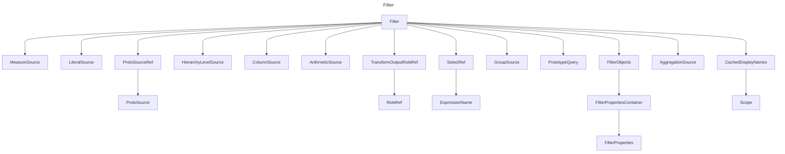

```mermaid
---
title: Filter
---
graph 
2721642009152["MeasureSource"]
2721642039408["ProtoSource"]
2721642022816["LiteralSource"]
2721642040384["RoleRef"]
2722076087968["FilterObjects"]
2721642012080["HierarchyLevelSource"]
2721641893008["FilterProperties"]
2721642014032["ColumnSource"]
2721642013056["ExpressionName"]
2721642031600["ArithmeticSource"]
2721642023792["ProtoSourceRef"]
2721642024768["TransformOutputRoleRef"]
2721642035504["GroupSource"]
2722076123104["PrototypeQuery"]
2722076109440["Filter"]
2722076124080["CachedDisplayNames"]
2721641879344["FilterPropertiesContainer"]
2722076120176["Scope"]
2721642003296["AggregationSource"]
2721642016960["SelectRef"]
2722076109440 ---> 2721642024768
2722076109440 ---> 2722076087968
2722076109440 ---> 2721642022816
2722076109440 ---> 2721642014032
2722076109440 ---> 2721642012080
2722076087968 ---> 2721641879344
2722076109440 ---> 2721642023792
2721642024768 ---> 2721642040384
2722076109440 ---> 2721642035504
2721642023792 ---> 2721642039408
2721642016960 ---> 2721642013056
2722076109440 ---> 2721642009152
2722076109440 ---> 2721642031600
2722076109440 ---> 2721642003296
2722076109440 ---> 2722076124080
2722076109440 ---> 2721642016960
2721641879344 ---> 2721641893008
2722076109440 ---> 2722076123104
2722076124080 ---> 2722076120176
```