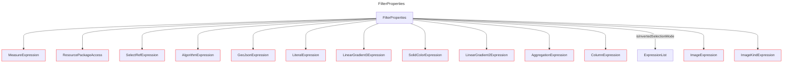

```mermaid
---
title: FilterProperties
---
graph 
2430071921216["ResourcePackageAccess"]
style 2430071921216 stroke:#ff0000,stroke-width:1px
2430071918288["GeoJsonExpression"]
style 2430071918288 stroke:#ff0000,stroke-width:1px
2430071926096["ImageKindExpression"]
style 2430071926096 stroke:#ff0000,stroke-width:1px
2430071907552["SolidColorExpression"]
style 2430071907552 stroke:#ff0000,stroke-width:1px
2430071923168["SelectRefExpression"]
style 2430071923168 stroke:#ff0000,stroke-width:1px
2430071930000["AlgorithmExpression"]
style 2430071930000 stroke:#ff0000,stroke-width:1px
2430071925120["ColumnExpression"]
style 2430071925120 stroke:#ff0000,stroke-width:1px
2430071889008["AggregationExpression"]
style 2430071889008 stroke:#ff0000,stroke-width:1px
2430071919264["ImageExpression"]
style 2430071919264 stroke:#ff0000,stroke-width:1px
2430071920240["LinearGradient2Expression"]
style 2430071920240 stroke:#ff0000,stroke-width:1px
2430071930976["ExpressionList"]
2430071887056["LiteralExpression"]
style 2430071887056 stroke:#ff0000,stroke-width:1px
2430071915360["FilterProperties"]
2430071910480["LinearGradient3Expression"]
style 2430071910480 stroke:#ff0000,stroke-width:1px
2430071888032["MeasureExpression"]
style 2430071888032 stroke:#ff0000,stroke-width:1px
2430071915360 ---> 2430071888032
2430071915360 ---> 2430071921216
2430071915360 ---> 2430071923168
2430071915360 ---> 2430071930000
2430071915360 ---> 2430071918288
2430071915360 ---> 2430071887056
2430071915360 ---> 2430071910480
2430071915360 ---> 2430071907552
2430071915360 ---> 2430071920240
2430071915360 ---> 2430071889008
2430071915360 ---> 2430071925120
2430071915360 --->|isInvertedSelectionMode| 2430071930976
2430071915360 ---> 2430071919264
2430071915360 ---> 2430071926096
```