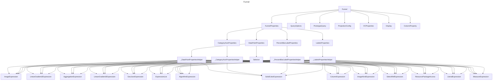

```mermaid
---
title: Funnel
---
graph 
2722178345904["_LabelsPropertiesHelper"]
2721641876416["ColumnExpression"]
2722178340048["_DataPointPropertiesHelper"]
2721641835424["LiteralExpression"]
2721641858848["LinearGradient2Expression"]
2722178362496["FunnelProperties"]
2721641839328["AggregationExpression"]
2721641889104["GeoJsonExpression"]
2722076049904["QueryOptions"]
2721641891056["AlgorithmExpression"]
2721641892032["ExpressionList"]
2722076168976["Selector"]
2721641883248["SelectRefExpression"]
2722076123104["PrototypeQuery"]
2721641874464["SolidColorExpression"]
2722178326384["_CategoryAxisPropertiesHelper"]
2721641886176["ImageExpression"]
2721641884224["ResourcePackageAccess"]
2722076034288["ProjectionConfig"]
2722178337120["CategoryAxisProperties"]
2722178355664["_PercentBarLabelPropertiesHelper"]
2721641852016["MeasureExpression"]
2722076033312["VCProperties"]
2721641878368["ImageKindExpression"]
2722076045024["Display"]
2722113511200["ColumnProperty"]
2722178357616["PercentBarLabelProperties"]
2721641859824["LinearGradient3Expression"]
2722178366400["Funnel"]
2722178342976["DataPointProperties"]
2722178351760["LabelsProperties"]
2722178337120 ---> 2722178326384
2722178355664 ---> 2721641878368
2722178340048 ---> 2721641858848
2722178362496 ---> 2722178337120
2722178366400 ---> 2722076049904
2722178345904 ---> 2721641859824
2722178326384 ---> 2721641886176
2722178362496 ---> 2722178351760
2722178345904 ---> 2721641883248
2722178345904 ---> 2721641858848
2722178355664 ---> 2721641858848
2722178342976 ---> 2722178340048
2722178340048 ---> 2721641883248
2722178326384 ---> 2721641858848
2722178366400 ---> 2722178362496
2722178326384 ---> 2721641839328
2722178345904 ---> 2721641889104
2722178351760 ---> 2722178345904
2722178355664 ---> 2721641839328
2722178345904 ---> 2721641876416
2722178355664 ---> 2721641883248
2722178355664 ---> 2721641891056
2722178326384 ---> 2721641859824
2722178340048 ---> 2721641889104
2722178326384 ---> 2721641889104
2722178340048 ---> 2721641835424
2722178345904 ---> 2721641886176
2722178362496 ---> 2722178342976
2722178326384 ---> 2721641892032
2722178326384 ---> 2721641891056
2722178340048 ---> 2721641859824
2722178355664 ---> 2721641876416
2722178345904 ---> 2721641891056
2722178355664 ---> 2721641835424
2722178340048 ---> 2721641874464
2722178362496 ---> 2722178357616
2722178340048 ---> 2721641891056
2722178326384 ---> 2721641874464
2722178326384 ---> 2721641876416
2722178345904 ---> 2721641835424
2722178366400 ---> 2722076033312
2722178357616 ---> 2722178355664
2722178340048 ---> 2721641886176
2722178355664 ---> 2721641852016
2722178355664 ---> 2721641889104
2722178326384 ---> 2721641878368
2722178366400 ---> 2722076045024
2722178345904 ---> 2721641839328
2722178340048 ---> 2721641852016
2722178326384 ---> 2721641883248
2722178340048 ---> 2721641884224
2722178366400 ---> 2722113511200
2722178340048 ---> 2721641876416
2722178340048 ---> 2721641878368
2722178326384 ---> 2721641884224
2722178366400 ---> 2722076034288
2722178355664 ---> 2721641892032
2722178326384 ---> 2721641835424
2722178355664 ---> 2721641884224
2722178345904 ---> 2721641878368
2722178355664 ---> 2721641874464
2722178326384 ---> 2721641852016
2722178355664 ---> 2721641886176
2722178345904 ---> 2721641852016
2722178355664 ---> 2721641859824
2722178340048 ---> 2721641892032
2722178345904 ---> 2721641892032
2722178366400 ---> 2722076123104
2722178345904 ---> 2721641874464
2722178340048 ---> 2721641839328
2722178345904 ---> 2721641884224
2722178342976 ---> 2722076168976
```