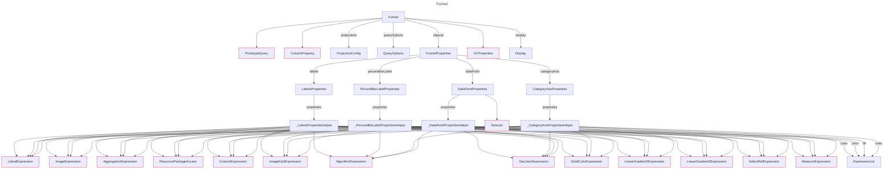

```mermaid
---
title: Funnel
---
graph 
2430071951472["PrototypeQuery"]
style 2430071951472 stroke:#ff0000,stroke-width:1px
2430071907552["SolidColorExpression"]
style 2430071907552 stroke:#ff0000,stroke-width:1px
2430591749968["LabelsProperties"]
2430071930000["AlgorithmExpression"]
style 2430071930000 stroke:#ff0000,stroke-width:1px
2430071921216["ResourcePackageAccess"]
style 2430071921216 stroke:#ff0000,stroke-width:1px
2430071926096["ImageKindExpression"]
style 2430071926096 stroke:#ff0000,stroke-width:1px
2430552678256["ColumnProperty"]
style 2430552678256 stroke:#ff0000,stroke-width:1px
2430514799136["ProjectionConfig"]
2430071925120["ColumnExpression"]
style 2430071925120 stroke:#ff0000,stroke-width:1px
2430591758752["_LabelsPropertiesHelper"]
2430071920240["LinearGradient2Expression"]
style 2430071920240 stroke:#ff0000,stroke-width:1px
2430071930976["ExpressionList"]
2430591760704["CategoryAxisProperties"]
2430071910480["LinearGradient3Expression"]
style 2430071910480 stroke:#ff0000,stroke-width:1px
2430514817680["QueryOptions"]
2430071888032["MeasureExpression"]
style 2430071888032 stroke:#ff0000,stroke-width:1px
2430591778272["PercentBarLabelProperties"]
2430591753872["_DataPointPropertiesHelper"]
2430591780224["FunnelProperties"]
2430071923168["SelectRefExpression"]
style 2430071923168 stroke:#ff0000,stroke-width:1px
2430591727520["_CategoryAxisPropertiesHelper"]
2430071919264["ImageExpression"]
style 2430071919264 stroke:#ff0000,stroke-width:1px
2430071745536["Selector"]
style 2430071745536 stroke:#ff0000,stroke-width:1px
2430591748016["DataPointProperties"]
2430071889008["AggregationExpression"]
style 2430071889008 stroke:#ff0000,stroke-width:1px
2430591766560["_PercentBarLabelPropertiesHelper"]
2430071918288["GeoJsonExpression"]
style 2430071918288 stroke:#ff0000,stroke-width:1px
2430514805968["VCProperties"]
style 2430514805968 stroke:#ff0000,stroke-width:1px
2430514810848["Display"]
2430071887056["LiteralExpression"]
style 2430071887056 stroke:#ff0000,stroke-width:1px
2430591777296["Funnel"]
2430591766560 ---> 2430071907552
2430591758752 ---> 2430071930000
2430591753872 ---> 2430071918288
2430591758752 ---> 2430071921216
2430591777296 --->|objects| 2430591780224
2430591780224 --->|categoryAxis| 2430591760704
2430591766560 ---> 2430071887056
2430591727520 ---> 2430071887056
2430591727520 ---> 2430071919264
2430591753872 ---> 2430071889008
2430591727520 ---> 2430071889008
2430591766560 ---> 2430071888032
2430591758752 ---> 2430071926096
2430591780224 --->|dataPoint| 2430591748016
2430591766560 --->|color| 2430071930976
2430591777296 ---> 2430552678256
2430591760704 --->|properties| 2430591727520
2430591766560 ---> 2430071926096
2430591758752 ---> 2430071920240
2430591753872 ---> 2430071887056
2430591753872 ---> 2430071923168
2430591727520 ---> 2430071921216
2430591777296 --->|projections| 2430514799136
2430591758752 --->|color| 2430071930976
2430591777296 ---> 2430514805968
2430591753872 ---> 2430071910480
2430591758752 ---> 2430071889008
2430591749968 --->|properties| 2430591758752
2430591766560 ---> 2430071925120
2430591727520 ---> 2430071925120
2430591748016 ---> 2430071745536
2430591758752 ---> 2430071888032
2430591727520 ---> 2430071926096
2430591758752 ---> 2430071910480
2430591748016 --->|properties| 2430591753872
2430591753872 ---> 2430071925120
2430591766560 ---> 2430071930000
2430591766560 ---> 2430071910480
2430591758752 ---> 2430071907552
2430591780224 --->|percentBarLabel| 2430591778272
2430591766560 ---> 2430071889008
2430591727520 ---> 2430071930000
2430591727520 ---> 2430071918288
2430591753872 ---> 2430071930000
2430591753872 ---> 2430071920240
2430591753872 ---> 2430071888032
2430591758752 ---> 2430071918288
2430591780224 --->|labels| 2430591749968
2430591758752 ---> 2430071919264
2430591777296 --->|queryOptions| 2430514817680
2430591727520 ---> 2430071907552
2430591766560 ---> 2430071920240
2430591766560 ---> 2430071919264
2430591727520 ---> 2430071920240
2430591777296 ---> 2430071951472
2430591758752 ---> 2430071887056
2430591753872 ---> 2430071926096
2430591753872 ---> 2430071919264
2430591727520 ---> 2430071910480
2430591766560 ---> 2430071923168
2430591766560 ---> 2430071918288
2430591766560 ---> 2430071921216
2430591778272 --->|properties| 2430591766560
2430591758752 ---> 2430071923168
2430591753872 ---> 2430071921216
2430591777296 --->|display| 2430514810848
2430591727520 ---> 2430071923168
2430591727520 ---> 2430071888032
2430591753872 --->|fill| 2430071930976
2430591753872 ---> 2430071907552
2430591727520 --->|color| 2430071930976
2430591758752 ---> 2430071925120
```