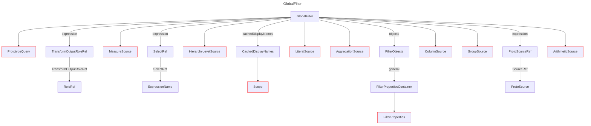

```mermaid
---
title: GlobalFilter
---
graph 
2430071820688["RoleRef"]
2430071951472["PrototypeQuery"]
style 2430071951472 stroke:#ff0000,stroke-width:1px
2430071814832["TransformOutputRoleRef"]
2430071366800["ExpressionName"]
2430071359968["MeasureSource"]
style 2430071359968 stroke:#ff0000,stroke-width:1px
2430071356064["SelectRef"]
2430071363872["HierarchyLevelSource"]
style 2430071363872 stroke:#ff0000,stroke-width:1px
2430071944640["FilterObjects"]
2430071816784["LiteralSource"]
style 2430071816784 stroke:#ff0000,stroke-width:1px
2430071960256["Scope"]
style 2430071960256 stroke:#ff0000,stroke-width:1px
2430071358016["AggregationSource"]
style 2430071358016 stroke:#ff0000,stroke-width:1px
2430071933904["FilterPropertiesContainer"]
2430071825568["ProtoSourceRef"]
2430071365824["ColumnSource"]
style 2430071365824 stroke:#ff0000,stroke-width:1px
2430071754320["GlobalFilter"]
2430071808976["GroupSource"]
style 2430071808976 stroke:#ff0000,stroke-width:1px
2430071819712["ProtoSource"]
2430071973920["CachedDisplayNames"]
2430071915360["FilterProperties"]
style 2430071915360 stroke:#ff0000,stroke-width:1px
2430071382416["ArithmeticSource"]
style 2430071382416 stroke:#ff0000,stroke-width:1px
2430071754320 ---> 2430071382416
2430071933904 ---> 2430071915360
2430071754320 ---> 2430071951472
2430071754320 ---> 2430071365824
2430071754320 --->|expression| 2430071356064
2430071754320 ---> 2430071363872
2430071825568 --->|SourceRef| 2430071819712
2430071754320 --->|expression| 2430071814832
2430071754320 --->|expression| 2430071825568
2430071754320 --->|objects| 2430071944640
2430071814832 --->|TransformOutputRoleRef| 2430071820688
2430071944640 --->|general| 2430071933904
2430071754320 ---> 2430071808976
2430071973920 ---> 2430071960256
2430071754320 ---> 2430071358016
2430071356064 --->|SelectRef| 2430071366800
2430071754320 --->|cachedDisplayNames| 2430071973920
2430071754320 ---> 2430071359968
2430071754320 ---> 2430071816784
```