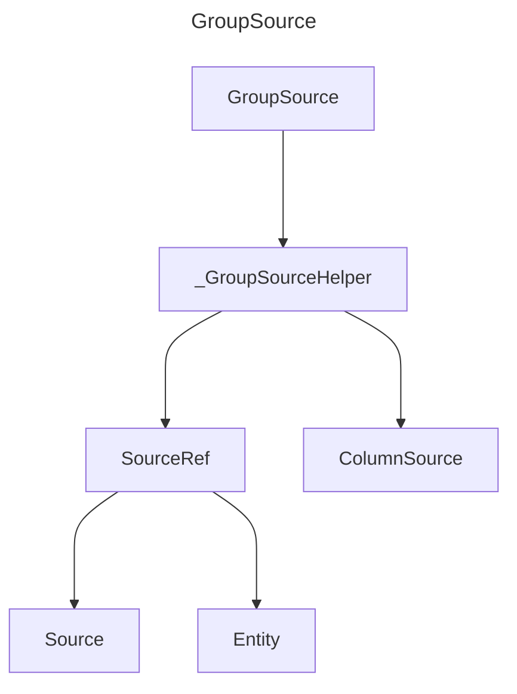

```mermaid
---
title: GroupSource
---
graph 
2721642000368["SourceRef"]
2721642014032["ColumnSource"]
2721641985728["Entity"]
2721642026720["_GroupSourceHelper"]
2721641982800["Source"]
2721642035504["GroupSource"]
2721642026720 ---> 2721642014032
2721642000368 ---> 2721641982800
2721642035504 ---> 2721642026720
2721642000368 ---> 2721641985728
2721642026720 ---> 2721642000368
```