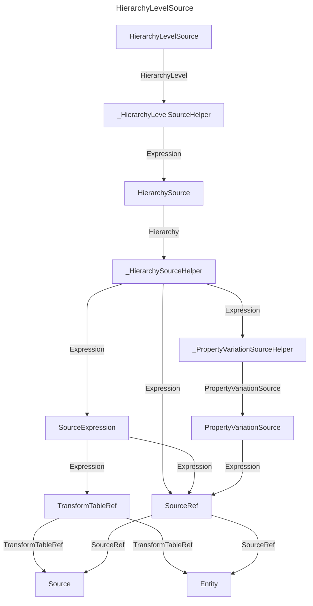

```mermaid
---
title: HierarchyLevelSource
---
graph 
2430071339472["SourceExpression"]
2430071370704["PropertyVariationSource"]
2430071367776["_PropertyVariationSourceHelper"]
2430071358992["_HierarchySourceHelper"]
2430071355088["SourceRef"]
2430071344352["Source"]
2430071368752["HierarchySource"]
2430071364848["_HierarchyLevelSourceHelper"]
2430071338496["TransformTableRef"]
2430071363872["HierarchyLevelSource"]
2430071353136["Entity"]
2430071358992 --->|Expression| 2430071355088
2430071339472 --->|Expression| 2430071338496
2430071368752 --->|Hierarchy| 2430071358992
2430071338496 --->|TransformTableRef| 2430071353136
2430071363872 --->|HierarchyLevel| 2430071364848
2430071339472 --->|Expression| 2430071355088
2430071358992 --->|Expression| 2430071339472
2430071367776 --->|PropertyVariationSource| 2430071370704
2430071338496 --->|TransformTableRef| 2430071344352
2430071364848 --->|Expression| 2430071368752
2430071355088 --->|SourceRef| 2430071344352
2430071358992 --->|Expression| 2430071367776
2430071370704 --->|Expression| 2430071355088
2430071355088 --->|SourceRef| 2430071353136
```