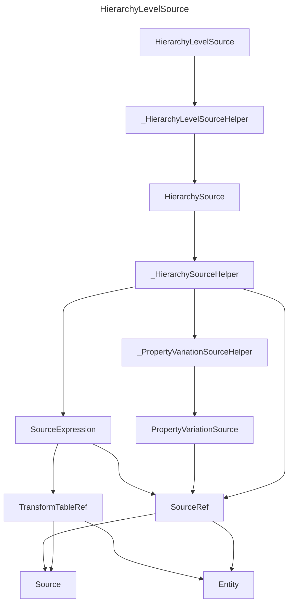

```mermaid
---
title: HierarchyLevelSource
---
graph 
2721642012080["HierarchyLevelSource"]
2721641999392["TransformTableRef"]
2721642000368["SourceRef"]
2721641985728["Entity"]
2721642006224["_PropertyVariationSourceHelper"]
2721642010128["_HierarchyLevelSourceHelper"]
2721642015984["HierarchySource"]
2721642015008["_HierarchySourceHelper"]
2721642011104["PropertyVariationSource"]
2721641982800["Source"]
2721641984752["SourceExpression"]
2721641984752 ---> 2721642000368
2721641984752 ---> 2721641999392
2721641999392 ---> 2721641985728
2721642012080 ---> 2721642010128
2721642015008 ---> 2721642006224
2721642000368 ---> 2721641982800
2721642000368 ---> 2721641985728
2721641999392 ---> 2721641982800
2721642006224 ---> 2721642011104
2721642010128 ---> 2721642015984
2721642011104 ---> 2721642000368
2721642015008 ---> 2721641984752
2721642015984 ---> 2721642015008
2721642015008 ---> 2721642000368
```