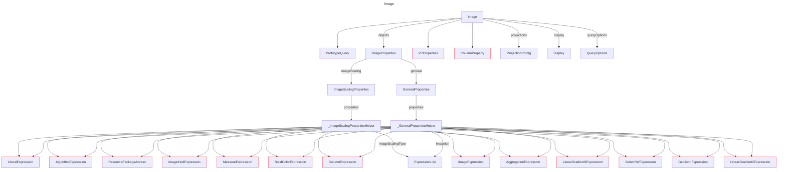

```mermaid
---
title: Image
---
graph 
2430591796816["GeneralProperties"]
2430071910480["LinearGradient3Expression"]
style 2430071910480 stroke:#ff0000,stroke-width:1px
2430071951472["PrototypeQuery"]
style 2430071951472 stroke:#ff0000,stroke-width:1px
2430591789984["Image"]
2430071907552["SolidColorExpression"]
style 2430071907552 stroke:#ff0000,stroke-width:1px
2430071923168["SelectRefExpression"]
style 2430071923168 stroke:#ff0000,stroke-width:1px
2430071930000["AlgorithmExpression"]
style 2430071930000 stroke:#ff0000,stroke-width:1px
2430591802672["ImageProperties"]
2430071919264["ImageExpression"]
style 2430071919264 stroke:#ff0000,stroke-width:1px
2430591792912["_ImageScalingPropertiesHelper"]
2430071889008["AggregationExpression"]
style 2430071889008 stroke:#ff0000,stroke-width:1px
2430071888032["MeasureExpression"]
style 2430071888032 stroke:#ff0000,stroke-width:1px
2430071921216["ResourcePackageAccess"]
style 2430071921216 stroke:#ff0000,stroke-width:1px
2430071926096["ImageKindExpression"]
style 2430071926096 stroke:#ff0000,stroke-width:1px
2430071918288["GeoJsonExpression"]
style 2430071918288 stroke:#ff0000,stroke-width:1px
2430514805968["VCProperties"]
style 2430514805968 stroke:#ff0000,stroke-width:1px
2430591774368["_GeneralPropertiesHelper"]
2430552678256["ColumnProperty"]
style 2430552678256 stroke:#ff0000,stroke-width:1px
2430514799136["ProjectionConfig"]
2430071925120["ColumnExpression"]
style 2430071925120 stroke:#ff0000,stroke-width:1px
2430071920240["LinearGradient2Expression"]
style 2430071920240 stroke:#ff0000,stroke-width:1px
2430514810848["Display"]
2430071930976["ExpressionList"]
2430071887056["LiteralExpression"]
style 2430071887056 stroke:#ff0000,stroke-width:1px
2430591798768["ImageScalingProperties"]
2430514817680["QueryOptions"]
2430591792912 ---> 2430071887056
2430591774368 ---> 2430071919264
2430591774368 ---> 2430071920240
2430591792912 ---> 2430071930000
2430591792912 ---> 2430071921216
2430591774368 ---> 2430071923168
2430591792912 ---> 2430071926096
2430591774368 ---> 2430071926096
2430591792912 ---> 2430071888032
2430591792912 ---> 2430071907552
2430591792912 ---> 2430071925120
2430591792912 --->|imageScalingType| 2430071930976
2430591789984 ---> 2430514805968
2430591792912 ---> 2430071919264
2430591789984 ---> 2430552678256
2430591789984 --->|projections| 2430514799136
2430591774368 ---> 2430071921216
2430591774368 ---> 2430071910480
2430591789984 --->|objects| 2430591802672
2430591802672 --->|imageScaling| 2430591798768
2430591796816 --->|properties| 2430591774368
2430591792912 ---> 2430071889008
2430591774368 ---> 2430071887056
2430591792912 ---> 2430071910480
2430591774368 ---> 2430071889008
2430591774368 ---> 2430071918288
2430591789984 ---> 2430071951472
2430591774368 ---> 2430071888032
2430591802672 --->|general| 2430591796816
2430591774368 ---> 2430071925120
2430591789984 --->|queryOptions| 2430514817680
2430591774368 ---> 2430071907552
2430591798768 --->|properties| 2430591792912
2430591774368 ---> 2430071930000
2430591792912 ---> 2430071923168
2430591774368 --->|imageUrl| 2430071930976
2430591789984 --->|display| 2430514810848
2430591792912 ---> 2430071918288
2430591792912 ---> 2430071920240
```