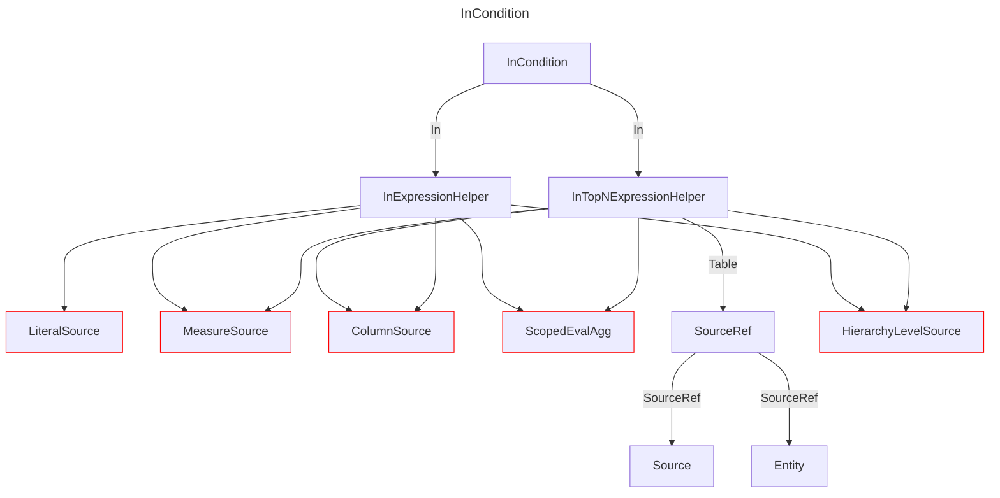

```mermaid
---
title: InCondition
---
graph 
2430071816784["LiteralSource"]
style 2430071816784 stroke:#ff0000,stroke-width:1px
2430071861680["InTopNExpressionHelper"]
2430071353136["Entity"]
2430071359968["MeasureSource"]
style 2430071359968 stroke:#ff0000,stroke-width:1px
2430071365824["ColumnSource"]
style 2430071365824 stroke:#ff0000,stroke-width:1px
2430071835328["InExpressionHelper"]
2430071371680["ScopedEvalAgg"]
style 2430071371680 stroke:#ff0000,stroke-width:1px
2430071355088["SourceRef"]
2430071344352["Source"]
2430071363872["HierarchyLevelSource"]
style 2430071363872 stroke:#ff0000,stroke-width:1px
2430071854848["InCondition"]
2430071835328 ---> 2430071365824
2430071861680 ---> 2430071365824
2430071854848 --->|In| 2430071861680
2430071854848 --->|In| 2430071835328
2430071861680 ---> 2430071359968
2430071835328 ---> 2430071359968
2430071861680 ---> 2430071371680
2430071835328 ---> 2430071371680
2430071355088 --->|SourceRef| 2430071344352
2430071835328 ---> 2430071816784
2430071861680 --->|Table| 2430071355088
2430071861680 ---> 2430071363872
2430071355088 --->|SourceRef| 2430071353136
2430071835328 ---> 2430071363872
```