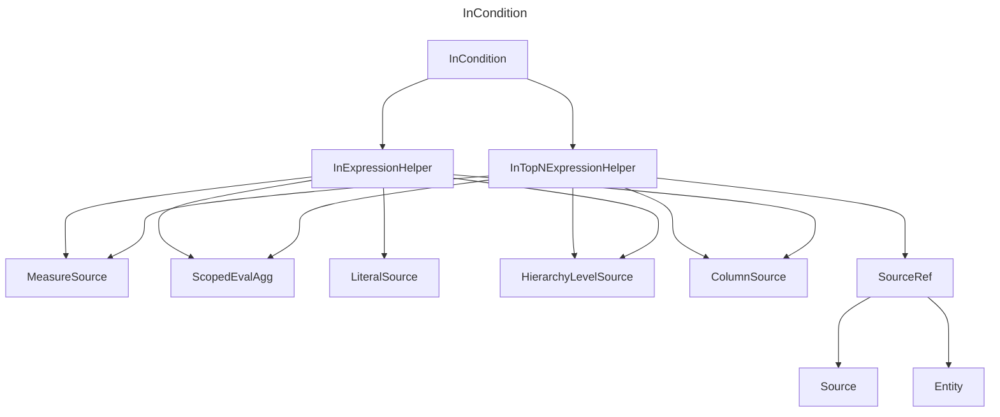

```mermaid
---
title: InCondition
---
graph 
2721642009152["MeasureSource"]
2721642007200["ScopedEvalAgg"]
2721641985728["Entity"]
2721642083328["InCondition"]
2721642022816["LiteralSource"]
2721642012080["HierarchyLevelSource"]
2721642014032["ColumnSource"]
2721642056000["InTopNExpressionHelper"]
2721642000368["SourceRef"]
2721642054048["InExpressionHelper"]
2721641982800["Source"]
2721642056000 ---> 2721642014032
2721642056000 ---> 2721642012080
2721642056000 ---> 2721642000368
2721642054048 ---> 2721642009152
2721642083328 ---> 2721642054048
2721642083328 ---> 2721642056000
2721642056000 ---> 2721642009152
2721642054048 ---> 2721642014032
2721642054048 ---> 2721642007200
2721642000368 ---> 2721641982800
2721642000368 ---> 2721641985728
2721642054048 ---> 2721642012080
2721642056000 ---> 2721642007200
2721642054048 ---> 2721642022816
```