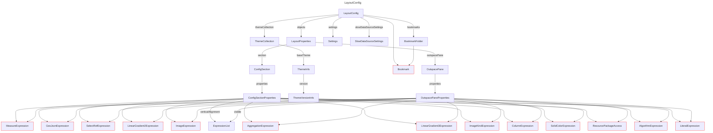

```mermaid
---
title: LayoutConfig
---
graph 
2430693834176["OutspacePaneProperties"]
2430693823440["LayoutProperties"]
2430693833200["ConfigSection"]
2430071907552["SolidColorExpression"]
style 2430071907552 stroke:#ff0000,stroke-width:1px
2430693815632["ThemeCollection"]
2430693803920["Settings"]
2430071930000["AlgorithmExpression"]
style 2430071930000 stroke:#ff0000,stroke-width:1px
2430071921216["ResourcePackageAccess"]
style 2430071921216 stroke:#ff0000,stroke-width:1px
2430071926096["ImageKindExpression"]
style 2430071926096 stroke:#ff0000,stroke-width:1px
2430693820512["SlowDataSourceSettings"]
2430071925120["ColumnExpression"]
style 2430071925120 stroke:#ff0000,stroke-width:1px
2430693810752["ThemeVersionInfo"]
2430514889904["BookmarkFolder"]
2430071920240["LinearGradient2Expression"]
style 2430071920240 stroke:#ff0000,stroke-width:1px
2430071930976["ExpressionList"]
2430071910480["LinearGradient3Expression"]
style 2430071910480 stroke:#ff0000,stroke-width:1px
2430071888032["MeasureExpression"]
style 2430071888032 stroke:#ff0000,stroke-width:1px
2430693831248["OutspacePane"]
2430071923168["SelectRefExpression"]
style 2430071923168 stroke:#ff0000,stroke-width:1px
2430071919264["ImageExpression"]
style 2430071919264 stroke:#ff0000,stroke-width:1px
2430693829296["ConfigSectionProperties"]
2430071889008["AggregationExpression"]
style 2430071889008 stroke:#ff0000,stroke-width:1px
2430071918288["GeoJsonExpression"]
style 2430071918288 stroke:#ff0000,stroke-width:1px
2430693841984["LayoutConfig"]
2430514883072["Bookmark"]
style 2430514883072 stroke:#ff0000,stroke-width:1px
2430071887056["LiteralExpression"]
style 2430071887056 stroke:#ff0000,stroke-width:1px
2430693813680["ThemeInfo"]
2430693834176 ---> 2430071888032
2430693834176 ---> 2430071918288
2430693829296 ---> 2430071888032
2430693829296 ---> 2430071918288
2430693829296 ---> 2430071923168
2430693829296 ---> 2430071920240
2430693823440 --->|section| 2430693833200
2430693829296 ---> 2430071919264
2430693829296 --->|verticalAlignment| 2430071930976
2430693841984 ---> 2430514883072
2430693833200 --->|properties| 2430693829296
2430693829296 ---> 2430071889008
2430693823440 --->|outspacePane| 2430693831248
2430693829296 ---> 2430071910480
2430693834176 ---> 2430071907552
2430693834176 ---> 2430071923168
2430693829296 ---> 2430071926096
2430693834176 ---> 2430071930000
2430693834176 ---> 2430071920240
2430693834176 ---> 2430071887056
2430693813680 --->|version| 2430693810752
2430693841984 --->|slowDataSourceSettings| 2430693820512
2430693829296 ---> 2430071925120
2430693829296 ---> 2430071907552
2430693834176 ---> 2430071919264
2430693841984 --->|objects| 2430693823440
2430693815632 --->|baseTheme| 2430693813680
2430693841984 --->|settings| 2430693803920
2430693841984 --->|themeCollection| 2430693815632
2430514889904 ---> 2430514883072
2430693829296 ---> 2430071921216
2430693834176 ---> 2430071925120
2430693834176 --->|visible| 2430071930976
2430693834176 ---> 2430071926096
2430693831248 --->|properties| 2430693834176
2430693829296 ---> 2430071930000
2430693834176 ---> 2430071921216
2430693834176 ---> 2430071889008
2430693834176 ---> 2430071910480
2430693841984 --->|bookmarks| 2430514889904
2430693829296 ---> 2430071887056
```