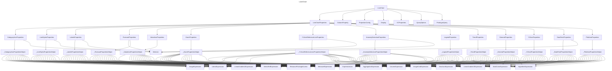

```mermaid
---
title: LineChart
---
graph 
2722178449360["_PlotAreaPropertiesHelper"]
2722178422032["_ForecastPropertiesHelper"]
2721641835424["LiteralExpression"]
2722178428864["_LegendPropertiesHelper"]
2722178226832["Y1AxisReferenceLineProperties"]
2722178431792["GeneralProperties"]
2721641858848["LinearGradient2Expression"]
2721641839328["AggregationExpression"]
2722178403488["_CategoryAxisPropertiesHelper"]
2721641889104["GeoJsonExpression"]
2722076049904["QueryOptions"]
2722178210240["_ValueAxisPropertiesHelper"]
2722076168976["Selector"]
2722178450336["_LineStylesPropertiesHelper"]
2721641883248["SelectRefExpression"]
2721641874464["SolidColorExpression"]
2722178242448["LineChart"]
2721641884224["ResourcePackageAccess"]
2722178222928["_Y2AxisPropertiesHelper"]
2722076034288["ProjectionConfig"]
2722178456192["LineStylesProperties"]
2722178213168["ValueAxisProperties"]
2722178445456["LegendProperties"]
2722178405440["CategoryAxisProperties"]
2722178195600["_TrendPropertiesHelper"]
2721641852016["MeasureExpression"]
2722113511200["ColumnProperty"]
2722178408368["ForecastProperties"]
2722178430816["LabelsProperties"]
2722178237568["ZoomProperties"]
2722178233664["_ZoomPropertiesHelper"]
2721641859824["LinearGradient3Expression"]
2722178201456["PlotAreaProperties"]
2721641886176["ImageExpression"]
2721641876416["ColumnExpression"]
2722178434720["_LabelsPropertiesHelper"]
2722178435696["_GeneralPropertiesHelper"]
2722178214144["Y2AxisProperties"]
2721641891056["AlgorithmExpression"]
2721641892032["ExpressionList"]
2722076123104["PrototypeQuery"]
2722178386896["AnomalyDetectionProperties"]
2722178240496["LineChartProperties"]
2722178407392["_DataPointPropertiesHelper"]
2722178421056["DataPointProperties"]
2722076033312["VCProperties"]
2721641878368["ImageKindExpression"]
2722076045024["Display"]
2722178227808["_Y1AxisReferenceLinePropertiesHelper"]
2722178197552["TrendProperties"]
2722178385920["_AnomalyDetectionPropertiesHelper"]
2722178240496 ---> 2722178405440
2722178222928 ---> 2721641876416
2722178195600 ---> 2721641858848
2722178227808 ---> 2721641884224
2722178428864 ---> 2721641883248
2722178227808 ---> 2721641852016
2722178227808 ---> 2721641886176
2722178434720 ---> 2721641889104
2722178210240 ---> 2721641883248
2722178445456 ---> 2722178428864
2722178210240 ---> 2721641884224
2722178195600 ---> 2721641876416
2722178435696 ---> 2721641859824
2722178450336 ---> 2721641858848
2722178407392 ---> 2721641886176
2722178422032 ---> 2721641874464
2722178407392 ---> 2721641878368
2722178428864 ---> 2721641878368
2722178403488 ---> 2721641858848
2722178407392 ---> 2721641839328
2722178213168 ---> 2722178210240
2722178242448 ---> 2722178240496
2722178227808 ---> 2721641835424
2722178450336 ---> 2721641892032
2722178422032 ---> 2721641835424
2722178242448 ---> 2722113511200
2722178222928 ---> 2721641886176
2722178227808 ---> 2721641858848
2722178403488 ---> 2721641891056
2722178428864 ---> 2721641886176
2722178210240 ---> 2721641852016
2722178450336 ---> 2721641852016
2722178430816 ---> 2722178434720
2722178385920 ---> 2721641835424
2722178201456 ---> 2722178449360
2722178240496 ---> 2722178456192
2722178403488 ---> 2721641835424
2722178210240 ---> 2721641839328
2722178403488 ---> 2721641884224
2722178422032 ---> 2721641889104
2722178422032 ---> 2721641858848
2722178195600 ---> 2721641892032
2722178434720 ---> 2721641883248
2722178422032 ---> 2721641839328
2722178233664 ---> 2721641839328
2722178422032 ---> 2721641886176
2722178435696 ---> 2721641835424
2722178407392 ---> 2721641892032
2722178227808 ---> 2721641859824
2722178233664 ---> 2721641886176
2722178428864 ---> 2721641835424
2722178403488 ---> 2721641886176
2722178422032 ---> 2721641878368
2722178449360 ---> 2721641852016
2722178449360 ---> 2721641835424
2722178385920 ---> 2721641859824
2722178449360 ---> 2721641883248
2722178407392 ---> 2721641891056
2722178240496 ---> 2722178430816
2722178435696 ---> 2721641884224
2722178233664 ---> 2721641892032
2722178222928 ---> 2721641884224
2722178434720 ---> 2721641892032
2722178450336 ---> 2721641883248
2722178449360 ---> 2721641858848
2722178385920 ---> 2721641839328
2722178449360 ---> 2721641878368
2722178240496 ---> 2722178408368
2722178227808 ---> 2721641889104
2722178210240 ---> 2721641878368
2722178450336 ---> 2721641889104
2722178386896 ---> 2722178385920
2722178435696 ---> 2721641876416
2722178385920 ---> 2721641852016
2722178227808 ---> 2721641892032
2722178422032 ---> 2721641883248
2722178195600 ---> 2721641891056
2722178210240 ---> 2721641859824
2722178385920 ---> 2721641886176
2722178428864 ---> 2721641884224
2722178222928 ---> 2721641874464
2722178422032 ---> 2721641892032
2722178195600 ---> 2721641874464
2722178195600 ---> 2721641884224
2722178407392 ---> 2721641859824
2722178233664 ---> 2721641878368
2722178456192 ---> 2722178450336
2722178434720 ---> 2721641835424
2722178242448 ---> 2722076034288
2722178434720 ---> 2721641886176
2722178233664 ---> 2721641874464
2722178227808 ---> 2721641891056
2722178222928 ---> 2721641835424
2722178435696 ---> 2721641886176
2722178222928 ---> 2721641859824
2722178428864 ---> 2721641876416
2722178435696 ---> 2721641858848
2722178428864 ---> 2721641874464
2722178195600 ---> 2721641883248
2722178450336 ---> 2721641876416
2722178428864 ---> 2721641839328
2722178434720 ---> 2721641884224
2722178226832 ---> 2722178227808
2722178227808 ---> 2721641883248
2722178421056 ---> 2722178407392
2722178197552 ---> 2722178195600
2722178240496 ---> 2722178213168
2722178450336 ---> 2721641835424
2722178407392 ---> 2721641876416
2722178240496 ---> 2722178237568
2722178449360 ---> 2721641892032
2722178385920 ---> 2721641883248
2722178435696 ---> 2721641874464
2722178407392 ---> 2721641889104
2722178240496 ---> 2722178226832
2722178428864 ---> 2721641891056
2722178408368 ---> 2722076168976
2722178195600 ---> 2721641886176
2722178422032 ---> 2721641876416
2722178405440 ---> 2722178403488
2722178450336 ---> 2721641886176
2722178450336 ---> 2721641878368
2722178237568 ---> 2722178233664
2722178407392 ---> 2721641874464
2722178428864 ---> 2721641852016
2722178385920 ---> 2721641878368
2722178195600 ---> 2721641889104
2722178434720 ---> 2721641852016
2722178195600 ---> 2721641852016
2722178195600 ---> 2721641839328
2722178385920 ---> 2721641892032
2722178195600 ---> 2721641859824
2722178450336 ---> 2721641859824
2722178210240 ---> 2721641892032
2722178385920 ---> 2721641889104
2722178233664 ---> 2721641858848
2722178222928 ---> 2721641839328
2722178226832 ---> 2722076168976
2722178222928 ---> 2721641858848
2722178240496 ---> 2722178386896
2722178222928 ---> 2721641852016
2722178408368 ---> 2722178422032
2722178385920 ---> 2721641891056
2722178435696 ---> 2721641889104
2722178435696 ---> 2721641852016
2722178242448 ---> 2722076045024
2722178233664 ---> 2721641884224
2722178450336 ---> 2721641891056
2722178449360 ---> 2721641859824
2722178449360 ---> 2721641889104
2722178233664 ---> 2721641835424
2722178435696 ---> 2721641878368
2722178227808 ---> 2721641874464
2722178210240 ---> 2721641889104
2722178449360 ---> 2721641874464
2722178428864 ---> 2721641858848
2722178428864 ---> 2721641859824
2722178195600 ---> 2721641835424
2722178407392 ---> 2721641883248
2722178222928 ---> 2721641883248
2722178428864 ---> 2721641892032
2722178233664 ---> 2721641891056
2722178449360 ---> 2721641839328
2722178214144 ---> 2722178222928
2722178403488 ---> 2721641852016
2722178222928 ---> 2721641878368
2722178407392 ---> 2721641858848
2722178403488 ---> 2721641876416
2722178222928 ---> 2721641889104
2722178227808 ---> 2721641878368
2722178195600 ---> 2721641878368
2722178240496 ---> 2722178445456
2722178240496 ---> 2722178197552
2722178422032 ---> 2721641891056
2722178430816 ---> 2722076168976
2722178434720 ---> 2721641876416
2722178242448 ---> 2722076033312
2722178434720 ---> 2721641858848
2722178405440 ---> 2722076168976
2722178434720 ---> 2721641839328
2722178240496 ---> 2722178431792
2722178240496 ---> 2722178214144
2722178385920 ---> 2721641884224
2722178240496 ---> 2722178421056
2722178456192 ---> 2722076168976
2722178210240 ---> 2721641876416
2722178422032 ---> 2721641884224
2722178435696 ---> 2721641892032
2722178385920 ---> 2721641874464
2722178386896 ---> 2722076168976
2722178428864 ---> 2721641889104
2722178233664 ---> 2721641876416
2722178403488 ---> 2721641859824
2722178210240 ---> 2721641886176
2722178385920 ---> 2721641858848
2722178422032 ---> 2721641852016
2722178450336 ---> 2721641884224
2722178233664 ---> 2721641883248
2722178210240 ---> 2721641891056
2722178434720 ---> 2721641859824
2722178449360 ---> 2721641884224
2722178434720 ---> 2721641878368
2722178434720 ---> 2721641891056
2722178403488 ---> 2721641889104
2722178435696 ---> 2721641883248
2722178403488 ---> 2721641839328
2722178222928 ---> 2721641892032
2722178422032 ---> 2721641859824
2722178233664 ---> 2721641889104
2722178434720 ---> 2721641874464
2722178435696 ---> 2721641839328
2722178449360 ---> 2721641886176
2722178421056 ---> 2722076168976
2722178233664 ---> 2721641852016
2722178407392 ---> 2721641835424
2722178210240 ---> 2721641874464
2722178233664 ---> 2721641859824
2722178210240 ---> 2721641835424
2722178403488 ---> 2721641883248
2722178242448 ---> 2722076049904
2722178450336 ---> 2721641874464
2722178403488 ---> 2721641878368
2722178435696 ---> 2721641891056
2722178403488 ---> 2721641874464
2722178431792 ---> 2722178435696
2722178450336 ---> 2721641839328
2722178210240 ---> 2721641858848
2722178449360 ---> 2721641891056
2722178227808 ---> 2721641839328
2722178240496 ---> 2722178201456
2722178407392 ---> 2721641852016
2722178385920 ---> 2721641876416
2722178407392 ---> 2721641884224
2722178242448 ---> 2722076123104
2722178222928 ---> 2721641891056
2722178403488 ---> 2721641892032
2722178449360 ---> 2721641876416
2722178227808 ---> 2721641876416
```