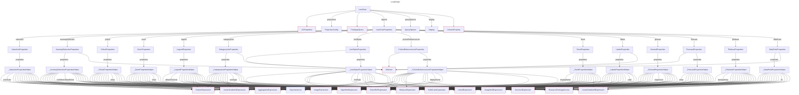

```mermaid
---
title: LineChart
---
graph 
2430071907552["SolidColorExpression"]
style 2430071907552 stroke:#ff0000,stroke-width:1px
2430591832928["_LabelsPropertiesHelper"]
2430591866112["_LineStylesPropertiesHelper"]
2430625924272["_TrendPropertiesHelper"]
2430625923296["_PlotAreaPropertiesHelper"]
2430071921216["ResourcePackageAccess"]
style 2430071921216 stroke:#ff0000,stroke-width:1px
2430552678256["ColumnProperty"]
style 2430552678256 stroke:#ff0000,stroke-width:1px
2430591830976["_ForecastPropertiesHelper"]
2430071910480["LinearGradient3Expression"]
style 2430071910480 stroke:#ff0000,stroke-width:1px
2430591825120["DataPointProperties"]
2430625915488["PlotAreaProperties"]
2430514817680["QueryOptions"]
2430625957456["LineChart"]
2430591859280["LegendProperties"]
2430071923168["SelectRefExpression"]
style 2430071923168 stroke:#ff0000,stroke-width:1px
2430625934032["ValueAxisProperties"]
2430071889008["AggregationExpression"]
style 2430071889008 stroke:#ff0000,stroke-width:1px
2430591827072["_DataPointPropertiesHelper"]
2430625937936["Y1AxisReferenceLineProperties"]
2430514810848["Display"]
2430071887056["LiteralExpression"]
style 2430071887056 stroke:#ff0000,stroke-width:1px
2430591854400["LabelsProperties"]
2430591812432["_AnomalyDetectionPropertiesHelper"]
2430071951472["PrototypeQuery"]
style 2430071951472 stroke:#ff0000,stroke-width:1px
2430591813408["AnomalyDetectionProperties"]
2430071930000["AlgorithmExpression"]
style 2430071930000 stroke:#ff0000,stroke-width:1px
2430591845616["GeneralProperties"]
2430625945744["_Y2AxisPropertiesHelper"]
2430071926096["ImageKindExpression"]
style 2430071926096 stroke:#ff0000,stroke-width:1px
2430625967216["LineChartProperties"]
2430625963312["Y2AxisProperties"]
2430514799136["ProjectionConfig"]
2430591817312["_CategoryAxisPropertiesHelper"]
2430071925120["ColumnExpression"]
style 2430071925120 stroke:#ff0000,stroke-width:1px
2430071920240["LinearGradient2Expression"]
style 2430071920240 stroke:#ff0000,stroke-width:1px
2430071930976["ExpressionList"]
2430591838784["ForecastProperties"]
2430625925248["TrendProperties"]
2430071888032["MeasureExpression"]
style 2430071888032 stroke:#ff0000,stroke-width:1px
2430625918416["LineStylesProperties"]
2430071919264["ImageExpression"]
style 2430071919264 stroke:#ff0000,stroke-width:1px
2430071745536["Selector"]
style 2430071745536 stroke:#ff0000,stroke-width:1px
2430625933056["_ValueAxisPropertiesHelper"]
2430591840736["_GeneralPropertiesHelper"]
2430071918288["GeoJsonExpression"]
style 2430071918288 stroke:#ff0000,stroke-width:1px
2430625959408["_ZoomPropertiesHelper"]
2430514805968["VCProperties"]
style 2430514805968 stroke:#ff0000,stroke-width:1px
2430625962336["ZoomProperties"]
2430625942816["_Y1AxisReferenceLinePropertiesHelper"]
2430591857328["_LegendPropertiesHelper"]
2430591805600["CategoryAxisProperties"]
2430625945744 ---> 2430071925120
2430625945744 ---> 2430071926096
2430625967216 --->|valueAxis| 2430625934032
2430591857328 ---> 2430071926096
2430625933056 ---> 2430071923168
2430591812432 ---> 2430071925120
2430591832928 ---> 2430071925120
2430591866112 ---> 2430071919264
2430625923296 ---> 2430071921216
2430591866112 ---> 2430071907552
2430591840736 ---> 2430071921216
2430625967216 --->|anomalyDetection| 2430591813408
2430591827072 ---> 2430071887056
2430591817312 ---> 2430071887056
2430591813408 --->|properties| 2430591812432
2430591866112 ---> 2430071930000
2430625945744 ---> 2430071920240
2430591830976 --->|show| 2430071930976
2430625967216 --->|y2Axis| 2430625963312
2430591832928 ---> 2430071889008
2430591857328 --->|defaultToCircle| 2430071930976
2430625945744 ---> 2430071889008
2430625933056 --->|axisScale| 2430071930976
2430591827072 ---> 2430071910480
2430591827072 ---> 2430071920240
2430591838784 ---> 2430071745536
2430625934032 --->|properties| 2430625933056
2430591857328 ---> 2430071888032
2430625942816 ---> 2430071923168
2430625963312 --->|properties| 2430625945744
2430625945744 ---> 2430071923168
2430625918416 ---> 2430071745536
2430625933056 ---> 2430071889008
2430591859280 --->|properties| 2430591857328
2430625957456 ---> 2430514805968
2430591827072 ---> 2430071919264
2430625959408 ---> 2430071919264
2430625967216 --->|zoom| 2430625962336
2430625945744 ---> 2430071919264
2430625923296 --->|transparency| 2430071930976
2430625942816 ---> 2430071920240
2430591866112 ---> 2430071889008
2430591830976 ---> 2430071910480
2430591827072 ---> 2430071921216
2430625945744 ---> 2430071888032
2430625942816 ---> 2430071925120
2430591857328 ---> 2430071889008
2430591817312 ---> 2430071926096
2430625924272 --->|displayName| 2430071930976
2430591812432 ---> 2430071919264
2430591812432 ---> 2430071930000
2430625924272 ---> 2430071918288
2430625933056 ---> 2430071920240
2430591817312 ---> 2430071925120
2430625942816 ---> 2430071930000
2430591832928 ---> 2430071920240
2430591830976 ---> 2430071920240
2430591857328 ---> 2430071887056
2430591817312 ---> 2430071930000
2430591830976 ---> 2430071921216
2430625945744 ---> 2430071907552
2430625923296 ---> 2430071887056
2430625937936 ---> 2430071745536
2430591866112 ---> 2430071918288
2430625945744 ---> 2430071921216
2430625942816 ---> 2430071887056
2430591812432 ---> 2430071923168
2430591812432 ---> 2430071920240
2430625924272 ---> 2430071920240
2430625942816 ---> 2430071921216
2430625933056 ---> 2430071926096
2430625967216 --->|legend| 2430591859280
2430625924272 ---> 2430071907552
2430591857328 ---> 2430071919264
2430625942816 ---> 2430071888032
2430625959408 ---> 2430071889008
2430591840736 ---> 2430071918288
2430591812432 ---> 2430071887056
2430625942816 ---> 2430071910480
2430625967216 --->|categoryAxis| 2430591805600
2430591827072 ---> 2430071925120
2430591866112 --->|lineStyle| 2430071930976
2430625967216 --->|lineStyles| 2430625918416
2430625959408 ---> 2430071907552
2430625923296 ---> 2430071918288
2430625918416 --->|properties| 2430591866112
2430591840736 ---> 2430071888032
2430591817312 ---> 2430071923168
2430591832928 ---> 2430071930000
2430591854400 --->|properties| 2430591832928
2430625942816 ---> 2430071919264
2430625967216 --->|y1AxisReferenceLine| 2430625937936
2430625924272 ---> 2430071889008
2430591832928 ---> 2430071910480
2430625959408 ---> 2430071888032
2430591832928 ---> 2430071926096
2430625959408 ---> 2430071926096
2430625957456 --->|projections| 2430514799136
2430625933056 ---> 2430071888032
2430591817312 ---> 2430071910480
2430591857328 ---> 2430071930000
2430625915488 --->|properties| 2430625923296
2430625923296 ---> 2430071923168
2430625933056 ---> 2430071925120
2430591805600 --->|properties| 2430591817312
2430591857328 ---> 2430071907552
2430625924272 ---> 2430071925120
2430591840736 ---> 2430071925120
2430625924272 ---> 2430071930000
2430591830976 ---> 2430071918288
2430591817312 ---> 2430071888032
2430625923296 ---> 2430071919264
2430591830976 ---> 2430071888032
2430625967216 --->|trend| 2430625925248
2430591840736 ---> 2430071926096
2430625942816 ---> 2430071918288
2430591830976 ---> 2430071907552
2430591830976 ---> 2430071925120
2430591812432 ---> 2430071888032
2430591866112 ---> 2430071910480
2430591840736 ---> 2430071930000
2430591840736 ---> 2430071907552
2430591812432 --->|confidenceBandColor| 2430071930976
2430591825120 --->|properties| 2430591827072
2430591830976 ---> 2430071930000
2430625924272 ---> 2430071923168
2430625924272 ---> 2430071919264
2430625923296 ---> 2430071907552
2430591812432 ---> 2430071918288
2430591857328 ---> 2430071925120
2430591813408 ---> 2430071745536
2430591840736 --->|responsive| 2430071930976
2430591817312 ---> 2430071889008
2430625967216 --->|labels| 2430591854400
2430591817312 ---> 2430071919264
2430591840736 ---> 2430071887056
2430591817312 ---> 2430071920240
2430591840736 ---> 2430071923168
2430625924272 ---> 2430071887056
2430625923296 ---> 2430071930000
2430625933056 ---> 2430071907552
2430591827072 ---> 2430071888032
2430591866112 ---> 2430071923168
2430625942816 --->|displayName| 2430071930976
2430625925248 --->|properties| 2430625924272
2430591827072 ---> 2430071889008
2430591832928 ---> 2430071907552
2430625933056 ---> 2430071887056
2430625923296 ---> 2430071889008
2430625957456 ---> 2430071951472
2430591817312 --->|axisType| 2430071930976
2430591832928 ---> 2430071921216
2430625967216 --->|general| 2430591845616
2430591827072 ---> 2430071907552
2430591827072 ---> 2430071923168
2430625945744 --->|show| 2430071930976
2430591812432 ---> 2430071910480
2430625924272 ---> 2430071910480
2430591830976 ---> 2430071919264
2430591840736 ---> 2430071889008
2430591827072 --->|fill| 2430071930976
2430591825120 ---> 2430071745536
2430591805600 ---> 2430071745536
2430625957456 --->|objects| 2430625967216
2430625933056 ---> 2430071921216
2430591832928 ---> 2430071923168
2430625959408 ---> 2430071918288
2430625957456 --->|queryOptions| 2430514817680
2430625924272 ---> 2430071926096
2430591857328 ---> 2430071920240
2430591840736 ---> 2430071920240
2430591817312 ---> 2430071921216
2430591866112 ---> 2430071921216
2430591854400 ---> 2430071745536
2430625959408 ---> 2430071920240
2430591812432 ---> 2430071907552
2430591845616 --->|properties| 2430591840736
2430591840736 ---> 2430071919264
2430625957456 --->|display| 2430514810848
2430591817312 ---> 2430071918288
2430591832928 ---> 2430071918288
2430625923296 ---> 2430071888032
2430625924272 ---> 2430071888032
2430591827072 ---> 2430071930000
2430591866112 ---> 2430071926096
2430625923296 ---> 2430071910480
2430591832928 ---> 2430071887056
2430625959408 ---> 2430071910480
2430625945744 ---> 2430071930000
2430625933056 ---> 2430071918288
2430591866112 ---> 2430071920240
2430625959408 ---> 2430071887056
2430625959408 ---> 2430071921216
2430591827072 ---> 2430071918288
2430591832928 --->|color| 2430071930976
2430625945744 ---> 2430071887056
2430591857328 ---> 2430071910480
2430591830976 ---> 2430071926096
2430625933056 ---> 2430071910480
2430625942816 ---> 2430071889008
2430625959408 ---> 2430071925120
2430625967216 --->|forecast| 2430591838784
2430591838784 --->|properties| 2430591830976
2430625945744 ---> 2430071910480
2430625945744 ---> 2430071918288
2430625959408 --->|show| 2430071930976
2430591840736 ---> 2430071910480
2430625933056 ---> 2430071930000
2430625957456 ---> 2430552678256
2430591832928 ---> 2430071919264
2430591857328 ---> 2430071918288
2430625959408 ---> 2430071930000
2430625967216 --->|plotArea| 2430625915488
2430591857328 ---> 2430071923168
2430591857328 ---> 2430071921216
2430625962336 --->|properties| 2430625959408
2430625933056 ---> 2430071919264
2430591830976 ---> 2430071889008
2430591827072 ---> 2430071926096
2430625967216 --->|dataPoint| 2430591825120
2430591832928 ---> 2430071888032
2430625924272 ---> 2430071921216
2430591866112 ---> 2430071925120
2430625923296 ---> 2430071925120
2430591812432 ---> 2430071889008
2430625942816 ---> 2430071907552
2430625942816 ---> 2430071926096
2430591866112 ---> 2430071888032
2430591812432 ---> 2430071926096
2430625937936 --->|properties| 2430625942816
2430591830976 ---> 2430071923168
2430591817312 ---> 2430071907552
2430591812432 ---> 2430071921216
2430591866112 ---> 2430071887056
2430625959408 ---> 2430071923168
2430625923296 ---> 2430071926096
2430625923296 ---> 2430071920240
2430591830976 ---> 2430071887056
```