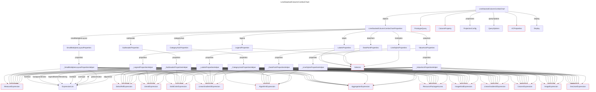

```mermaid
---
title: LineStackedColumnComboChart
---
graph 
2430626032608["LineStackedColumnComboChartProperties"]
2430626013088["SmallMultiplesLayoutProperties"]
2430626002352["_LineStylesPropertiesHelper"]
2430071951472["PrototypeQuery"]
style 2430071951472 stroke:#ff0000,stroke-width:1px
2430071907552["SolidColorExpression"]
style 2430071907552 stroke:#ff0000,stroke-width:1px
2430626051152["LineStackedColumnComboChart"]
2430071930000["AlgorithmExpression"]
style 2430071930000 stroke:#ff0000,stroke-width:1px
2430625975024["_LabelsPropertiesHelper"]
2430625974048["_DataPointPropertiesHelper"]
2430626000400["_SmallMultiplesLayoutPropertiesHelper"]
2430071921216["ResourcePackageAccess"]
style 2430071921216 stroke:#ff0000,stroke-width:1px
2430071926096["ImageKindExpression"]
style 2430071926096 stroke:#ff0000,stroke-width:1px
2430625993568["_LegendPropertiesHelper"]
2430625984784["DataPointProperties"]
2430626030656["_ValueAxisPropertiesHelper"]
2430625965264["_CategoryAxisPropertiesHelper"]
2430552678256["ColumnProperty"]
style 2430552678256 stroke:#ff0000,stroke-width:1px
2430514799136["ProjectionConfig"]
2430071925120["ColumnExpression"]
style 2430071925120 stroke:#ff0000,stroke-width:1px
2430071920240["LinearGradient2Expression"]
style 2430071920240 stroke:#ff0000,stroke-width:1px
2430071930976["ExpressionList"]
2430625979904["CategoryAxisProperties"]
2430071910480["LinearGradient3Expression"]
style 2430071910480 stroke:#ff0000,stroke-width:1px
2430514817680["QueryOptions"]
2430071888032["MeasureExpression"]
style 2430071888032 stroke:#ff0000,stroke-width:1px
2430626005280["LegendProperties"]
2430626003328["LineStylesProperties"]
2430625981856["LabelsProperties"]
2430071923168["SelectRefExpression"]
style 2430071923168 stroke:#ff0000,stroke-width:1px
2430071919264["ImageExpression"]
style 2430071919264 stroke:#ff0000,stroke-width:1px
2430071745536["Selector"]
style 2430071745536 stroke:#ff0000,stroke-width:1px
2430071889008["AggregationExpression"]
style 2430071889008 stroke:#ff0000,stroke-width:1px
2430626017968["SubheaderProperties"]
2430626018944["_SubheaderPropertiesHelper"]
2430071918288["GeoJsonExpression"]
style 2430071918288 stroke:#ff0000,stroke-width:1px
2430514805968["VCProperties"]
style 2430514805968 stroke:#ff0000,stroke-width:1px
2430626029680["ValueAxisProperties"]
2430514810848["Display"]
2430071887056["LiteralExpression"]
style 2430071887056 stroke:#ff0000,stroke-width:1px
2430626000400 ---> 2430071918288
2430626002352 ---> 2430071918288
2430625993568 ---> 2430071921216
2430625974048 ---> 2430071923168
2430626000400 ---> 2430071925120
2430626002352 ---> 2430071920240
2430626000400 ---> 2430071910480
2430625993568 ---> 2430071918288
2430625993568 ---> 2430071923168
2430625975024 ---> 2430071919264
2430626002352 ---> 2430071919264
2430626051152 ---> 2430552678256
2430626032608 --->|subheader| 2430626017968
2430626032608 --->|smallMultiplesLayout| 2430626013088
2430625974048 ---> 2430071926096
2430626018944 ---> 2430071888032
2430626018944 --->|fontSize| 2430071930976
2430625975024 ---> 2430071907552
2430626018944 ---> 2430071923168
2430626013088 --->|properties| 2430626000400
2430626018944 ---> 2430071887056
2430625965264 ---> 2430071921216
2430626029680 ---> 2430071745536
2430625975024 --->|backgroundColor| 2430071930976
2430625993568 ---> 2430071926096
2430625993568 ---> 2430071910480
2430626000400 ---> 2430071926096
2430625993568 ---> 2430071907552
2430625993568 ---> 2430071889008
2430626032608 --->|categoryAxis| 2430625979904
2430625974048 ---> 2430071920240
2430626000400 ---> 2430071923168
2430626030656 ---> 2430071918288
2430626000400 ---> 2430071887056
2430625993568 --->|legendMarkerRendering| 2430071930976
2430625975024 ---> 2430071930000
2430626030656 ---> 2430071910480
2430626029680 --->|properties| 2430626030656
2430625975024 ---> 2430071889008
2430626000400 ---> 2430071889008
2430626032608 --->|dataPoint| 2430625984784
2430625975024 ---> 2430071888032
2430626018944 ---> 2430071907552
2430626000400 ---> 2430071920240
2430625993568 ---> 2430071887056
2430625965264 ---> 2430071889008
2430626002352 ---> 2430071887056
2430625974048 ---> 2430071930000
2430626000400 ---> 2430071907552
2430625965264 ---> 2430071930000
2430626030656 ---> 2430071930000
2430626018944 ---> 2430071910480
2430625975024 ---> 2430071926096
2430626018944 ---> 2430071930000
2430626030656 ---> 2430071923168
2430625965264 ---> 2430071907552
2430625965264 ---> 2430071920240
2430626000400 ---> 2430071930000
2430625981856 ---> 2430071745536
2430625965264 ---> 2430071925120
2430625974048 ---> 2430071907552
2430625965264 ---> 2430071926096
2430626002352 --->|lineStyle| 2430071930976
2430626017968 --->|properties| 2430626018944
2430625975024 ---> 2430071910480
2430625974048 ---> 2430071925120
2430626018944 ---> 2430071889008
2430626018944 ---> 2430071921216
2430626000400 ---> 2430071888032
2430625984784 --->|properties| 2430625974048
2430626002352 ---> 2430071910480
2430626018944 ---> 2430071926096
2430626002352 ---> 2430071889008
2430626030656 ---> 2430071907552
2430626002352 ---> 2430071923168
2430625979904 --->|properties| 2430625965264
2430626003328 --->|properties| 2430626002352
2430626000400 ---> 2430071921216
2430626032608 --->|legend| 2430626005280
2430626051152 ---> 2430514805968
2430626002352 ---> 2430071921216
2430626002352 ---> 2430071907552
2430625974048 ---> 2430071921216
2430626051152 --->|queryOptions| 2430514817680
2430626018944 ---> 2430071920240
2430625965264 ---> 2430071919264
2430626032608 --->|lineStyles| 2430626003328
2430626032608 --->|labels| 2430625981856
2430625965264 ---> 2430071888032
2430626051152 --->|display| 2430514810848
2430625974048 ---> 2430071887056
2430626018944 ---> 2430071925120
2430626002352 ---> 2430071888032
2430625993568 ---> 2430071920240
2430626030656 ---> 2430071920240
2430625975024 ---> 2430071918288
2430625993568 ---> 2430071925120
2430626030656 ---> 2430071887056
2430625984784 ---> 2430071745536
2430625974048 ---> 2430071918288
2430625965264 --->|axisType| 2430071930976
2430625975024 ---> 2430071925120
2430626018944 ---> 2430071919264
2430625993568 ---> 2430071888032
2430626002352 ---> 2430071930000
2430625974048 --->|fill| 2430071930976
2430625981856 --->|properties| 2430625975024
2430625975024 ---> 2430071887056
2430625965264 ---> 2430071910480
2430626030656 ---> 2430071889008
2430626032608 --->|valueAxis| 2430626029680
2430626002352 ---> 2430071925120
2430626051152 --->|objects| 2430626032608
2430625975024 ---> 2430071920240
2430626005280 ---> 2430071745536
2430626000400 --->|gridLineColor| 2430071930976
2430626051152 ---> 2430071951472
2430625974048 ---> 2430071888032
2430626030656 ---> 2430071925120
2430625965264 ---> 2430071923168
2430626000400 ---> 2430071919264
2430625965264 ---> 2430071918288
2430626030656 ---> 2430071919264
2430625965264 ---> 2430071887056
2430625975024 ---> 2430071921216
2430626003328 ---> 2430071745536
2430626051152 --->|projections| 2430514799136
2430625974048 ---> 2430071910480
2430625993568 ---> 2430071919264
2430625974048 ---> 2430071889008
2430626030656 --->|alignZeros| 2430071930976
2430626030656 ---> 2430071888032
2430625975024 ---> 2430071923168
2430626030656 ---> 2430071926096
2430626030656 ---> 2430071921216
2430626002352 ---> 2430071926096
2430626018944 ---> 2430071918288
2430626005280 --->|properties| 2430625993568
2430625974048 ---> 2430071919264
2430625993568 ---> 2430071930000
```