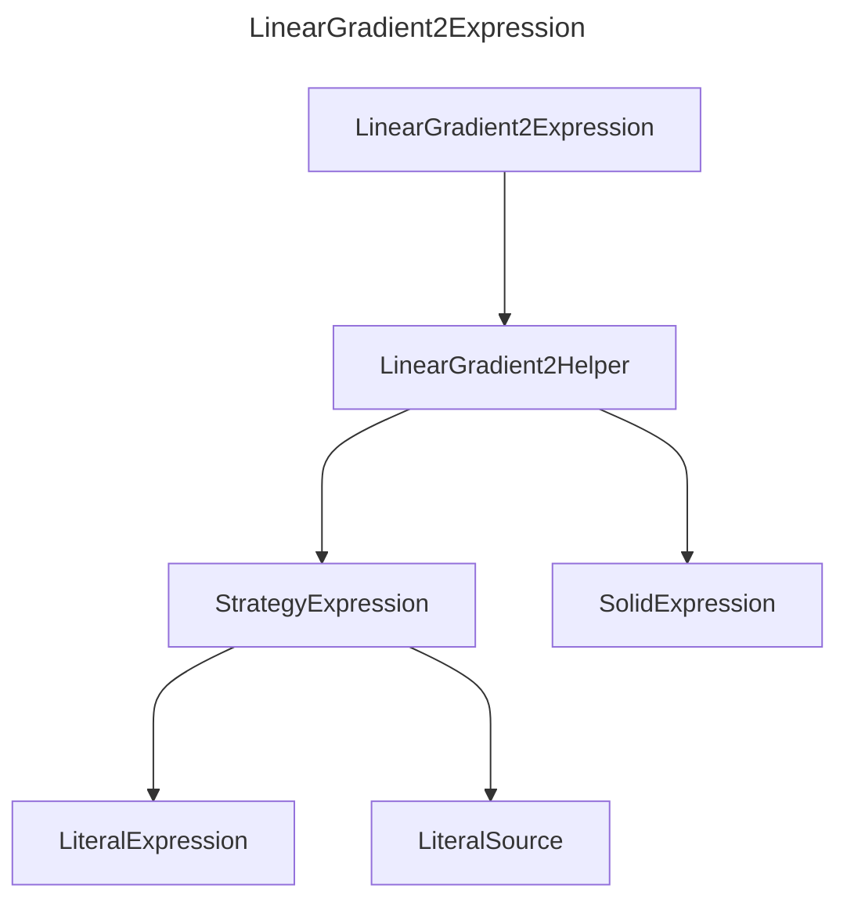

```mermaid
---
title: LinearGradient2Expression
---
graph 
2721641870560["StrategyExpression"]
2721641835424["LiteralExpression"]
2721641860800["LinearGradient2Helper"]
2721642022816["LiteralSource"]
2721641858848["LinearGradient2Expression"]
2721641857872["SolidExpression"]
2721641860800 ---> 2721641857872
2721641870560 ---> 2721641835424
2721641860800 ---> 2721641870560
2721641858848 ---> 2721641860800
2721641870560 ---> 2721642022816
```