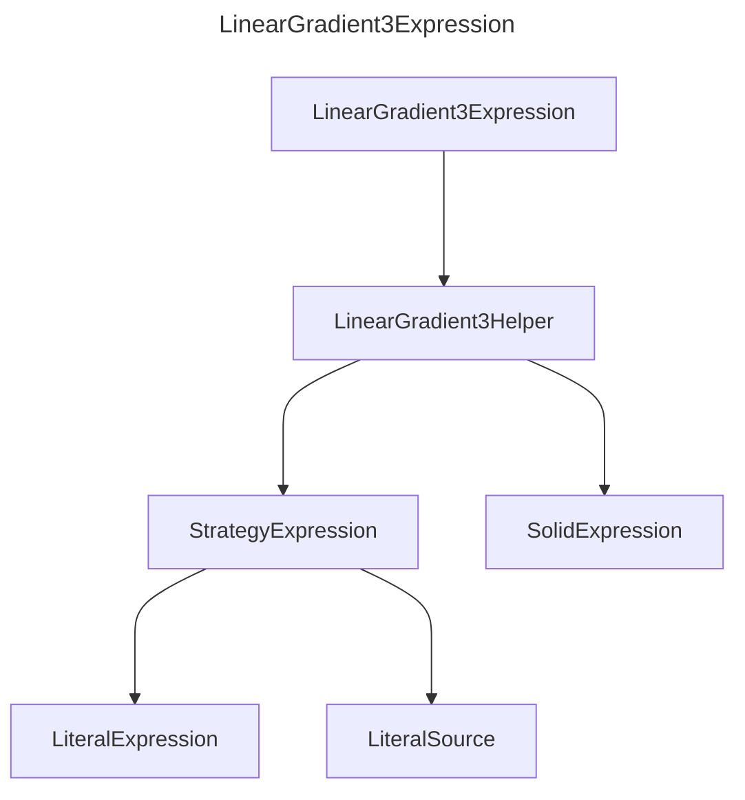

```mermaid
---
title: LinearGradient3Expression
---
graph 
2721641870560["StrategyExpression"]
2721641835424["LiteralExpression"]
2721641859824["LinearGradient3Expression"]
2721641875440["LinearGradient3Helper"]
2721642022816["LiteralSource"]
2721641857872["SolidExpression"]
2721641870560 ---> 2721641835424
2721641875440 ---> 2721641870560
2721641870560 ---> 2721642022816
2721641859824 ---> 2721641875440
2721641875440 ---> 2721641857872
```