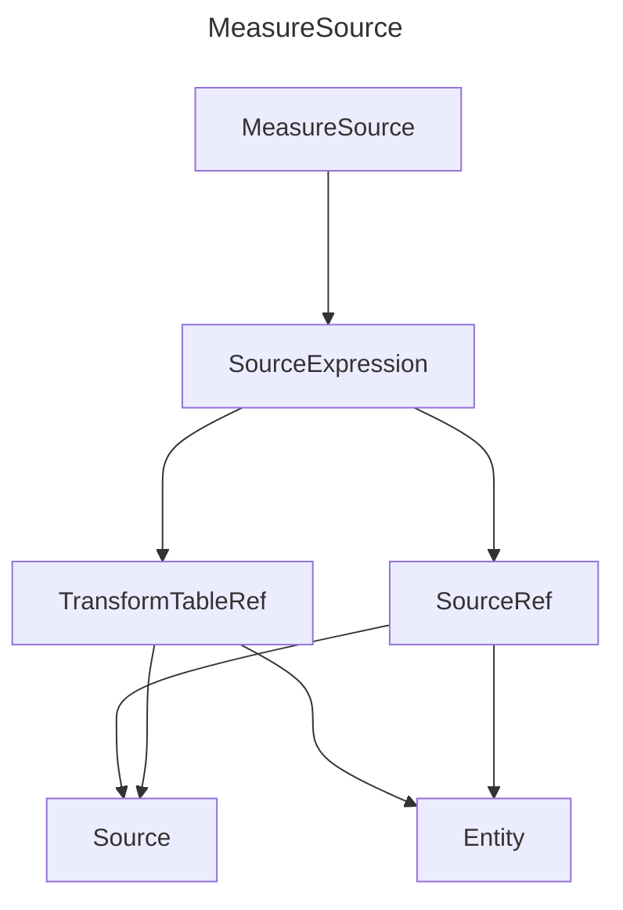

```mermaid
---
title: MeasureSource
---
graph 
2721642009152["MeasureSource"]
2721641999392["TransformTableRef"]
2721642000368["SourceRef"]
2721641985728["Entity"]
2721641984752["SourceExpression"]
2721641982800["Source"]
2721641984752 ---> 2721642000368
2721641984752 ---> 2721641999392
2721641999392 ---> 2721641985728
2721642000368 ---> 2721641982800
2721641999392 ---> 2721641982800
2721642000368 ---> 2721641985728
2721642009152 ---> 2721641984752
```