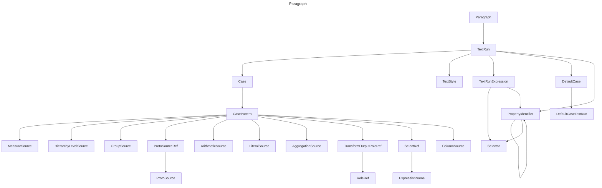

```mermaid
---
title: Paragraph
---
graph 
2721642009152["MeasureSource"]
2722076180688["PropertyIdentifier"]
2722076181664["DefaultCaseTextRun"]
2721642039408["ProtoSource"]
2721642022816["LiteralSource"]
2721642040384["RoleRef"]
2722076176784["TextRun"]
2721642012080["HierarchyLevelSource"]
2722076168976["Selector"]
2721642014032["ColumnSource"]
2722076172880["CasePattern"]
2721642013056["ExpressionName"]
2721642031600["ArithmeticSource"]
2721642024768["TransformOutputRoleRef"]
2721642023792["ProtoSourceRef"]
2721642035504["GroupSource"]
2722076178736["TextRunExpression"]
2722076189472["Paragraph"]
2722076183616["Case"]
2722076170928["DefaultCase"]
2721642003296["AggregationSource"]
2722076173856["TextStyle"]
2721642016960["SelectRef"]
2722076172880 ---> 2721642009152
2722076172880 ---> 2721642012080
2722076178736 ---> 2722076168976
2722076172880 ---> 2721642035504
2722076176784 ---> 2722076183616
2722076180688 ---> 2722076180688
2722076172880 ---> 2721642023792
2722076172880 ---> 2721642031600
2721642024768 ---> 2721642040384
2721642023792 ---> 2721642039408
2722076172880 ---> 2721642022816
2721642016960 ---> 2721642013056
2722076176784 ---> 2722076173856
2722076176784 ---> 2722076178736
2722076172880 ---> 2721642003296
2722076170928 ---> 2722076181664
2722076176784 ---> 2722076170928
2722076180688 ---> 2722076168976
2722076172880 ---> 2721642024768
2722076172880 ---> 2721642016960
2722076178736 ---> 2722076180688
2722076183616 ---> 2722076172880
2722076172880 ---> 2721642014032
2722076176784 ---> 2722076180688
2722076189472 ---> 2722076176784
```