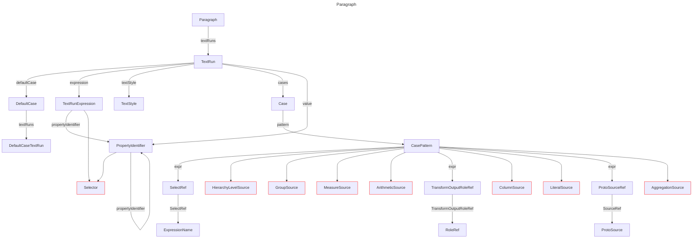

```mermaid
---
title: Paragraph
---
graph 
2430071756272["TextStyle"]
2430071820688["RoleRef"]
2430071814832["TransformOutputRoleRef"]
2430071366800["ExpressionName"]
2430071359968["MeasureSource"]
style 2430071359968 stroke:#ff0000,stroke-width:1px
2430071758224["CasePattern"]
2430071768960["TextRun"]
2430071356064["SelectRef"]
2430071746512["Case"]
2430071777744["TextRunExpression"]
2430071363872["HierarchyLevelSource"]
style 2430071363872 stroke:#ff0000,stroke-width:1px
2430071765056["DefaultCaseTextRun"]
2430071816784["LiteralSource"]
style 2430071816784 stroke:#ff0000,stroke-width:1px
2430071358016["AggregationSource"]
style 2430071358016 stroke:#ff0000,stroke-width:1px
2430071745536["Selector"]
style 2430071745536 stroke:#ff0000,stroke-width:1px
2430071825568["ProtoSourceRef"]
2430071771888["Paragraph"]
2430071365824["ColumnSource"]
style 2430071365824 stroke:#ff0000,stroke-width:1px
2430071808976["GroupSource"]
style 2430071808976 stroke:#ff0000,stroke-width:1px
2430071819712["ProtoSource"]
2430071767984["DefaultCase"]
2430071773840["PropertyIdentifier"]
2430071382416["ArithmeticSource"]
style 2430071382416 stroke:#ff0000,stroke-width:1px
2430071777744 --->|propertyIdentifier| 2430071773840
2430071758224 --->|expr| 2430071356064
2430071771888 --->|textRuns| 2430071768960
2430071758224 ---> 2430071363872
2430071768960 --->|defaultCase| 2430071767984
2430071767984 --->|textRuns| 2430071765056
2430071768960 --->|expression| 2430071777744
2430071777744 ---> 2430071745536
2430071768960 --->|textStyle| 2430071756272
2430071758224 ---> 2430071808976
2430071825568 --->|SourceRef| 2430071819712
2430071768960 --->|cases| 2430071746512
2430071814832 --->|TransformOutputRoleRef| 2430071820688
2430071773840 ---> 2430071745536
2430071773840 --->|propertyIdentifier| 2430071773840
2430071356064 --->|SelectRef| 2430071366800
2430071758224 ---> 2430071359968
2430071768960 --->|value| 2430071773840
2430071758224 ---> 2430071382416
2430071758224 --->|expr| 2430071814832
2430071758224 ---> 2430071365824
2430071746512 --->|pattern| 2430071758224
2430071758224 ---> 2430071816784
2430071758224 --->|expr| 2430071825568
2430071758224 ---> 2430071358016
```